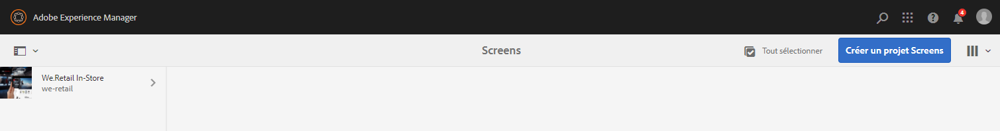
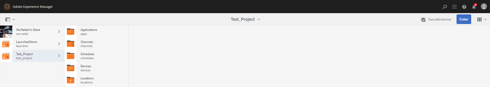

# Guide de démarrage rapide      {#kickstart-guide}

Cette section vous donne un premier aperçu d’AEM Screens et montre comment réaliser des actions de base. Elle vous guide à travers la configuration d’une expérience de signalisation numérique de base avec des ressources ou du contenu et la publication dans le lecteur Screens. Pour une présentation détaillée de tous les composants pour le développement de Screens, reportez-vous aux ressources indiquées à la fin de la page.

## Création d’une expérience de signalisation numérique en 5 minutes {#creating-a-digital-signage-experience-in-minutes}

Les étapes suivantes vous permettent de créer un exemple de projet pour Screens et de publier du contenu sur le lecteur Screens.

1. Pour télécharger le **lecteur AEM Screens**, cliquez [ici](https://download.macromedia.com/screens/).

   AEM Screens est également disponible dans **Google Play**.

   Pour plus d’informations sur la mise en œuvre du lecteur Chrome OS, reportez-vous à la section [Console de gestion Chrome](implementing-chrome-os-player.md).

   Pour plus d’informations, voir [Installation et configuration de Screens](configuring-screens-introduction.md).

   >[!NOTE]
   >
   >**Paramètres OSGI**
   >
   >
   >Vous devez activer le référent vide pour autoriser le périphérique à publier des données sur le serveur. Par exemple, si la propriété de référent vide est désactivée, le périphérique ne pourra pas publier de capture d’écran. Actuellement, certaines de ces fonctions ne sont disponibles que si l’option Allow Empty d’Apache Sling Referrer Filter est activée dans la configuration OSGi. Le tableau de bord peut afficher un avertissement indiquant que les paramètres de sécurité peuvent empêcher l’utilisation de certaines de ces fonctions.
   >
   >
   >Pour activer l’option ***Allow Empty d’Apache Sling Referrer Filter ***, procédez comme suit :
   >
   >
   >
   >    1. Accédez à **Configuration de la console Web Adobe Experience Manager** : `https://localhost:4502/system/console/configMgr/org.apache.sling.security.impl.ReferrerFilter`.
   >    1. Cochez l’option **allow.empty**.
   >    1. Cliquez sur **Enregistrer**.

1. **Création d’un projet**

   1. Sélectionnez le lien Adobe Experience Manager (en haut à gauche), puis **Screens**. Vous pouvez également accéder directement à `https://localhost:4502/screens.html/content/screens](https://localhost:4502/screens.html/content/screens`.

   1. Cliquez sur **Créer** pour créer un projet Screens (voir la figure ci-dessous).
   1. Sélectionnez **Screens** à partir de l’assistant **Créer un projet Screens**, puis cliquez sur **Suivant**.

   1. Saisissez le titre *Test_Project* et cliquez ensuite sur **Créer**.
   

   Une fois le projet créé, vous êtes redirigé vers la console du projet Screens. Vous pouvez sélectionner votre projet. Dans un projet, il existe cinq types de dossiers, à savoir : **Applications**, **Channels** (Canaux), **Devices** (Périphériques), **Locations** (Emplacements) et **Schedules** (Planifications), comme illustré dans la figure ci-dessous.

   >[!NOTE]
   >
   >« Planifications » n’est disponible que si vous avez installé le Feature Pack 1 d’AEM 6.3 Sites. Pour accéder à ce Feature Pack, vous devez contacter l’assistance d’Adobe et demander à y accéder. Une fois que vous disposez des autorisations nécessaires, vous pouvez le télécharger à partir de Package Share.

   

   Voir [Créer et gérer un projet Screens](creating-a-screens-project.md) pour en savoir plus.

1. **Création d’un canal** 

   Une fois que vous avez votre projet, vous devez créer une nouveau canal où vous pouvez gérer le contenu.

   Pour créer un canal pour votre projet, procédez comme suit :

   1. Accédez au projet *Test_Project* que vous avez créé et sélectionnez ensuite le dossier **Channels** (Canaux).

   1. Cliquez sur **Créer** dans la barre d’actions (voir la figure ci-dessous). Un assistant s’ouvre.
   1. Sélectionnez **Canal de séquences** et cliquez sur **Suivant**.

   1. Saisissez le **nom** et le **titre** *TestChannel*, puis cliquez sur **Créer**.
   

   Le canal *TestChannel* est créé et ajouté au dossier de canaux, comme illustré dans la figure ci-dessous.

   

   Reportez-vous à la section [Gestion des canaux](managing-channels.md) pour plus de détails sur la création et la gestion des canaux.

1. **Ajout de contenu à un canal**

   Une fois que vous avez votre canal, vous devez y ajouter le contenu que le lecteur Screens va afficher.

   Suivez les étapes ci-dessous pour ajouter du contenu au canal (*TestChannel*) dans votre projet : 

   1. Accédez au projet *Test_Project* que vous avez créé et sélectionnez ensuite le dossier **Channels** (Canaux).

   1. Cliquez sur **Modifier** dans la barre d’actions (voir la figure ci-dessous). L’éditeur de *TestChannel* s’ouvre.

   1. Cliquez sur l’icône qui fait passer le panneau latéral du côté gauche de la barre d’actions pour ouvrir les ressources et les composants. 
   1. Faites glisser et déposez les composants que vous souhaitez ajouter à votre canal. 
   

   Dans cet exemple, l’éditeur affiche une image ajoutée au canal. 

   

1. **Création d’un emplacement**

   Une fois que vous avez le canal, vous devez créer votre emplacement. 

   Les ***emplacements ***permettent de compartimenter vos diverses expériences de signalisation numériques et contiennent les configurations de leurs affichages en fonction de l’endroit où se trouvent les différents écrans.

   Pour créer un emplacement pour votre projet, procédez comme suit :

   1. Accédez au projet *Test_Project* que vous avez créé et sélectionnez le dossier **Emplacements**.

   1. Cliquez sur **Créer** à côté de l’icône Plus dans la barre d’actions (voir la figure ci-dessous). Un assistant s’ouvre.
   1. Sélectionnez **Emplacement** dans l’assistant, puis cliquez sur **Suivant**.

   1. Saisissez le **nom** et le **titre** de votre emplacement (saisissez le titre *TestLocation*), puis cliquez sur **Créer**.
   

   L’emplacement *TestLocation* est créé et ajouté à votre dossier **Locations** (Emplacements).

   

1. **Création d’un affichage pour *TestLocation***

   Une fois que vous avez créé un emplacement, vous devez créer un affichage pour celui-ci.

   Les ***affichages ***représentent l’expérience numérique qui s’exécute sur un ou plusieurs écrans.

   1. Accédez à l’emplacement sur lequel vous souhaitez créer votre affichage (*Test_Projec* t --> **Emplacements** --> *TestLocation)* comme indiqué dans la figure ci-dessus, puis sélectionnez *TestLocation*.

   1. Cliquez sur **Créer** dans la barre d’actions.
   1. Sélectionnez **Affichage** à partir de l’assistant **Créer** et cliquez sur **Suivant**.

   1. Saisissez le **nom** et le **titre** de votre emplacement d’affichage (saisissez le titre *TestDisplay*).

   1. Dans l’onglet **Affichage**, sélectionnez les détails de la mise en page.

      1. Sélectionnez la **résolution** **Full HD**.

      1. Définissez **Nombre d’appareils horizontalement** sur 1.
      1. Définissez **Nombre d’appareils verticalement** sur 1.
   1. Cliquez sur **Créer**.
   Un nouvel affichage (*TestDisplay*) est ajouté à votre emplacement (*TestLocation)*, comme le montre la figure ci-dessous. 

   

1. **Ajout d’une planification**

   Dans AEM Screens, les *planifications* vous permettent d’organiser les canaux en groupes réutilisables. Ainsi, vous n’avez pas à répéter leur attribution individuellement pour chaque affichage sur lequel vous souhaitez afficher votre contenu.

   >[!NOTE]
   >
   >Cette fonctionnalité d’AEM Screens n’est disponible que si vous avez installé AEM 6.3 Sites Feature Pack 1. Pour accéder à ce Feature Pack, vous devez contacter l’assistance d’Adobe et demander à y accéder. Une fois que vous disposez des autorisations nécessaires, vous pouvez le télécharger à partir de Package Share.

   1. Accédez au dossier **Planifications** depuis Test_Project --> **Planifications**.

   1. Cliquez sur **Créer** dans la barre d’actions. Un assistant s’ouvre.
   1. Sélectionnez **Planification** depuis la page de l’assistant **Créer**. 

   1. Saisissez le **nom** et le **titre** *MorningSchedule* dans la page des propriétés.

   1. Cliquez sur **Créer** pour ajouter une planification au dossier **Planifications**, comme illustré dans la figure ci-dessous. 
   

   En outre, sélectionnez la planification (*MorningSchedule*) et cliquez sur **Tableau de bord** dans la barre d’actions pour afficher le tableau de bord des planifications. Vous pouvez afficher/modifier les propriétés de la planification, attribuer des canaux et voir les affichages attribués à l’aide du tableau de bord. 

   

   Voir [Créer et gérer des planifications](managing-schedules.md) pour obtenir des informations détaillées sur les planifications.

1. **Attribution d’un canal**

   1. Accédez à l’affichage depuis *Test_Project* --> **Emplacements** --> *TestLocation* --> *TestDisplay*.

   1. Sélectionnez *TestDisplay* et cliquez ou appuyez sur **Attribuer un canal **depuis la barre d’actions *.*

   1. Vous pouvez aussi cliquer sur **Tableau de bord** et sélectionner **+Attribuer un canal** en haut à droite du panneau **CANAUX ET PLANIFICATIONS ATTRIBUÉS**, comme illustré dans la figure ci-dessous. La boîte de dialogue **Attribution de canaux** s’ouvre.

   1. Sélectionnez **Canal de référence** en fonction du **chemin d’accès**

   1. Définissez le **rôle du canal** sur *LiveStream*.

   1. Sélectionnez **Chemin d’accès au canal** (*Test_Project* --> *Canaux* --> *TestChannel*) dans le **canal**.

   1. Définissez la **priorité** de ce canal sur *1*.

   1. Choisissez les **événements pris en charge** **Chargement initial** et **Écran inactif**.

   1. Entrez la **planification** et sélectionnez les dates dans **Active from (Actif à partir de)** et **Active until (Actif jusqu’à)**.

   1. Cliquez sur **Enregistrer**.
   Le canal est créé et ajouté au panneau.

   

   Pour en savoir plus sur la boîte de dialogue **Attribution des canaux** et les propriétés associées, voir [Attribution des canaux](channel-assignment.md).

1. **Ajout de la planification à un canal**

   1. Accédez à l’affichage depuis *Test_Project* --> **Emplacements** --> *TestLocation* --> *TestDisplay*.

   1. Cliquez sur **Tableau de bord** et sélectionnez **+Attribuer une planification** en haut à droite du panneau **CANAUX ET PLANIFICATIONS ATTRIBUÉS**, comme indiqué dans la figure ci-dessus. La boîte de dialogue **Attribution des planifications** s’ouvre.

   1. Sélectionnez le chemin dans lequel vous avez créé la planification (ici, *Test_Project* --> **Planifications** --> *MorningSchedule*).

   1. Cliquez sur **Enregistrer** pour ajouter la planification à votre canal. 
   

1. **Enregistrement d’un périphérique**

   Vous devez enregistrer votre périphérique à l’aide du tableau de bord AEM. 

   >[!NOTE]
   >
   >Vous pouvez ouvrir le lecteur Screens à l’aide de l’application AEM’Screens que vous avez téléchargée ou à l’aide du navigateur web.

   Pour afficher le périphérique en attente :

   1. Lancez une fenêtre du navigateur distincte.
   1. Accédez au lecteur Screens à l’aide du *navigateur web* `https://localhost:4502/content/mobileapps/cq-screens-player/firmware.html` ou lancez l’application AEM Screens. Lorsque vous ouvrez le périphérique, vous remarquez que son état est non enregistré. 
   1. Depuis le tableau de bord AEM, accédez à *Test_Project* --> **Périphériques**

   1. Cliquez sur **Gestionnaire de périphériques** dans la barre d’actions.
   1. Cliquez sur **Enregistrement des périphériques** et les périphériques en attente s’affichent, comme illustré dans la figure ci-dessous.
   

   Sélectionnez le périphérique que vous voulez enregistrer et cliquez ensuite sur **Enregistrer le périphérique**.

   

   Vous devez valider le code en le vérifiant à partir du navigateur web ou du lecteur AEM Screens.

   Cliquez sur **Valider** pour accéder à l’écran **Enregistrement du périphérique**.

   

   Saisissez le **titre** et cliquez sur **Enregistrer** pour que le périphérique soit enregistré.

   Cliquez sur **Terminer** pour terminer l’étape d’enregistrement du périphérique.

   

   En cliquant sur **Terminer**, vous retournez à la page des périphériques qui affiche les périphériques attribués et non attribués.

   

   >[!NOTE]
   >
   >Le périphérique que vous avez ajouté s’affiche comme **Non attribué** sous l’état **Attribué**.

1. **Attribution du périphérique à afficher**

   Une fois que vous avez enregistré le périphérique, vous devez attribuer le périphérique à un affichage.

   Suivez les étapes ci-dessous pour effectuer l’attribution d’un périphérique :

   1. Sélectionnez le périphérique que vous souhaitez attribuer.
   1. Cliquez sur **Attribuer le périphérique** dans la barre d’actions.
   1. Définissez le chemin d’affichage pour le canal sur `/content/screens/Test_Project/***Locations***/TestLocation/TestDisplay.`

   1. Cliquez sur **Attribuer**.
   1. Cliquez sur **Terminer** pour achever le processus. Le périphérique est désormais attribué.
   

   Le tableau de bord s’ouvre et affiche toutes les informations relatives aux planifications et aux canaux attribués, ainsi que les informations de configuration du périphérique.

   

### Affichage du contenu dans le lecteur Screens {#viewing-the-content-in-screens-player}

Une fois que vous avez ajouté les configurations ci-dessus, le lecteur doit automatiquement afficher le canal par défaut pour l’affichage sur votre périphérique, par exemple une image (dans ce cas, un canal de séquence et le contenu sont visibles dans le lecteur Screens pour le navigateur web).

Pour plus d’informations sur le lecteur AEM Screens, voir [Lecteur AEM Screens](working-with-screens-player.md).
