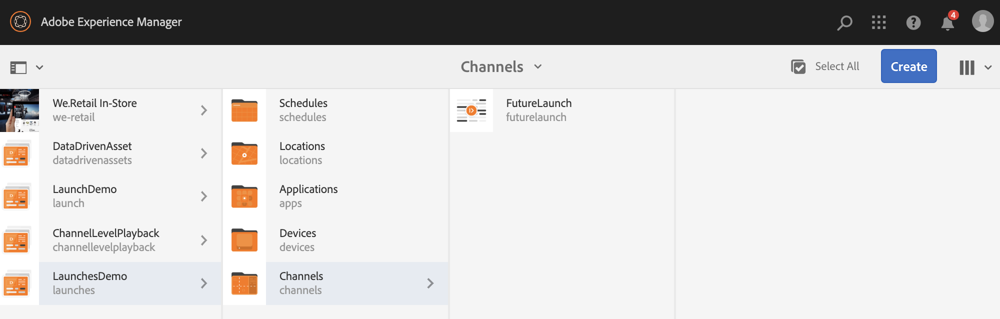

# Lancements {#launches}

Les auteurs de contenu peuvent créer une version future du ou des canaux, connue sous le nom de **lancement** , et la définition ultérieure de la date de lancement permet au contenu d’être actif sur des périphériques ou des lecteurs.

Avec l’aide des lancements, les auteurs peuvent prévisualiser chaque canal du lancement et doivent pouvoir lancer une demande de révision. Le groupe des approbateurs reçoit une notification et peut approuver ou rejeter la demande. Lorsque la date d’activation est atteinte, le contenu est lu sur les périphériques.

Par exemple, si l’auteur souhaite créer des versions futures de c1, c2 (canaux), un lancement est créé et une date de production est définie (par exemple, le 10 novembre à 8 heures). Toute mise à jour ultérieure du contenu est envoyée pour révision. Une fois approuvé et à la date d’activation (10 novembre, 8 h), ce lancement lit le contenu sur les périphériques ou les lecteurs.

## Conditions {#requirements}

Avant de commencer l’implémentation des lancements dans un projet AEM Screens, assurez-vous de bien comprendre le concept de période de grâce et sa pertinence.

La section suivante explique la période de grâce et explique comment la configurer en standard. Vous pouvez également télécharger un exemple de configuration de test pour comprendre son utilisation.

### Présentation de la période de grâce {#understanding-grace-period}

La configuration suivante permet à l’administrateur de configurer la période ***de ***grâce, obligatoire dans les lancements.

**Période** de grâce :

* promotion du lancement
* publication des ressources aux instances de publication
* temps nécessaire aux périphériques pour télécharger le contenu à partir de l’instance de publication et les différences de temps entre le serveur et le lecteur

Par exemple, supposons que le serveur est en PST et que les périphériques sont en EST, que la différence de temps maximale est de 3 heures dans ce cas et supposons que la promotion prendra 1 minute et que la publication de l’auteur à la publication prend 10 minutes et que le lecteur peut télécharger les ressources généralement en 10-15 minutes. Ensuite, période de grâce = différence de temps (3 heures) + temps pour promouvoir le lancement (1 min) + temps pour publier le lancement (10 min) + temps pour télécharger au lecteur (10-15 min) + mémoire tampon (pour être sûr, disons 30 min) = 3 heures 56 min = 14160 secondes. Ainsi, dès que nous planifions un lancement en direct, la promotion commence tôt par ce décalage. Dans l&#39;équation ci-dessus, la plupart des éléments ne prennent pas beaucoup de temps, nous pouvons utiliser une estimation correcte pour ce décalage une fois que nous connaissons la différence de temps maximale b/w le serveur et n&#39;importe quel joueur.

### Configuration de la période de grâce prête à l’emploi {#configuring-out-of-the-box-grace-period}

La période de grâce d’un lancement prêt à l’emploi est définie sur 24 heures, ce qui signifie que lorsque nous définissons la date de lancement pour les ressources sous */contenu/écrans*, la promotion commence par ce décalage. Par exemple, si la date de production est définie sur 24 novembre, 9:00 et que la période de grâce est de 24 heures, la tâche de promotion démarrera à 9:00 nov.

### Téléchargement des configurations {#downloading-configurations}

Téléchargez les configurations de test suivantes :

[Obtenir un fichier](assets/launches_event_handlerconfig-10.zip)

>[!NOTE]
>
>La configuration mentionnée ci-dessus a 600 secondes comme période de grâce dans cette configuration de test.

#### Mise à jour des configurations {#updating-the-configurations}

Si vous souhaitez modifier la configuration ci-dessus, suivez les instructions ci-dessous :

* créez le fichier ***sling:OsgiConfig/ nt:file dans /apps/system/config ***sous le nom**com.adobe.cq.wcm.launches.impl.LaunchesEventHandler.config **et le contenu.

   *launches.eventhandler.updatelastmodification=B&quot;false&quot;launches.event.launch.promotion.graceperiod=[&quot;/content/screens(/.*):600&quot;]launches.eventhandler.threadpool.maxsize=I&quot;5&quot;launches.eventhandler.threadpool.priority=&quot;MIN&quot;*

* `launches.eventhandler.launch.promotion.graceperiod=["/content/screens(/.&#42;):600"`, vous permet de définir une période de grâce de 600 secondes dans le chemin */content/screens*.

Cela signifie que lorsque vous définissez la date d’activation d’un lancement pour les ressources sous */content/screens*, la promotion commence par ce décalage. Si, par exemple, la date d’activation est définie sur 24 novembre, 9:00 et que la période de grâce est de 600 secondes, la tâche de promotion démarrera le 24 novembre, 8:50.

## Utilisation des lancements {#using-launches}

Suivez la section ci-dessous pour implémenter les lancements dans votre projet AEM Screens. Cette section traite des sujets suivants :

1. **Création d’un lancement**
1. **Modification d’un lancement pour définir la date et l’étendue d’activation**

### Création d’un lancement {#creating-a-launch}

Suivez les étapes ci-dessous pour mettre en oeuvre les futures fonctionnalités de publication dans votre projet AEM Screens :

1. Accédez au canal dans votre projet AEM Screens, par exemple **LaunchesDemo** —> **Canaux** —> **FutureLaunch**, comme illustré ci-dessous.

   >[!CAUTION]
   >
   >Vous devez créer un lancement à partir d’un canal préexistant dans votre projet AEM Screens.

   

1. Sélectionnez le canal **FutureLaunch** , puis cliquez sur **Créer**. Sélectionnez **Lancer** dans le menu déroulant.

   

1. L’assistant **Créer un lancement** s’ouvre. Cliquez sur **+ Ajouter des pages** pour sélectionner les canaux AEM Screens pour lesquels vous souhaitez créer le lancement.

   

1. Accédez au canal et cliquez sur **Sélectionner**.

   

1. Une fois la page sélectionnée, cliquez sur **Suivant** pour avancer d’une étape vers l’assistant **Créer un lancement** .

   

1. Saisissez le Titre **du** lancement comme **Promotions** d’été et vous n’avez pas besoin de définir la Date **de** lancement, comme illustré dans la figure ci-dessous. Cliquez sur **Créer**.

   >[!NOTE]
   >
   >*L’activation ou la vérification* de l’option **Hériter les données** dynamiques de la page source permet de créer les canaux en tant que copies dynamiques au lancement. Si des modifications sont apportées au canal d’origine, elles sont automatiquement appliquées aux canaux de lancement.
   >
   >
   >*La désactivation ou la désactivation* des données **dynamiques de la page source** d’hériter permet de copier les canaux sans aucune relation active au lancement. Ainsi, si des modifications sont apportées au canal d’origine, elles ne sont pas appliquées aux canaux de lancement.

   

   >[!NOTE]
   >
   >Vous pouvez définir la date de lancement en direct dans cette étape ou la configurer ultérieurement lors de la modification des propriétés du lancement une fois qu’il a déjà été créé.

1. Vous verrez que votre lancement est créé. Vous pouvez cliquer sur **Ouvrir** pour afficher les pages dans l’éditeur ou sur **Terminé** pour revenir à votre projet.

   

   Cliquez sur **Terminé** pour revenir à votre projet **LancementsDémo** .

   

### Modification des propriétés de lancement pour définir la date et l’étendue d’activation {#editing-the-launch-properties-to-set-the-live-date-and-scope}

Après avoir créé le lancement, vous devez modifier les propriétés de lancement pour définir la date de lancement sur la portée du lancement.

Pour modifier les propriétés de lancement, procédez comme suit :

1. Accédez au canal (**FutureLaunch**) et sélectionnez-le, comme illustré dans la figure ci-dessous. Ouvrez le rail **Références** à partir du rail latéral gauche.

   >[!NOTE]
   >
   >Sélectionnez l’option Arborescence **de** contenu dans le rail de gauche pour ouvrir le lancement que vous avez créé.

   

1. Accédez à **Lancements** et sélectionnez le lancement (**Promotions** d’été) que vous avez créé. Cliquez sur **Modifier les propriétés**.

   

1. La boîte de dialogue **Promotions** d’été s’ouvre. Renseignez les champs suivants :

   * Sélectionner la date de **lancement**
   * Vérifier **la production prête**
   * Sélectionnez **Promouvoir les pages** approuvées dans **l’étendue.**
   >[!NOTE]
   >
   >Présentation des entrées Lancements sous Promotion **automatique**:

   >    * **Date** de lancement, fait référence à la date d’activation, c’est-à-dire la date/l’heure de lecture du contenu dans le lecteur d’écran selon le fuseau horaire du lecteur.
   >    * **Prêt**&#x200B;à la production, permet de promouvoir les canaux et d’utiliser le lancement.
   >    * **Scope** fait référence aux canaux qui peuvent être promus lors d’un lancement.

   Les trois options suivantes sont disponibles pour configurer la portée :
   1. **Promouvoir le lancement** complet : Tous les canaux du lancement sont promus à la date définie.
   1. **Promouvoir les pages** modifiées : Seules les ressources de lancement modifiées seront promues. Il est recommandé d’utiliser cette option lorsque la révision du lancement n’est pas requise. Il permet de promouvoir les modifications apportées aux canaux de lancement.
   1. **Promouvoir les pages** approuvées : Seules les pages approuvées sont promues à la date définie.
   

   >[!CAUTION]
   >
   >La promotion du lancement respecte le fuseau horaire du lecteur/périphérique plutôt que celui du serveur.

1. Cliquez sur **Enregistrer et fermer** pour revenir au canal **FutureLaunch** .

   

