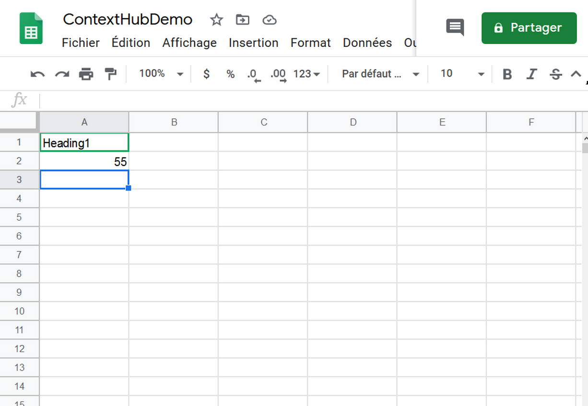

# Activation de la température du centre de voyage {#travel-center-temperature-activation}

Le cas d’utilisation suivant illustre l’utilisation de l’activation de la température locale du centre de voyage en fonction des valeurs renseignées dans les feuilles Google.

## Description {#description}

Dans ce cas d’utilisation, si votre feuille Google a une valeur inférieure à 50, une image avec boissons chaudes s’affiche et si la valeur est supérieure ou égale à 50, l’image avec boissons froides s’affiche. En cas de valeur différente ou nulle, le lecteur affichera une image par défaut.

## Conditions préalables {#preconditions}

Avant de commencer à mettre en oeuvre l’activation de la température locale du centre de voyage, vous devez apprendre à configurer le stockage ***de*** données, la segmentation ***de l’*** audience et l’ ***activation du ciblage des canaux*** dans un projet AEM Screens.

Consultez [Configuration de ContextHub dans les écrans](configuring-context-hub.md) AEM pour plus d’informations.

## Flux de base {#basic-flow}

Suivez les étapes ci-dessous pour mettre en oeuvre le cas d’utilisation de l’activation de température locale du centre de voyage :

1. **Renseigner les feuilles de Google**

   1. Accédez à la feuille Google ContextHubDemo.
   1. Ajoutez une colonne avec **Titre1** avec la valeur correspondante pour la température.
   

1. **Configuration des segments dans Audiences conformément aux exigences**

   1. Accédez aux segments de votre audience (Reportez-vous à l’ ***étape 2 : Configuration de la segmentation*** de l’audience dans **[Configuration de ContextHub dans la page AEM Screens](configuring-context-hub.md)** (pour plus d’informations).

   1. Sélectionnez les **feuilles A1 1** et cliquez sur **Modifier**.

   1. Sélectionnez la propriété de comparaison et cliquez sur l’icône Configurer pour modifier les propriétés.
   1. Sélectionnez **googlesheets/value/1/0** dans la liste déroulante du nom de la **propriété.**

   1. Sélectionnez l’ **opérateur** **supérieur ou égal à **dans le menu déroulant.

   1. Saisissez la **valeur** **50.**

   1. De même, sélectionnez les feuilles A1 2 *** et cliquez sur **Modifier**.

   1. Sélectionnez la propriété **Comparison - Valeur** et cliquez sur l’icône Configurer pour modifier les propriétés.
   1. Sélectionnez **googlesheets/value/1/0** dans la liste déroulante du nom de la **propriété.**

   1. Sélectionnez l’ **opérateur** **Inférieur à **dans le menu déroulant.

   1. Saisissez la **valeur** **50.**

1. Naviguez et sélectionnez votre canal (), puis cliquez sur **Modifier** dans la barre d’actions. Dans l’exemple suivant, **DataDrivenWeather**, un canal séquentiel est utilisé pour présenter la fonctionnalité.

   >[!NOTE]
   >
   >Votre canal doit déjà avoir une image par défaut et les audiences doivent être préconfigurées comme décrit dans [Configuration de ContextHub dans les écrans](configuring-context-hub.md)AEM.

   

   >[!CAUTION]
   >
   >Vous auriez dû configurer vos **configurations** ContextHub **à l’aide de l’onglet** Propriétés **du canal —&gt;** **Personnalisation.**

   

1. Sélectionnez **Ciblage** dans l’éditeur, sélectionnez **Marque** et **Activité** dans le menu déroulant, puis cliquez sur **Démarrer le ciblage.**

   

1. **Vérification de l’aperçu**

   1. Click **Preview.** Ouvrez également votre feuille Google et mettez à jour sa valeur.
   1. Remplacez la valeur par une valeur inférieure à 50, vous devriez pouvoir voir une image des boissons d’été. Si la valeur de la feuille Google est supérieure ou égale à 50, vous pouvez afficher une image de boisson chaude.
   

