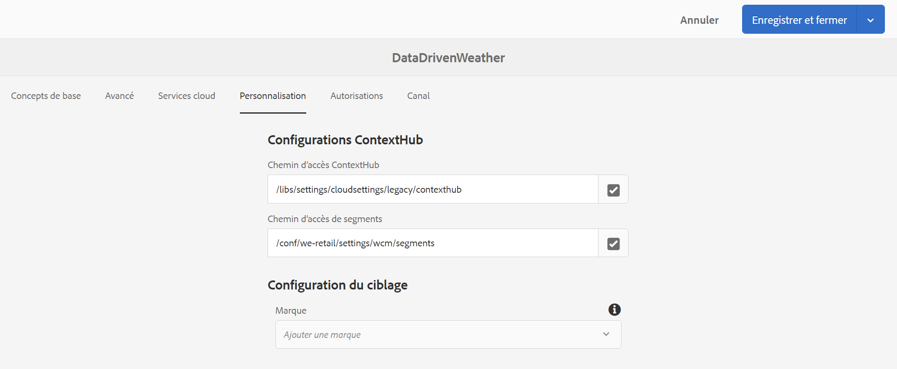

# Activation de la température pour une agence de voyages {#travel-center-temperature-activation}

Le cas d’utilisation suivant illustre l’utilisation de l’activation de la température locale de l’agence de voyages en fonction des valeurs renseignées dans Google Sheets.

## Description {#description}

Pour ce cas d’utilisation, si la valeur dans Google Sheets est inférieure à 50, une image avec des boissons chaudes s’affiche. Si la valeur est supérieure ou égale à 50, une image avec des boissons fraîches s’affiche. Si la valeur est différente ou s’il n’y a aucune valeur, le lecteur affiche une image par défaut.

## Prérequis {#preconditions}

Avant de commencer à implémenter l’activation de la température locale de l’agence de voyages, vous devez apprendre à configurer le ***Magasin de données***, la ***Segmentation d’audience*** et ***Activer le ciblage pour les canaux*** dans un projet AEM Screens.

Consultez [Configuration de ContextHub dans AEM Screens](configuring-context-hub.md) pour plus d’informations.

## Flux de base {#basic-flow}

Suivez les étapes ci-dessous pour mettre en œuvre le cas d’utilisation de l’activation de température locale de l’agence de voyages :

1. **Remplissage des feuilles de calcul Google Sheets**

   1. Accédez à la feuille de calcul Google appelée ContextHubDemo.
   1. Ajoutez une colonne **`Heading1`** avec la valeur de température correspondante.

   

1. **Configuration des segments dans les audiences selon les besoins**

   1. Accédez aux segments de votre audience (reportez-vous à l’***Étape 2 : configuration de la segmentation de l’audience*** dans la page **[Configuration de ContextHub dans AEM Screens](configuring-context-hub.md)** pour plus d’informations).

   1. Sélectionnez **Sheets A1 1** et cliquez sur **Modifier**.

   1. Cliquez sur la comparaison de la propriété, puis sur l’icône de configuration.
   1. Sélectionnez **googlesheets/value/1/0** dans la liste déroulante **Nom de la propriété**.

   1. Sélectionnez l’**opérateur** **supérieur ou égal à** dans le menu déroulant.

   1. Saisissez la **valeur** **50**

   1. De la même manière, sélectionnez **Sheets A1 2** et cliquez sur **Modifier**.

   1. Cliquez sur la **comparaison Propriété - Valeur** et sélectionnez l’icône de configuration.
   1. Sélectionnez **googlesheets/value/1/0** dans la liste déroulante **Nom de la propriété**.

   1. Sélectionnez l’**opérateur** **inférieur à** dans le menu déroulant.

   1. Saisissez la **valeur** **50**

1. Naviguez et sélectionnez votre canal (), puis cliquez sur **Modifier** dans la barre d’actions. Dans l’exemple ci-dessous, **DataDrivenWeather**, la fonctionnalité est illustrée au moyen d’un canal de séquence.

   >[!NOTE]
   >
   >Votre canal doit déjà comporter une image par défaut et les audiences doivent être préconfigurées comme décrit dans [Configuration de ContextHub dans AEM Screens](configuring-context-hub.md).

   

   >[!CAUTION]
   >
   >Vos **configurations** **ContextHub** utilisant l’onglet de canal **Propriétés** > **Personnalisation** doivent déjà être configurées.

   

1. Sélectionnez **Ciblage** dans l’éditeur. Sélectionnez ensuite la **Marque** et l’**Activité** dans le menu déroulant, puis cliquez sur **Commencer le ciblage**.

   

1. **Vérification de l’aperçu**

   1. Cliquez sur **Aperçu.** Ouvrez également votre feuille de calcul Google Sheet et mettez à jour sa valeur.
   1. Définissez une valeur inférieure à 50. Vous pouvez afficher une image d’une boisson froide. Si la valeur dans Google Sheets est supérieure ou égale à 50, une image de boisson chaude doit s’afficher.

   
