# Création et gestion des canaux {#creating-and-managing-channels}

Un Canal affiche une séquence de contenu (images et vidéos) et affiche également un site Web ou une application d’une seule page.

Cette page présente la création et la gestion de canaux pour AEM Screens.

**Conditions préalables** :

* [Configuration et déploiement de Screens](configuring-screens-introduction.md)
* [Création et gestion de projet Screens](creating-a-screens-project.md)

## Création d’un canal {#creating-a-new-channel}

Une fois le projet AEM Screens créé, suivez les étapes ci-dessous pour lui créer un canal :

1. Sélectionnez le lien Adobe Experience Manager (en haut à gauche), puis Screens. Vous pouvez également accéder directement à `https://localhost:4502/screens.html/content/screens`.

1. Accédez à votre projet Screens et sélectionnez le dossier **Canaux**.

1. Cliquez sur **Créer** dans la barre d’actions.

   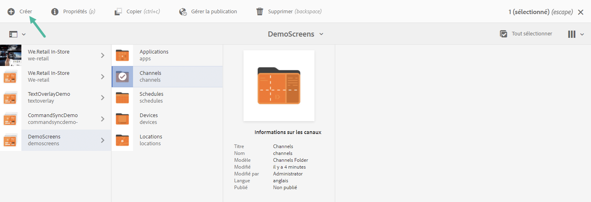

1. Sélectionnez le modèle **Canal de séquence** dans l’assistant **Créer** et cliquez sur **Suivant**.

   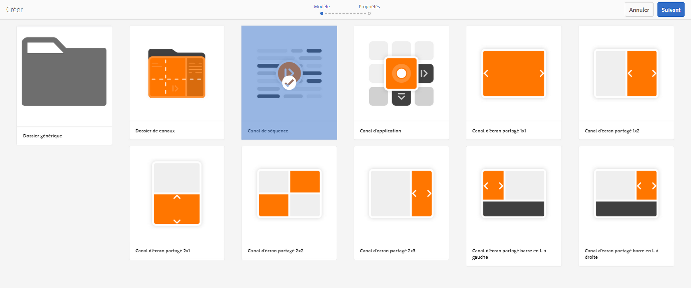

1. Saisissez le titre **ScreensChannel** et cliquez sur **Créer**.

   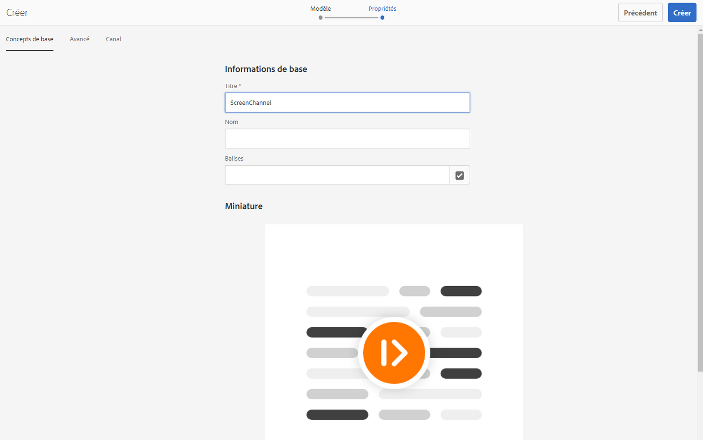

1. Un canal de séquence est maintenant ajouté à votre dossier **Canaux**.

### Types de canaux  {#channel-types}

Les options de modèles suivantes sont disponibles avec l’assistant :

| **Option de modèle** | **Description** |
|---|---|
| Dossier de canaux | Permet de créer un dossier où stocker une collection de canaux. |
| Canal de séquence | Permet de créer un canal qui lit les composants de manière séquentielle (l’un après l’autre comme une série de diapositives). |
| Canal d’application | Permet de présenter votre application web personnalisée dans le lecteur Screens. |
| Canal d’écran partagé 1x1 | Permet d’afficher le composant dans une seule zone. |
| Canal d’écran partagé 1x2 | Permet d’afficher les ressources dans deux zones (division horizontale).. |
| Canal d’écran partagé 2x1 | Permet d’afficher les ressources dans deux zones (division verticale).. |
| Canal d’écran partagé 2x2 | Permet d’afficher les ressources dans quatre zones (division horizontale et verticale dans une matrice).. |
| Canal d’écran partagé 2x3 | Permet d’afficher les ressources dans deux zones (division horizontale) où l’une des zones est plus grande que l’autre. |
| Canal d’écran partagé barre en L gauche ou droite | Permet aux auteurs de contenus d’afficher différents types de ressources dans des zones de taille appropriée. |

>[!NOTE]
>
>Les canaux d’écran partagé divisent l’affichage en plusieurs zones, ce qui permet de lire plusieurs expériences simultanément, côte à côte. Les expériences peuvent être des ressources/du texte statiques ou des séquences incorporées.

>[!IMPORTANT]
>
> Une fois que vous avez créé et ajouté du contenu au canal, l’étape suivante consiste à créer un emplacement et ensuite un affichage. En outre, vous devez attribuer ce canal à un affichage. Consultez les ressources ci-dessous à la fin de la section pour en savoir plus.

## Utilisation des canaux {#working-with-channels}

Vous pouvez modifier, copier, prévisualiser, supprimer un canal, et afficher ses propriétés et son tableau de bord.

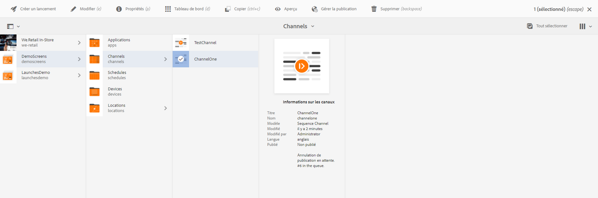

### Ajout de contenu à un canal et modification de ce contenu {#adding-editing-content-to-a-channel}

Pour ajouter du contenu à un canal ou modifier son contenu, suivez les étapes ci-dessous :

1. Sélectionnez le canal à modifier (comme illustré ci-dessus).
1. Cliquez sur **Modifier** dans l’angle supérieur gauche de la barre d’actions pour modifier les propriétés du canal. L’éditeur s’ouvre pour vous permettre d’ajouter au canal des ressources/composants que vous souhaitez publier.

>[!NOTE]
>Vous pouvez ajouter des composants à votre canal. Voir **[Ajout de composants à un canal](adding-components-to-a-channel.md)** pour en savoir plus.

**Chargement de vidéos vers le canal**

Suivez les étapes ci-dessous pour charger des vidéos vers votre canal :

1. Sélectionnez le canal vers lequel transférer la vidéo.
1. Cliquez sur **Modifier** dans la barre d’actions pour ouvrir l’éditeur.
1. Sélectionnez **Vidéos** sous Ressources, puis faites glisser les vidéos choisies.

>[!NOTE]
>Si vous rencontrez des problèmes lors du transfert des vidéos vers votre canal, reportez-vous à la section [Dépannage des vidéos](troubleshoot-videos.md).

### Affichage des propriétés {#viewing-properties}

Pour afficher ou modifier les propriétés d’un canal, suivez les étapes ci-dessous :

1. Cliquez sur le canal à modifier.
1. Cliquez sur **Propriétés** dans la barre d’actions pour afficher ou modifier les propriétés du canal. Les onglets suivants vous permettent de modifier les options.

### Affichage du tableau de bord {#viewing-dashboard}

Pour afficher le tableau de bord d’un canal, suivez les étapes ci-dessous :

1. Sélectionnez le canal à modifier.
1. Cliquez sur **Tableau de bord** dans la barre d’actions pour afficher le tableau de bord. Les panneaux **INFORMATIONS SUR LES CANAUX**, **AFFICHAGES ATTRIBUÉS** et **LANCEMENTS EN ATTENTE** s’ouvrent, comme illustré ci-dessous :

### Informations sur le canal {#channel-information}

Le panneau Informations sur le canal fournit une description des propriétés ainsi qu’un aperçu du canal. Il vous permet également de voir si le canal est en ligne ou hors ligne.

Cliquez sur l’icône (**...**) dans la barre d’actions **INFORMATIONS SUR LES CANAUX** pour afficher les propriétés, modifier le contenu ou mettre à jour la mémoire cache (contenu hors ligne) du canal.

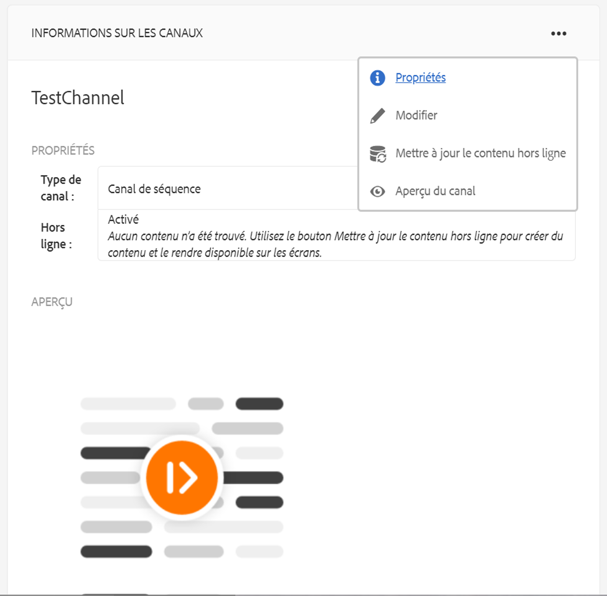

#### Affichage du manifeste {#view-manifest}

Vous pouvez afficher le manifeste à partir du tableau de bord des canaux.

>[!IMPORTANT]
>Cette option est disponible uniquement avec AEM 6.4 Feature Pack 8 ou AEM 6.5 Feature Pack 4.

Procédez comme suit pour activer cette option à partir du tableau de bord des canaux :

1. **Définir le canal sur Hors ligne**
   1. Sélectionnez le canal et choisissez **Propriétés** dans la barre d’actions.
   1. Accédez à l’onglet **Canal** et assurez-vous de désélectionner l’option **Mode développeur (forcer le canal à être en ligne)**.
   1. Cliquez sur **Enregistrer et fermer**
1. **Mettre à jour le contenu hors ligne**
   1. Sélectionnez le canal et choisissez **Tableau de bord** dans la barre d’actions.
   1. Accédez au panneau **INFORMATIONS SUR LES CANAUX** et cliquez sur *...*
   1. Cliquez sur **Mettre à jour le contenu hors ligne**.

You should see the **View Manifest** option from the **CHANNEL INFORMATION** panel in the Channel dashboard.

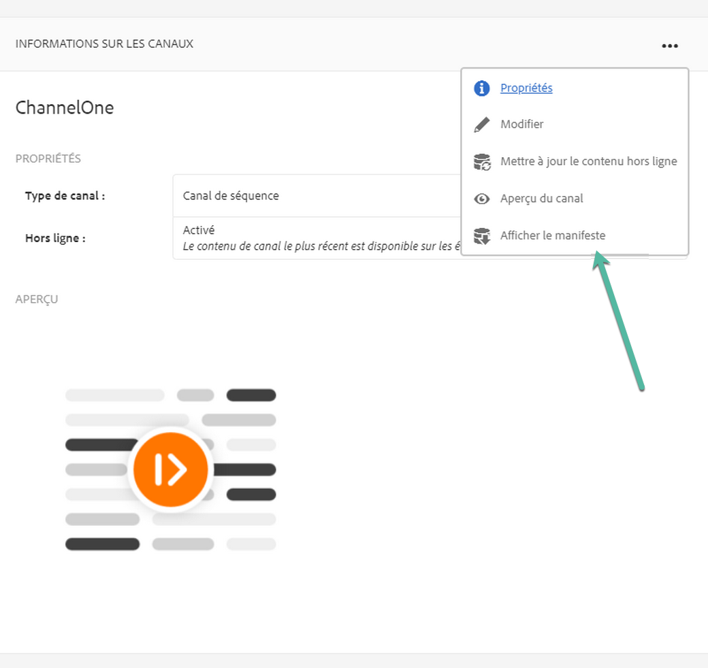

### Canaux en ligne et hors ligne {#online-and-offline-channels}

>[!NOTE]
>Par défaut, lorsque vous créez un canal, il est hors ligne.

Lorsque vous créez un canal, il peut être défini comme étant en ligne ou hors ligne.

Un ***canal en ligne*** affiche le contenu mis à jour dans l’environnement en temps réel, alors qu’un ***canal hors ligne*** affiche le contenu en mémoire cache.

Suivez les étapes ci-dessous pour que le canal soit en ligne :

1. Accédez au canal en sélectionnant **TestProject** > **Canaux** > **TestChannel**.

   Sélectionnez le canal.

   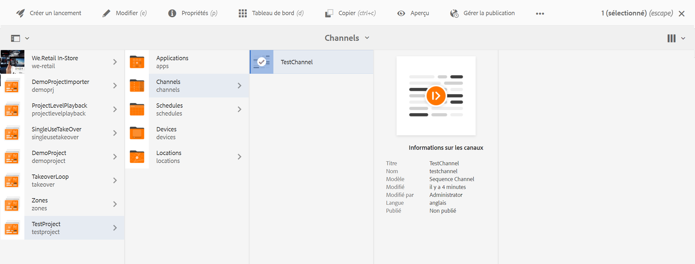

   Cliquez sur **Tableau de bord** dans la barre d’actions pour afficher le statut du lecteur. Le panneau **INFORMATIONS SUR LES CANAUX** indique si le canal est en ligne ou hors ligne.

   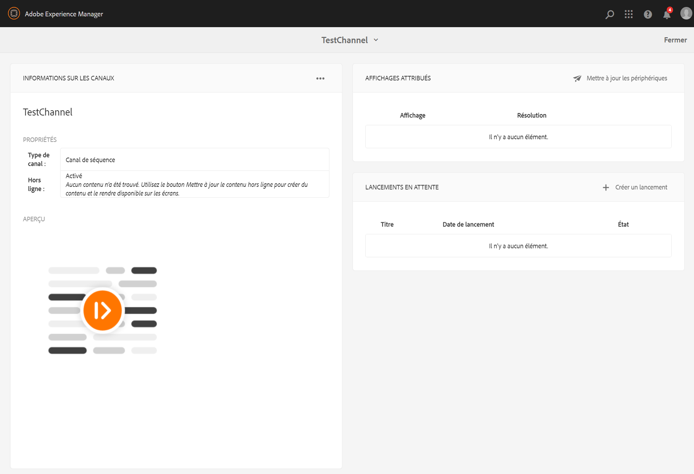

1. Cliquez sur **Propriétés** dans la barre d’actions et accédez à l’onglet **Canal** comme illustré ci-dessous :

   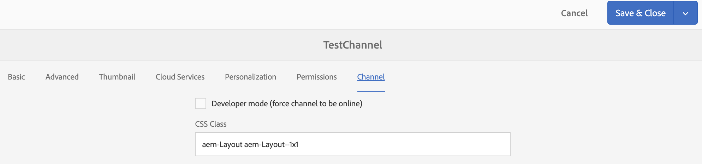

1. Vérifiez le mode **Développeur** **(forcer le canal à être en ligne)** pour que le canal soit en ligne.

   Cliquez sur **Enregistrer et Fermer** pour enregistrer.

   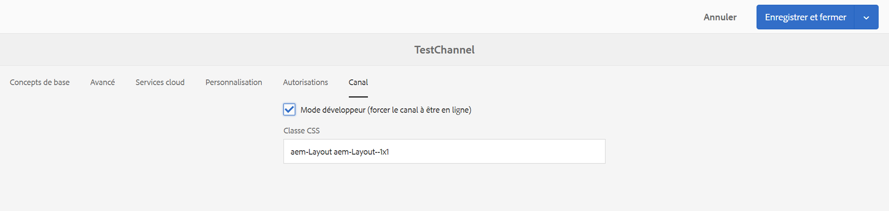

   Retournez sur le tableau de bord des canaux. Vous pouvez alors voir le statut en ligne du lecteur dans le panneau **INFORMATIONS SUR LE CANAL**.

   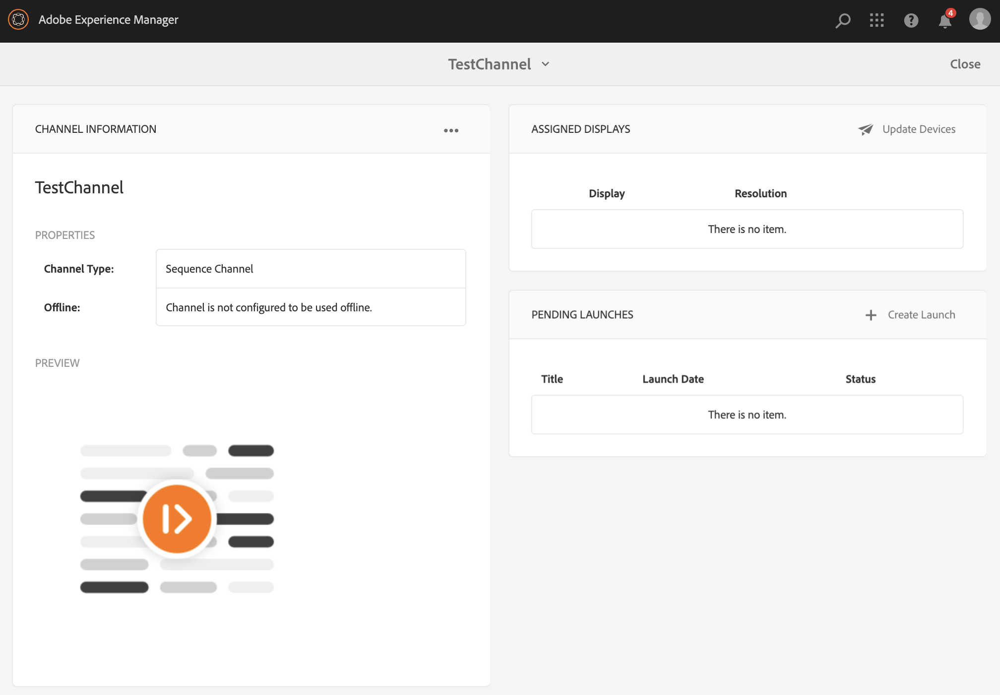

>[!NOTE]
>Si vous souhaitez reconfigurer votre canal pour le mettre hors ligne, décochez l’option Mode développeur dans l’onglet **Propriétés** (comme indiqué à l’étape (3)), puis, dans le panneau **INFORMATIONS SUR LE CANAL**, cliquez sur **Mettre à jour le contenu hors ligne**, comme illustré dans la figure ci-dessous.

#### Mises à jour automatiques ou manuelles depuis le tableau de bord du périphérique. {#automatic-versus-manual-updates-from-the-device-dashboard}

Le tableau suivant répertorie les événements associés aux mises à jour automatiques ou manuelles depuis le tableau de bord du périphérique.

<table>
 <tbody>
  <tr>
   <td><strong>Événement</strong></td>
   <td><strong>Mise à jour automatique de l’appareil</strong></td>
   <td><strong>Mise à jour manuelle de l’appareil</strong></td>
  </tr>
  <tr>
   <td>Changement de canal en ligne</td>
   <td>Contenu mis à jour automatiquement</td>
   <td>
Contenu mis à jour sur "Périphérique : Configuration Push"
 
Ou,
 
Contenu mis à jour sur <strong><i>Appareil : Redémarrer</i></strong>
 </td>
  </tr>
  <tr>
   <td>Changement du canal hors ligne, mais le "contenu Push" du canal n’est PAS déclenché (aucune recréation du package hors ligne)</td>
   <td>Aucune mise à jour de contenu</td>
   <td>Aucune mise à jour de contenu</td>
  </tr>
  <tr>
   <td>Changement dans le canal hors ligne et le "contenu Push" du canal est déclenché (nouveau package hors ligne)</td>
   <td>Contenu mis à jour automatiquement</td>
   <td>
Contenu mis à jour sur <strong><i>Appareil : Configuration Push</i></strong>
 
Ou,
 
Contenu mis à jour sur <strong><i>Appareil : Redémarrer</i></strong>
 </td>
  </tr>
  <tr>
   <td>
Changement de configuration

    <ul>
     <li>Affichage (canal forcé)</li>
     <li>Périphérique</li>
     <li>Affectations de canal (nouveau canal, canal supprimé)</li>
     <li>Affectation de canal (rôle, événement, planification)</li>
    </ul> </td>
   <td>Configuration mise à jour automatiquement</td>
   <td>
Configuration mise à jour sur <strong><i>Appareil : Configuration Push</i></strong>
 
Ou,
 
Configuration mise à jour sur <strong><i>Appareil : Redémarrer</i></strong>
 </td>
  </tr>
 </tbody>
</table>

### Affichages attribués {#assigned-displays}

Le panneau des affichages attribués indique quel affichage est associé à quel canal. Il fournit un instantané de l’affichage attribué et de sa résolution.

Les affichages attribués sont affichés dans le panneau **Affichages attribués** comme illustré ci-dessous :

>[!NOTE]
>Pour en savoir plus sur la création d’un affichage dans un emplacement, consultez :
>
>* [Création et gestion des emplacements](managing-locations.md)
>* [Création et gestion des affichages](managing-displays.md)

>

Cliquez ensuite sur l’affichage dans le panneau **AFFICHAGES ATTRIBUÉS** pour voir les informations relatives à l’affichage, comme illustré ci-dessous :

### Étapes suivantes {#the-next-steps}

Une fois que vous savez créer un canal, lui ajouter du contenu et modifier ce contenu, l’étape suivante consiste à découvrir comment créer un emplacement et un affichage, ainsi qu’à attribuer un canal à cet affichage.

Consultez les ressources ci-après pour les étapes suivantes :

* [Création et gestion des canaux](managing-channels.md)
* [Création et gestion des emplacements](managing-locations.md)
* [Création et gestion des affichages](managing-displays.md)

