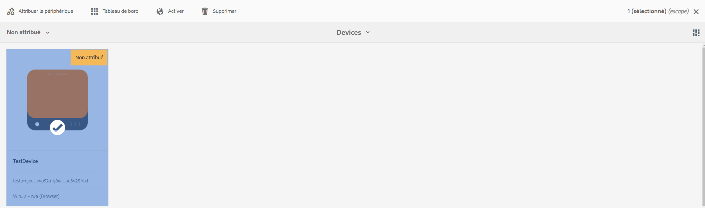
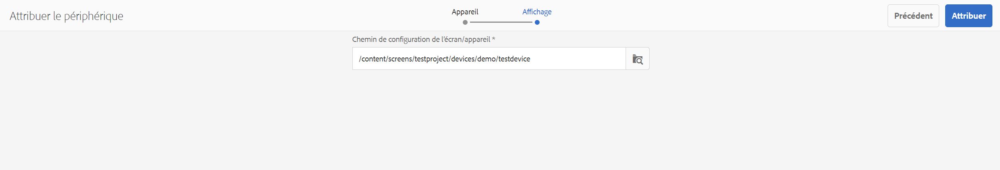
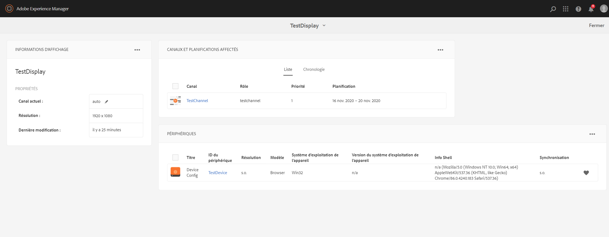
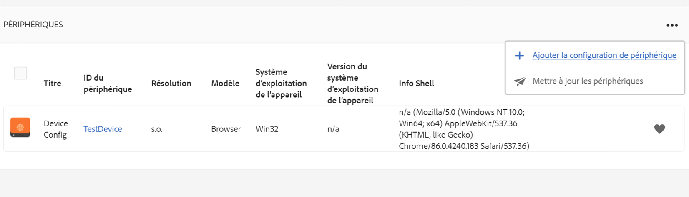
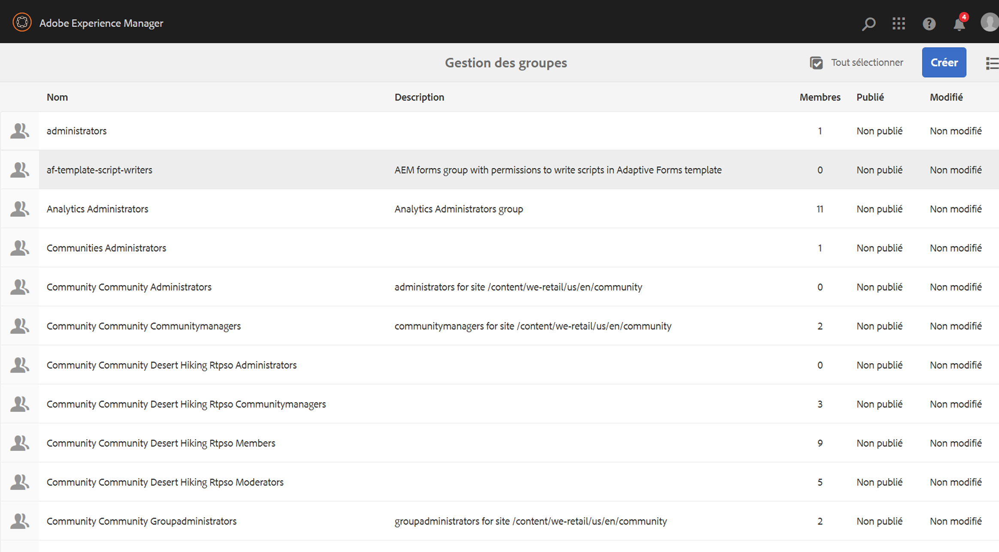

# Gestion des périphériques {#managing-devices}

Cette page décrit la procédure d’attribution des périphériques.

La console Périphériques vous permet d’accéder au gestionnaire de périphériques afin d’attribuer votre périphérique à un affichage.

>[!CAUTION]
>
>Avant d’attribuer votre périphérique, vous devez l’enregistrer. Pour plus d’informations, reportez-vous à la section [Enregistrement des périphériques](device-registration.md).

## Attribution des appareils {#device-assignment}

Suivez les étapes ci-dessous pour attribuer un périphérique à un affichage :

1. Accédez au dossier Périphériques de votre projet, par exemple :

   `http://localhost:4502/screens.html/content/screens/TestProject`

   

1. Sélectionnez votre dossier **Périphériques** et appuyez ou cliquez ensuite sur **Gestionnaire de périphériques** dans la barre d’actions. Les périphériques attribués et non attribués s’affichent.

   

1. Sélectionnez un périphérique non attribué dans la liste et appuyez/cliquez sur **Attribuer le périphérique** dans la barre d’actions.

   

1. Sélectionnez l’affichage auquel vous voulez attribuer le périphérique dans la liste, puis appuyez/cliquez sur le bouton **Attribuer**.

   

1. Appuyez/cliquez sur **Terminer** pour terminer la procédure d’attribution.

   Le tableau de bord des affichages montre le périphérique attribué dans le volet **PÉRIPHÉRIQUES**.

   

   Cliquez sur (**...**) en haut à droite du panneau **PÉRIPHÉRIQUES** pour ajouter une configuration de périphérique ou mettre à jour les périphériques.

   

>[!NOTE]
>
>Chaque fois que vous ajoutez un premier périphérique à un nouveau projet Screens, un groupe d’utilisateurs est créé.
>Par exemple, si le nom du nœud de projet est *we-retail*, le nom du groupe d’utilisateurs est *screens-we-retail-devices*.
>Ce groupe est ajouté en tant que membre au groupe **Contributeurs**, comme illustré dans la figure ci-dessous :

### Étapes suivantes {#the-next-steps}

Une fois que vous êtes familiarisé avec la procédure d’attribution d’un canal à un affichage, consultez les ressources suivantes :

* [Contrôle et dépannage](monitoring-screens.md)

