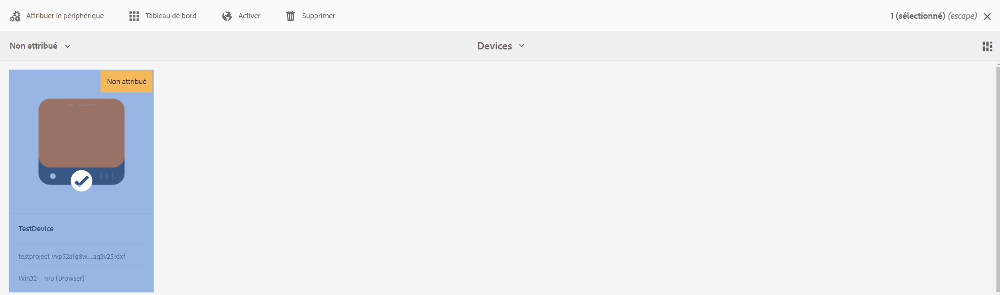
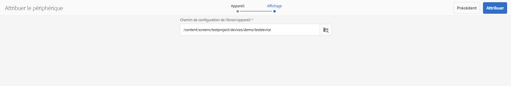
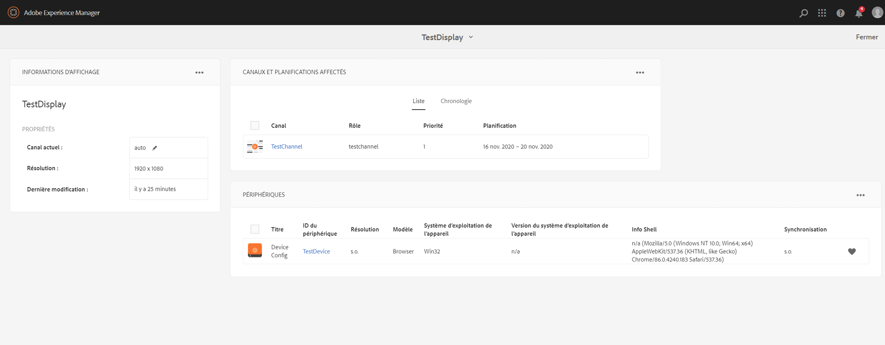
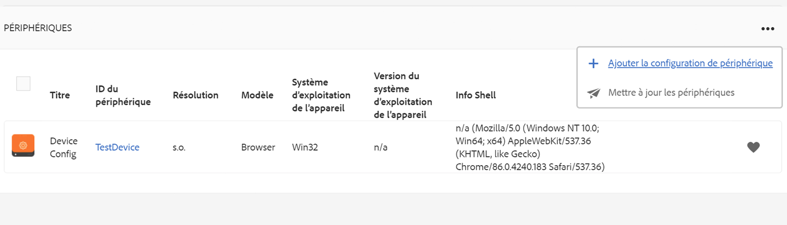
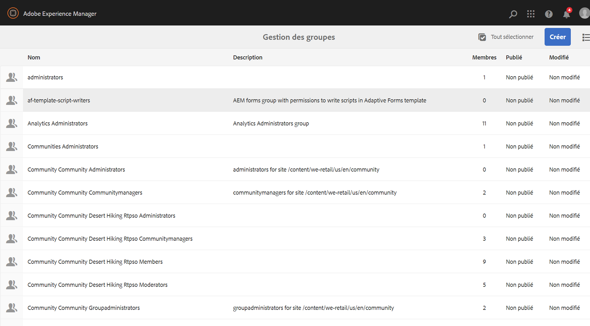

# Gestion des appareils {#managing-devices}

Cette page décrit la procédure d’attribution des appareils.

La console Appareils vous permet d’accéder au gestionnaire de périphériques afin d’attribuer votre appareil à un affichage.

>[!CAUTION]
>
>Avant d’attribuer votre appareil, enregistrez-le. Voir [Enregistrement des appareils](device-registration.md).

## Attribution des appareils {#device-assignment}

Suivez les étapes ci-dessous pour attribuer un appareil à un affichage :

1. Accédez au dossier Appareils de votre projet, par exemple :

   `http://localhost:4502/screens.html/content/screens/TestProject`

   

1. Cliquez sur votre dossier **Appareils** et sur **Gestionnaire de périphériques** dans la barre d’actions. Les appareils attribués et non attribués s’affichent.

   

1. Cliquez sur un appareil non affecté dans la liste, puis, dans la barre d’actions, cliquez sur **Attribuer un appareil**.

   

1. Cliquez sur l’affichage auquel vous voulez attribuer l’appareil dans la liste, puis sur le bouton **Attribuer**.

   

1. Cliquez sur **Terminer** pour terminer le processus d’attribution.

   Le tableau de bord des affichages montre l’appareil attribué dans le volet **APPAREILS**.

   

   Cliquez sur (**...**) dans le coin supérieur droit du panneau **APPAREILS** pour ajouter la configuration de l’appareil ou mettre à jour les appareils.

   

>[!NOTE]
>
>Chaque fois que vous ajoutez un premier appareil à un nouveau projet Screens, un groupe d’utilisateurs est créé.
>Par exemple, si le nom du nœud de projet est *we-retail*, le nom du groupe d’utilisateurs est *screens-we-retail-devices*.
>Ce groupe est ajouté en tant que membre au groupe **Contributeurs et contributrices**, comme illustré ci-dessous :

### Étapes suivantes {#the-next-steps}

Une fois que la procédure d’attribution d’un canal à un affichage n’a plus de secret pour vous, consultez [Surveiller et résoudre les problèmes](monitoring-screens.md).
