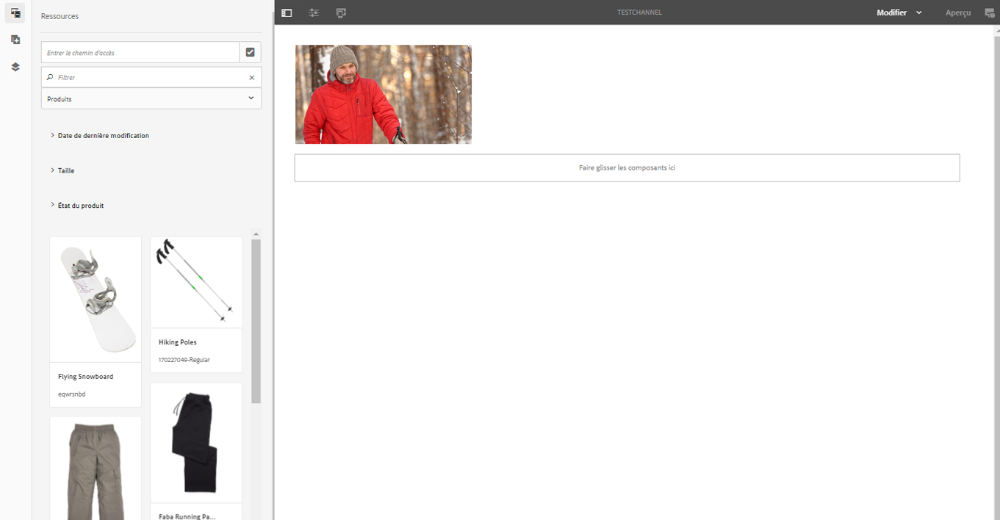
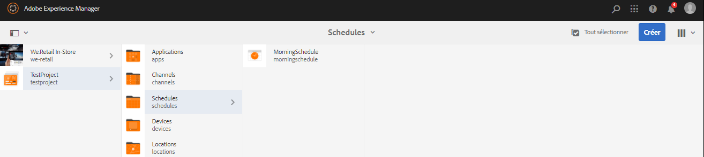

# Création et gestion des affichages {#creating-and-managing-displays}

Un affichage est un groupe virtuel d’écrans généralement positionnés les uns à côté des autres. L’affichage est en général permanent dans une installation. C’est l’objet avec lequel les auteurs de contenu travaillent. Ils le désignent par ailleurs toujours par le terme d’affichage logique pour le distinguer de ses équivalents physiques.

Une fois que vous avez créé un emplacement, vous devez créer un affichage pour celui-ci.

Vous découvrirez dans cette page comment créer et gérer des affichages pour Screens.

**Conditions préalables** :

* [Configuration et déploiement de Screens](configuring-screens-introduction.md)
* [Création et gestion de projet Screens](creating-a-screens-project.md)
* [Création et gestion des canaux](managing-channels.md)
* [Création et gestion des emplacements](managing-locations.md)

## Création d’un affichage {#creating-a-new-display}

>[!NOTE]
>
>Vous devez créer un emplacement avant de créer un affichage. Pour savoir comment créer un emplacement, voir [Création et gestion des emplacements](managing-locations.md) pour plus d’informations.

Pour créer un affichage dans votre emplacement, suivez les étapes ci-dessous.

1. Accédez à l’emplacement souhaité, par exemple `http://localhost:4502/screens.html/content/screens/TestProject`.
1. Sélectionnez votre dossier d’emplacements, puis appuyez ou cliquez sur **Créer** en regard de l’icône « + » dans la barre d’actions. Un assistant s’ouvre.
1. Sélectionnez **Affichage** à partir de l’assistant **Créer** et cliquez sur **Suivant**.

1. Saisissez le **nom** et le **titre** de l’emplacement de l’affichage.

1. Dans l’onglet **Affichage**, sélectionnez les détails de la mise en page. Sélectionnez la **résolution** souhaitée (par exemple, **Full HD**). Vous pouvez également sélectionner le nombre de périphériques horizontalement et verticalement.

1. Cliquez sur **Créer**.

L’affichage (*StoreDisplay*) est créé et ajouté à l’affichage de l’emplacement (*SanJose*).

Une fois que l’affichage est en place, l’étape suivante est de créer une configuration de périphérique pour cet affichage. Suivez la section ci-dessous pour créer une configuration de périphérique.

>[!NOTE]
>
>**La prochaine étape** :
>
>Une fois que vous avez créé un affichage pour votre emplacement, vous devez attribuer un canal à votre affichage de façon à exploiter le contenu.
>
>Voir [Attribution de canaux](channel-assignment.md) pour savoir comment attribuer un canal à l’affichage.

## Création d’une configuration de périphérique {#creating-a-new-device-config}

Une configuration de périphérique fonctionne comme un espace réservé pour un périphérique d’affichage numérique qui n’est pas encore installé.

Suivez les étapes ci-dessous pour créer une configuration de périphérique.

1. Accédez à l’affichage souhaité, par exemple `http://localhost:4502/screens.html/content/screens/TestProject/locations/newlocation`.
1. Sélectionnez votre dossier d’affichage et appuyez ou cliquez ensuite sur **Afficher le tableau de bord** dans la barre d’actions.
1. Appuyez/cliquez sur **+ Ajouter la configuration de périphériques** en haut à droite du panneau **Périphériques**.

1. Sélectionnez **Configuration du périphérique** comme modèle requis, puis appuyez/cliquez sur **Suivant**.

1. Saisissez les propriétés demandées, puis appuyez ou cliquez sur **Créer**.

La configuration du périphérique est créée et ajoutée à l’affichage en cours (dans la démonstration suivante, la nouvelle configuration du périphérique s’appelle *DeviceConfig*).

Une fois que vous avez ajouté la configuration de périphérique à votre affichage dans l’emplacement, l’étape suivante est d’attribuer un canal à votre affichage.

>[!NOTE]
>
>Une fois que vous avez ajouté la configuration de périphérique à votre affichage dans l’emplacement, l’étape suivante est d’attribuer un canal à votre affichage.
>
>Comme illustré dans la figure ci-dessous, si la configuration du périphérique est affichée comme non attribuée dans le volet **PÉRIPHÉRIQUES**, aucun canal n’est attribué à cette configuration du périphérique.
>
>Vous devez d’abord comprendre comment créer et gérer des canaux. Voir [Création et gestion des canaux](managing-channels.md) pour en savoir plus.

## Tableau de bord des affichages {#display-dashboard}

Le tableau de bord des affichages présente plusieurs panneaux pour gérer les périphériques d’affichage et la configuration de votre périphérique.

>[!NOTE]
>
>Vous pouvez sélectionner les listes de tableaux de bord et déclencher des actions en masse sur des éléments, au lieu de passer par chaque élément individuellement.
>
>Par exemple, l’illustration suivante montre comment vous pouvez sélectionner plusieurs canaux à partir du tableau de bord.

### Panneau Informations d’affichage {#display-information-panel}

Le panneau **INFORMATIONS D’AFFICHAGE** affiche les propriétés de l’affichage.

Cliquez sur (**...**) en haut à droite du panneau **INFORMATIONS D’AFFICHAGE** pour afficher les propriétés et un aperçu de l’affichage.

#### Affichage des propriétés {#viewing-properties}

Cliquez sur **Propriétés** pour afficher ou modifier les propriétés de votre affichage.

Vous pouvez également régler la valeur du retardateur d’événements pour votre canal interactif dans la propriété **Délai d’inactivité** sous l’onglet **Affichage**. Par défaut, cette valeur est définie sur *300 secondes*.

Utilisez **CRXDE Lite** pour accéder à la propriété **idleTimeout**, à savoir `http://localhost:4502/crx/de/index.jsp#/content/screens/we-retail/locations/demo/flagship/single/jcr%3Acontent/channels`.

### Panneau Canaux attribués {#assigned-channels-panel}

Le panneau **CANAUX ATTRIBUÉS** affiche les canaux attribués à cet périphérique.

### Panneau Périphériques {#devices-panel}

Le panneau **PÉRIPHÉRIQUES** fournit des informations sur les configurations des périphériques.

Cliquez sur (**...**) en haut à droite du panneau **APPAREILS** pour ajouter des configurations d’appareils ou mettre à jour les appareils.

Cliquez sur la configuration du périphérique pour en afficher les propriétés, l‘attribuer ou le supprimer.

#### Étapes suivantes {#the-next-steps}

Une fois que vous avez créé un affichage pour votre emplacement, vous devez lui attribuer un canal.

Reportez-vous à la section [Attribution des canaux](channel-assignment.md) pour plus de détails.
