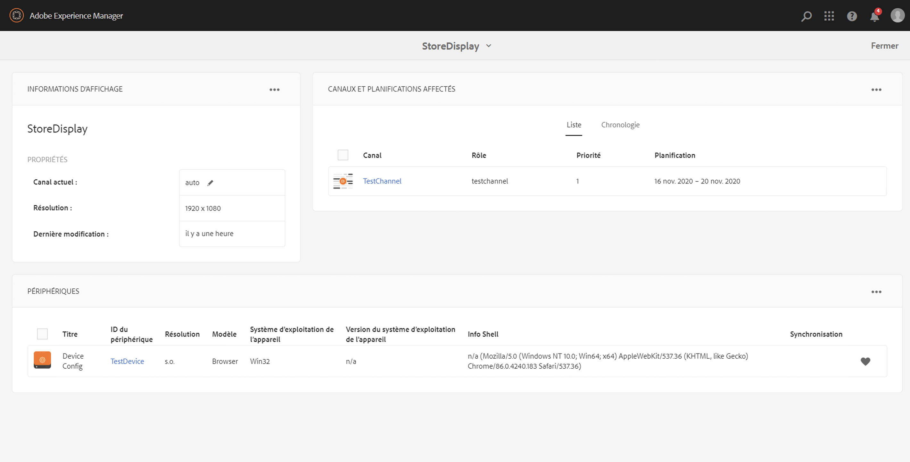

# Création et gestion des affichages {#creating-and-managing-displays}

Un affichage est un groupe virtuel d’écrans positionnés les uns à côté des autres. L’affichage est généralement permanent par rapport à une installation. Les auteurs et autrices utilisent ce contenu d’objet et s’y réfèrent toujours en tant qu’affichage logique plutôt qu’à leurs équivalents physiques.

Lorsque vous avez créé un emplacement, vous devez créer un affichage pour cet emplacement.

Vous découvrirez dans cette page comment créer et gérer des affichages pour Screens.

**Conditions préalables** :

* [Configuration et déploiement de Screens](configuring-screens-introduction.md)
* [Création et gestion de projet Screens](creating-a-screens-project.md)
* [Création et gestion des canaux](managing-channels.md)
* [Création et gestion des emplacements](managing-locations.md)

## Création d’un affichage {#creating-a-new-display}

>[!NOTE]
>
>Créez un emplacement avant de créer un affichage. Voir [Création et gestion des emplacements](managing-locations.md) pour plus d’informations.

1. Accédez à l’emplacement souhaité, par exemple `http://localhost:4502/screens.html/content/screens/TestProject`.
1. Cliquez sur votre dossier d’emplacements, puis sur **Créer** en regard de l’icône « + » dans la barre d’actions.
1. Cliquez sur **Affichage** à partir de l’assistant **Créer**, puis sur **Suivant**.
1. Saisissez le **Nom** et le **Titre** de l’emplacement de l’affichage.
1. Dans l’onglet **Affichage**, sélectionnez les détails de la mise en page. Choisissez la **résolution** souhaitée, par exemple, **Full HD**. Choisissez le nombre d’appareils horizontalement et verticalement.
1. Cliquez sur **Créer**.

L’affichage (*StoreDisplay*) est créé et ajouté à l’affichage de l’emplacement (*SanJose*).

Lorsque l’affichage est en place, l’étape suivante consiste à créer une configuration d’appareil pour cet affichage.

>[!NOTE]
>
>**Prochaine étape** :
>
>Lorsque vous créez un affichage pour votre emplacement, attribuez-lui un canal pour utiliser le contenu.
>
>Voir la section [Attribuer des canaux](channel-assignment.md) pour savoir comment attribuer un canal à l’affichage.

## Création d’une configuration d’appareil {#creating-a-new-device-config}

Une configuration d’appareil fonctionne comme un espace réservé pour un appareil de signalétique numérique qui n’est pas encore installé.

1. Accédez à l’affichage souhaité, par exemple `http://localhost:4502/screens.html/content/screens/TestProject/locations/newlocation`.
1. Cliquez sur votre dossier d’affichage, puis sur **Afficher le tableau de bord** dans la barre d’actions.
1. Cliquez sur **+ Ajouter la configuration de l’appareil** en haut à droite du panneau **Appareils**.

1. Cliquez sur le modèle **Configuration de l’appareil** comme modèle requis, puis sur **Suivant**.

1. Saisissez les propriétés demandées, puis cliquez sur **Créer**.

La configuration de l’appareil est créée et ajoutée à l’affichage en cours (dans la démonstration suivante, la nouvelle configuration de l’appareil s’appelle *DeviceConfig*).

>[!NOTE]
>
>Lorsque vous avez ajouté la configuration d’appareil à votre affichage dans l’emplacement, l’étape suivante est d’attribuer un canal à votre affichage.
>
>Comme illustré ci-dessous, si la configuration de l’appareil est affichée comme non attribuée dans le panneau **APPAREILS**, aucun canal n’est attribué à cette configuration de l’appareil.
>
>Vous devez d’abord comprendre comment créer et gérer des canaux. Voir [Création et gestion des canaux](managing-channels.md) pour en savoir plus.

## Tableau de bord des affichages {#display-dashboard}

Le tableau de bord des affichages vous fournit différents panneaux pour la gestion des appareils d’affichage. Il vous permet également de configurer votre appareil.

>[!NOTE]
>
>Vous pouvez cliquer sur les listes du tableau de bord et déclencher des actions en masse sur les éléments, au lieu de parcourir chaque élément individuellement.
>
>Par exemple, l’image suivante montre comment cliquer sur plusieurs canaux à partir du tableau de bord d’affichage.

### Panneau Informations d’affichage {#display-information-panel}

Le panneau **INFORMATIONS D’AFFICHAGE** affiche les propriétés de l’affichage.

Cliquez sur les points de suspension (**...**) dans le coin supérieur droit du panneau **INFORMATIONS SUR L’AFFICHAGE** pour pouvoir afficher les propriétés et un aperçu de l’affichage.

#### Afficher des propriétés {#viewing-properties}

Cliquez sur **Propriétés** pour pouvoir afficher ou modifier les propriétés de votre affichage.

Vous pouvez également régler la valeur du retardateur d’événements pour votre canal interactif sous l’onglet **Affichage**. Par défaut, cette valeur est définie sur *300 secondes*.

Utilisez **CRXDE Lite** pour accéder à la propriété **idleTimeout**, à savoir `http://localhost:4502/crx/de/index.jsp#/content/screens/we-retail/locations/demo/flagship/single/jcr%3Acontent/channels`.

### Panneau Canaux attribués {#assigned-channels-panel}

Le panneau **CANAUX ATTRIBUÉS** affiche les canaux attribués à cet appareil.

### Panneau Appareils {#devices-panel}

Le panneau **APPAREILS** fournit des informations sur les configurations des appareils.

Cliquez sur les points de suspension (**…**) dans le coin supérieur droit du panneau **APPAREILS** pour pouvoir ajouter des configurations d’appareil et mettre à jour les appareils.

Cliquez également sur la configuration de l’appareil pour afficher les propriétés, attribuer un appareil ou le supprimer.

#### Étapes suivantes {#the-next-steps}

Lorsque vous avez créé un affichage pour votre emplacement, attribuez-lui un canal.

Reportez-vous à la section [Attribution des canaux](channel-assignment.md) pour plus de détails.
