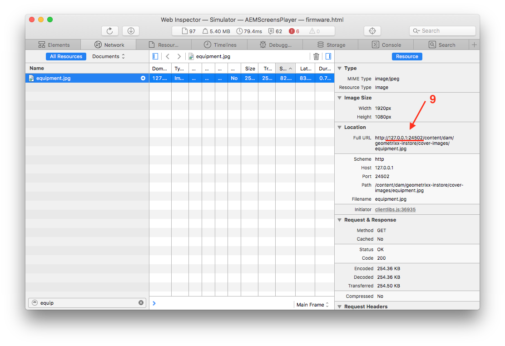

# Création et gestion d’une Live Copy {#creating-and-managing-a-live-copy}

Cette page décrit la création et la gestion des Live Copies des canaux.

Une ***Live Copy*** est une copie du contenu spécifique d’un site pour laquelle une relation directe avec la source d’origine est conservée. Ces relations en direct permettent à la Live Copy d’hériter des propriétés du contenu et de la page de la source.

Cette page décrit la création d’une Live Copy d’un canal, l’affichage des propriétés, la vérification de l’état et la propagation des modifications d’un canal à sa Live Copy.

## Création d’une Live Copy {#creating-a-live-copy}

Procédez comme suit pour créer la Live Copy d’un canal dans le dossier de votre projet.

1. Sélectionnez le lien Adobe Experience Manager (en haut à gauche), puis **Screens**. Vous pouvez également utiliser le lien d’accès direct : `http://localhost:4502/screens.html/content/screens`.

1. Accédez au projet Screens, puis cliquez sur **Canaux**.
1. Cliquez sur **Créer**, puis sélectionnez **Live Copy** pour créer une Live Copy du canal.

1. Sélectionnez la destination, puis cliquez sur **Suivant**.
1. Sélectionnez l’emplacement de la Live Copy.
1. Saisissez le **Titre** et le **Nom** dans la page **Créer une Live Copy**.

1. Cliquez sur **Ouvrir** pour afficher le contenu de la nouvelle Live Copy ou sur **Terminé** pour revenir à la page principale.

Sinon, suivez les étapes ci-dessous pour obtenir une représentation visuelle de la création de la Live Copy d’un canal.

L’exemple suivant illustre la création d’une Live Copy (***IdleLiveCopy***) pour le ***Canal inactif***, dont le dossier de destination est ***Canaux***.

## Affichage du contenu du canal de Live Copy {#viewing-content-of-the-live-copy-channel}

Une Live Copy est une copie d’un canal qui existe déjà.

Pour afficher le contenu de la Live Copy, procédez comme suit :

1. Accédez au projet Screens et cliquez sur l’emplacement dans lequel vous avez créé la Live Copy comme indiqué dans la section ci-dessus. (Ici, l’emplacement qui a été sélectionné est le dossier **Canaux**)

   

1. Cliquez sur le bouton **Modifier** de la barre d’actions pour afficher le contenu du canal.

   

   >[!NOTE]
   >
   >Lors de la consultation du contenu d’un canal de Live Copy, un élément supplémentaire apparaît dans le menu : **État de Live Copy**. Voir la section ci-dessous pour plus de détails.

### Affichage des propriétés d’une Live Copy {#viewing-properties-of-a-live-copy}

En outre, vous pouvez afficher les propriétés du canal de Live Copy.

1. Accédez au canal de Live Copy et cliquez sur **Propriétés** dans la barre d’actions.

   

1. Sélectionnez l’onglet **Live Copy** pour afficher les détails du canal.

   

### État de Live Copy {#live-copy-status}

Le mode **État de Live Copy**, comme illustré dans la figure ci-dessous, permet d’afficher l’état des relations de tous les éléments du canal.

1. Cliquez sur **Modifier** pour sélectionner **État de Live Copy** et afficher l’association du contenu de votre canal avec le canal d’origine (à partir duquel la Live Copy est générée).

   

1. Sélectionnez **État de Live Copy** pour afficher l’aperçu de la page.

   Lorsque les ressources comportent une bordure verte, cela signifie que le contenu est hérité du canal d’origine.

   

### Rupture de l’héritage {#breaking-the-inheritance}

Vous pouvez également annuler l’héritage de la Live Copy. Le contenu devient alors indépendant de la branche d’origine.

L’exemple suivant montre que vous sélectionnez l’image en mode Modifier et cliquez sur le symbole d’annulation de l’héritage dans l’angle supérieur droit.

### Propagation des modifications au canal de Live Copy {#propagating-changes-to-the-live-copy-channel}

Si vous apportez des modifications/mises à jour au canal d’origine, vous devez également les propager à votre canal de Live Copy.

Procédez comme suit pour vous assurer que les modifications sont propagées du canal d’origine au canal de Live Copy :

1. Sélectionnez le canal d’origine (***Idle Channel***) et cliquez sur **Modifier** dans la barre d’actions.

   

1. Apportez des modifications au contenu de ce canal. Par exemple, supprimez une image de ce canal.

   

1. Sélectionnez la Live Copy du canal (***IdleLiveCopy***) et cliquez sur le bouton **Modifier** de la barre d’actions. Vous remarquerez que l’image que vous avez supprimée est toujours visible dans la Live Copy.

   Pour propager les modifications, vous devez synchroniser le canal.

   

1. Pour propager les modifications au canal de Live Copy, accédez au tableau de bord AEM et choisissez le canal de Live Copy, puis cliquez sur **Propriétés** dans la barre d’actions.

   

1. Sélectionnez l’onglet **Live Copy**, puis cliquez sur **Synchroniser** dans la barre d’actions.

   

1. Cliquez sur **Synchronisation** pour confirmer les modifications. Cliquez sur **Enregistrer et fermer** pour revenir au tableau de bord AEM.

   

   Vous remarquerez que l’image est désormais également supprimée du canal de Live Copy.

