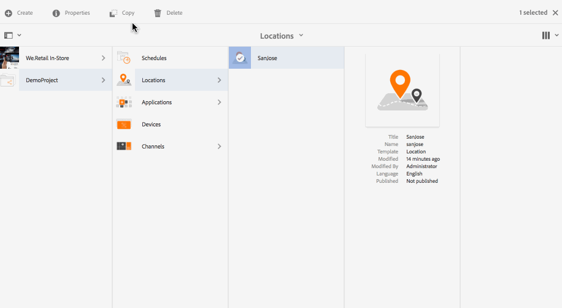

# Création et gestion des emplacements {#creating-and-managing-locations}

Les emplacements hébergent la configuration des affichages en fonction des endroits où se trouvent les différents écrans.

Cette page décrit la création et la gestion des emplacements pour Screens.

**Conditions préalables** :

* [Configuration et déploiement de Screens](configuring-screens-introduction.md)
* [Création et gestion de projet Screens](creating-a-screens-project.md)
* [Création et gestion des canaux](managing-channels.md)

## Création d’un emplacement {#creating-a-new-location}

Une fois que vous avez créé votre projet, procédez comme suit pour créer un emplacement pour le projet Screens :

1. Sélectionnez le lien Adobe Experience Manager (en haut à gauche), puis Screens. Vous pouvez également accéder directement à : `http://localhost:4502/screens.html/content/screens`.
1. Accédez au projet Screens, puis cliquez sur **Emplacements**.
1. Cliquez sur **Créer** en regard de l’icône plus (+) de la barre d’actions. Un assistant s’ouvre.
1. Sélectionnez l’**emplacement** du modèle à partir de l’Assistant et cliquez sur **Suivant**.

1. Saisissez les propriétés pour **Titre et balises**, **Autres titres et description**, **Heure d’activation/de désactivation** et **URL Vanity**.

1. Cliquez sur **Créer** pour créer l’emplacement et l’ajouter au dossier des emplacements.

Suivez les étapes ci-dessous pour comprendre la création d’un emplacement dans le cadre d’un projet AEM Screens. À des fins de démonstration, le nouvel emplacement (SanJose) est créé sous *DemoProject*.

Une fois que vous avez créé un emplacement, vous devez créer un affichage pour cet emplacement.

### Modification des propriétés d’un emplacement {#editing-properties-for-a-location}

Pour modifier/accéder aux propriétés d’un emplacement :

1. Sélectionnez l’emplacement.
1. Cliquez sur **Propriétés** dans la barre d’actions.

#### Étapes suivantes {#the-next-steps}

Une fois que vous avez créé un emplacement, vous devez créer un affichage pour cet emplacement.

Pour plus d’informations, voir [Création et gestion des affichages](managing-displays.md).
