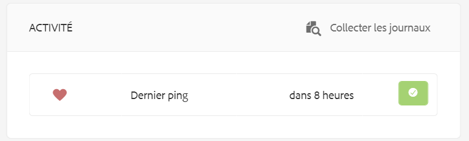
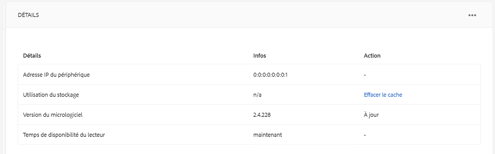

# Création et gestion des planifications {#creating-and-managing-schedules}

Dans AEM Screens, les **planifications** vous permettent d’organiser les canaux en groupes réutilisables. Ainsi, vous n’avez pas à répéter leur attribution individuellement pour chaque affichage sur lequel vous souhaitez afficher votre contenu.

Lorsqu’ils sont combinés avec des ***tranches horaires***, les plannings permettent de définir une planification globale avec plusieurs canaux qui s’exécutent à des moments spécifiques de la journée et de réutiliser cette configuration pour tous vos affichages simultanément.

>[!NOTE]
>
>Cette fonctionnalité d’AEM Screens est disponible uniquement si vous avez installé AEM 6.3 Sites Feature Pack 1. Pour accéder à ce Feature Pack, vous devez contacter l’assistance d’Adobe et demander à y accéder. Une fois que vous disposez des autorisations nécessaires, vous pouvez le télécharger à partir de Package Share.

## Création d’une planification {#creating-a-schedule}

Vous pouvez créer pour votre projet Screens une planification qui va gérer toutes les activités de votre cas d’utilisation.

Suivez les étapes ci-dessous pour créer la planification pour votre canal :

1. Sélectionnez le lien Adobe Experience Manager (en haut à gauche), puis Screens. Vous pouvez également utiliser le lien d’accès direct : `http://localhost:4502/screens.html/content/screens`.
1. Accédez au projet Screens et cliquez sur **Planifications**.
1. Cliquez sur **Créer** dans la barre d’actions.
1. Sélectionnez **Planification** dans l’assistant **Créer**, puis cliquez sur **Suivant**.

1. Saisissez le **nom** et le **titre**, puis cliquez sur **Créer**.

Vous verrez un dossier de planifications avec le nom et le titre de votre projet.

## Affichage du tableau de bord {#viewing-dashboard}

Une fois que vous avez créé le dossier de planifications dans votre projet, vous pouvez afficher les détails du tableau de bord des planifications

Suivez les étapes ci-dessous pour afficher le tableau de bord des planifications. L’exemple suivant présente le tableau de bord du projet We.Retail :

1. Accédez au dossier **Schedules** (Planifications) du projet Screens (par exemple, We.Retail).

   

1. Pour ouvrir le tableau de bord de la planification, cliquez sur **Tableau de bord** dans la barre d’actions.

   Trois panneaux s’affichent : **INFORMATIONS SUR LA PLANIFICATION**, **CANAUX ATTRIBUÉS** et **AFFICHAGES ATTRIBUÉS**.

   

   **Panneau d’Informations sur la planification** Cliquez sur Propriétés dans le coin supérieur droit du panneau INFORMATIONS SUR LA PLANIFICATION pour afficher/modifier les propriétés de la planification.

   **Panneau Canaux attribués** Cliquez sur +Attribuer le canal dans l’angle supérieur droit du panneau CANAUX ATTRIBUÉS pour ouvrir la boîte de dialogue Attribution de canaux.

   **Panneau Affichages attribués** Sélectionnez l’un des affichages dans le panneau AFFICHAGES ATTRIBUÉS pour ouvrir le tableau de bord de l’affichage.

