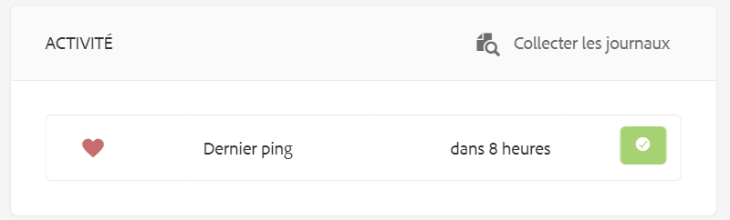
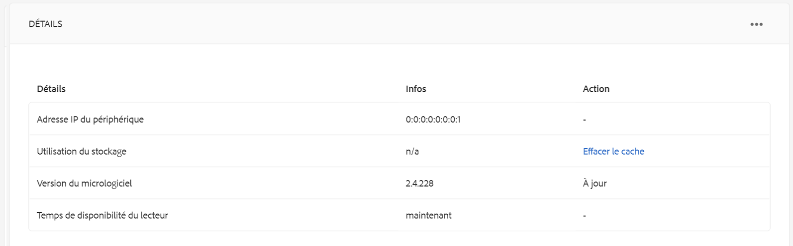

# Créer et gérer des plannings {#creating-and-managing-schedules}

>[!IMPORTANT]
>Ce contenu est valide pour AEM on-premise/AMS (AEM 6.5LTS et AEM 6.5). Pour le contenu AEM as a Cloud Service Screens, reportez-vous au guide [AEM as a Cloud Service](https://experienceleague.adobe.com/en/docs/experience-manager-cloud-service/content/screens-as-cloud-service/overview/introduction).

Les **plannings** dans AEM Screens vous permettent d’organiser les canaux en groupes réutilisables. Cela signifie que vous n’avez pas à répéter leur attribution individuellement pour chaque affichage sur lequel vous souhaitez afficher votre contenu.

Lorsqu’ils sont combinés avec des ***tranches horaires***, les plannings permettent de définir une planification globale avec plusieurs canaux qui s’exécutent à des moments spécifiques de la journée et de réutiliser cette configuration pour tous vos affichages simultanément.

>[!NOTE]
>
>Cette fonctionnalité d’AEM Screens est disponible uniquement si vous avez installé le pack de fonctionnalités 1 d’AEM 6.3 Sites. Pour accéder à ce pack de fonctionnalités, contactez l’assistance d’Adobe et demandez à y accéder. Lorsque vous disposez des autorisations nécessaires, vous pouvez le télécharger à partir de Partage de modules.

## Créer un planning {#creating-a-schedule}

Vous pouvez créer pour votre projet Screens un planning qui peut gérer toutes les activités de votre cas d’utilisation.

Suivez les étapes ci-dessous pour créer un planning pour votre canal :

1. Cliquez sur le lien Adobe Experience Manager (en haut à gauche), puis sur Screens. Vous pouvez également utiliser le lien d’accès direct : `http://localhost:4502/screens.html/content/screens`.
1. Accédez au projet Screens et cliquez sur **Planifications**.
1. Cliquez sur **Créer** dans la barre d’actions.
1. Cliquez sur **Planning** dans l’assistant **Créer**, puis sur **Suivant**.

1. Saisissez le **Nom** et le **Titre**, puis cliquez sur **Créer**.

Vous voyez un dossier de plannings avec le nom et le titre de votre projet.

## Afficher le tableau de bord {#viewing-dashboard}

Lorsque vous avez créé le dossier de plannings dans votre projet, vous pouvez afficher les détails du tableau de bord des plannings.

Procédez comme suit pour afficher le tableau de bord des plannings. L’exemple suivant illustre le tableau de bord du projet `We.Retail` :

1. Accédez au dossier **Plannings** du projet Screens (par exemple, `We.Retail`).

   

1. Cliquez sur **Tableau de bord** dans la barre d’actions.

   Trois panneaux s’affichent : **INFORMATIONS SUR LE PLANNING**, **CANAUX ATTRIBUÉS** et **AFFICHAGES ATTRIBUÉS**.

   

   **Panneau d’informations sur la planification** - Cliquez sur Propriétés dans le coin supérieur droit du panneau d’informations sur la planification pour afficher/modifier les propriétés de la planification.

   **Panneau Canaux attribués** - Cliquez sur +Attribuer un canal dans le coin supérieur droit du panneau CANAUX ATTRIBUÉS pour ouvrir la boîte de dialogue Attribution de canal.

   **Panneau Affichages attribués** - Cliquez sur l’un des affichages du panneau AFFICHAGES ATTRIBUÉS pour ouvrir le tableau de bord d’affichage.

