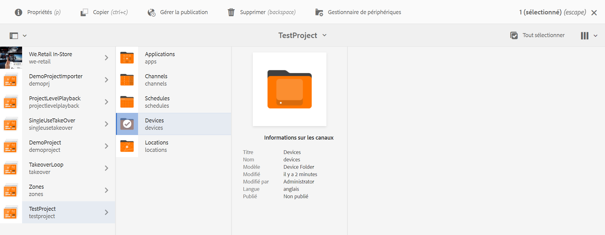
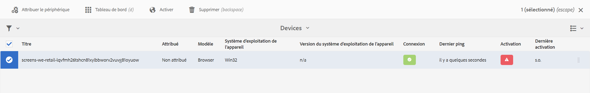
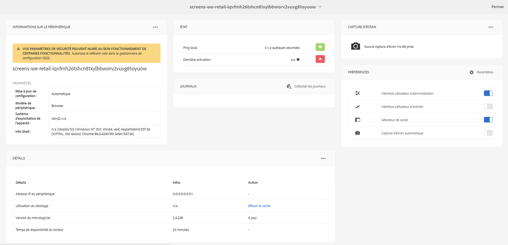
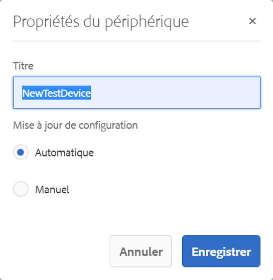
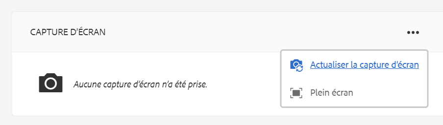

# Dépannage du Centre de contrôle des périphériques {#troubleshooting-device-control-center}

Vous pouvez surveiller les performances et résoudre les problèmes associés pour l’activité de votre lecteur Screens et le périphérique de lecture à l’aide du tableau de bord du périphérique. Cette page fournit des informations sur la façon de surveiller et de résoudre les problèmes de performances perçus pour le lecteur Screens et les périphériques attribués.

## Surveillance et dépannage à partir du centre de contrôle des périphériques {#monitor-and-troubleshoot-from-device-control-center}

Vous pouvez surveiller l’activité et ainsi résoudre les problèmes liés à votre lecteur Screens, à l’aide du tableau de bord du périphérique.

### Tableau de bord du périphérique {#device-dashboard}

Suivez les étapes ci-dessous pour accéder au tableau de bord du périphérique :

1. Accédez au tableau de bord du périphérique à partir de votre projet, par exemple, ***Projet de test*** > ***Périphériques***.

   Sélectionnez **Périphériques** et **Gestionnaire de périphériques** dans la barre d’actions.

   

1. La liste affiche les périphériques affectés et non affectés, comme illustré ci-dessous.

   

1. Sélectionnez l’appareil (**NewTestDevice**) et cliquez sur **Tableau de bord** dans la barre d’actions.

   

1. La page affiche les informations sur le périphérique, son activité et les détails le concernant pour vous permettre de surveiller les activités et les fonctions du périphérique.

   

### Surveillance de l’activité du périphérique {#monitor-device-activity}

Le panneau **Activité** affiche le dernier ping de votre lecteur Screens avec l’horodatage. Le dernier ping correspond à la dernière fois où le périphérique a contacté le serveur.

En outre, cliquez sur **Collecter les journaux** dans le coin supérieur droit du panneau **Activité** afin de consulter les journaux pour votre lecteur.

### Mise à jour des détails d’un périphérique {#update-device-details}

Consultez le panneau **Détails du périphérique** pour afficher l’adresse IP du périphérique, l’utilisation du stockage, la version du micrologiciel et le temps de disponibilité de votre périphérique.

Cliquez également sur **Effacer le cache** et **Mettre à jour** pour effacer le cache de votre périphérique et mettre à jour la version du [micrologiciel](screens-glossary.md), respectivement, à partir de ce panneau.

Vous pouvez également cliquer sur les points de suspension **…** dans le coin supérieur droit du panneau **Détails du périphérique** afin de redémarrer ou de rafraîchir l’état de votre lecteur.

### Mise à jour des informations sur un périphérique {#update-device-information}

Consultez le panneau **INFORMATIONS SUR L’APPAREIL** pour afficher la mise à jour de configuration, le modèle du périphérique, le système d’exploitation du périphérique et les informations sur le shell.

Cliquez également sur les points de suspension (**…**) dans le coin supérieur droit du panneau Informations sur le périphérique pour afficher le panneau des propriétés ou mettre à jour le périphérique.

Cliquez sur **Propriétés** pour afficher la boîte de dialogue **Propriétés du périphérique**. Vous pouvez modifier le titre du périphérique ou sélectionner l’option **manuelle** ou **automatique** pour les mises à jour de configuration.

>[!NOTE]
>
>Pour plus d’informations sur les événements liés aux mises à jour automatiques ou manuelles d’un périphérique, voir la section ***Mises à jour automatiques ou manuelles depuis le tableau de bord du périphérique*** dans [Gestion des canaux](managing-channels.md).

### Afficher une capture d’écran du lecteur {#view-player-screenshot}

Vous pouvez afficher la capture d’écran d’un lecteur à partir du périphérique dans le panneau **CAPTURE D’ÉCRAN DU LECTEUR**.

Cliquez sur les points de suspension (**…**) dans le coin supérieur droit du panneau Capture d’écran du lecteur et sélectionnez **Actualiser la capture d’écran** pour afficher l’instantané du lecteur en cours d’exécution.

### Gestion des préférences {#manage-preferences}

Le panneau **PRÉFÉRENCES** permet à l’utilisateur de modifier les préférences de l’**interface utilisateur d’administration**, du **sélecteur de canal** et du **débogage à distance** pour le périphérique.

>[!NOTE]
>Pour plus d’informations sur ces options, voir [Lecteur AEM Screens](working-with-screens-player.md).

De plus, cliquez sur **Paramètres** dans le coin supérieur droit pour mettre à jour les préférences du périphérique. Vous pouvez mettre à jour les préférences suivantes :

* **URL du serveur**
* **Résolution**
* **Redémarrer la planification**
* **Nombre max. de fichiers journaux à conserver**.
* **Niveau de journal**

>[!NOTE]
>Vous pouvez sélectionner l’un des niveaux de journal suivants :
>* **Désactiver**
>* **Déboguer**
>* **Infos**
>* **Avertissement**
>* **Erreur**

## Résolution des incidents des paramètres d’OSGi {#troubleshoot-osgi-settings}

Vous devez activer le référent vide pour autoriser le périphérique à publier des données sur le serveur. Par exemple, si la propriété de référent vide est désactivée, le périphérique ne pourra pas publier de capture d’écran.

Actuellement, certaines de ces fonctions ne sont disponibles que si l’option *Allow Empty d’Apache Sling Referrer Filter* est activée dans la configuration OSGi. Le tableau de bord peut afficher un avertissement indiquant que les paramètres de sécurité peuvent empêcher l’utilisation de certaines de ces fonctions.

Suivez les étapes ci-après pour activer Apache Sling Referrer Filter Allow Empty

1. Accédez à **Configuration de la console web Adobe Experience Manager**, à savoir `https://localhost:4502/system/console/configMgr/org.apache.sling.security.impl.ReferrerFilter`.
1. Cochez l’option **allow.empty**.
1. Cliquez sur **Enregistrer**.

### Recommandations {#recommendations}

Dans la section suivante, il est recommandé de surveiller les liens de réseaux, le serveur et les lecteurs pour en comprendre l’état et réagir face aux problèmes.

AEM offre une surveillance intégrée avec les fonctions suivantes :

* *Pulsation* toutes les cinq secondes pour indiquer que le lecteur AEM Screens est en fonction.
* *Capture d’écran* provenant du lecteur qui montre ce qu’il affiche actuellement.
* Version du *micrologiciel du lecteur AEM Screens* installée sur le lecteur.
* *Espace de stockage libre* sur le lecteur.

Recommandations pour la surveillance à distance avec un logiciel tiers :

* Utilisation de l’unité centrale sur les lecteurs.
* Vérifiez si le processus du lecteur AEM Screens est exécuté.
* Redémarrez/réinitialisez le lecteur à distance.
* Notifications en temps réel.

Il est recommandé de déployer le matériel et le système d’exploitation du lecteur de manière à se connecter à distance afin de diagnostiquer les problèmes et de redémarrer le lecteur.

#### Ressources supplémentaires {#additional-resources}

Voir [Configuration et dépannage de la lecture vidéo](troubleshoot-videos.md) pour déboguer et dépanner les vidéos lues sur votre canal.
