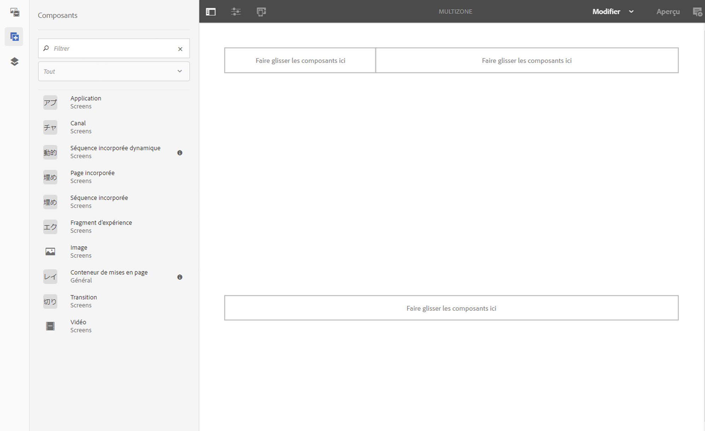
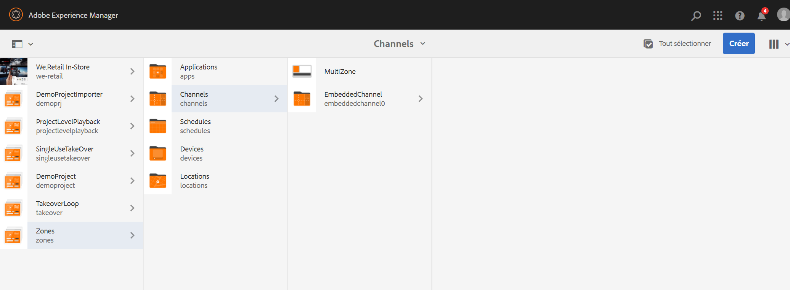
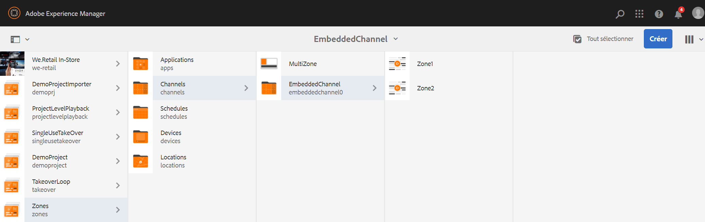

# Disposition multizone {#multi-zone-layout}

La page suivante décrit l’utilisation de la disposition multizone et aborde les sujets suivants :

* Présentation
* Création d’une disposition multizone
* Conditions préalables
* Utilisation de ressources uniques dans une ou plusieurs zones
* Utilisation de contenu séquentiel dans une ou plusieurs zones

## Présentation {#overview}

La ***disposition multizone*** permet de créer du contenu multizone et d’utiliser diverses ressources telles que des vidéos, des images et du texte, qui peuvent être regroupées en un seul écran. Il est possible d’importer des images, des vidéos et du texte, et les mélanger de façon à créer une expérience numérique intuitive .

En fonction des exigences du projet, il est parfois nécessaire de disposer de plusieurs zones au sein d’un canal et dus modifier comme une unité entière. Par exemple, une séquence de produits avec un flux de réseaux sociaux associé qui s’exécute dans trois zones distinctes sur un seul canal.

## Création d’une disposition multizone {#creating-multi-zone-layout}

Lors de la création d’un canal, vous pouvez utiliser des modèles différents afin de créer des zones dans votre canal. Vous pouvez ajouter une image, une vidéo ou un canal incorporé qui permet d’afficher plusieurs ressources dans une séquence.

### Conditions préalables {#prerequisites}

Avant de commencer à implémenter cette fonctionnalité, assurez-vous que vous disposez d’un projet prêt comme condition préalable pour commencer à mettre en œuvre la disposition multizone. Par exemple :

* Créez un projet AEM Screens intitulé **Zones**
* Créez un affichage sous **Emplacements** intitulé&#x200B;**MultiZoneDisplay**

Créez un canal intitulé **MultiZone** dans le projet **Zones**. Suivez les étapes ci-dessous :

**Création du canal**

1. Sélectionnez le lien Adobe Experience Manager (en haut à gauche), puis **Screens**. Vous pouvez également utiliser le lien d’accès direct : `http://localhost:4502/screens.html/content/screens`.
1. Accédez au dossier **Channels** (Canaux) et cliquez sur **Créer** dans la barre d’actions.

1. Sélectionnez **Canal d’écran partagé Barre-L gauche** dans l’assistant de **création** .

1. Cliquez sur **Suivant** et saisissez le **titre** **MultiZone**.

1. Cliquez sur **Créer** pour terminer la création du canal.

### {#using-single-assets-in-one-or-more-zones}Utilisation de ressources uniques dans une ou plusieurs zones

Vous pouvez utiliser des ressources uniques telles qu’une image ou une vidéo dans les trois zones différentes. Suivez les étapes ci-dessous pour la mise en œuvre :

1. **Ajout de contenu au canal**

   1. Accédez à **Zones** —&gt; **Canaux**—&gt;**MultiZone**.
   1. Sélectionnez le canal **MultiZone** et cliquez sur **Modifier** dans la barre d’actions pour ouvrir l’éditeur.
   

1. **Ajout d’images au canal**

   Pour lire une seule image ou une vidéo dans les trois zones, faites glisser l’image dans l’éditeur de canaux, comme illustré ci-dessous.

   

### Utilisation de contenu séquentiel dans une ou plusieurs zones {#using-sequenced-content-in-one-or-more-zones}

Si vous souhaitez que les zones affichent une séquence d’images ou de contenu et une image statique dans trois zones différentes, suivez les étapes ci-dessous pour plus de détails.

1. **Créer un dossier de canaux**

   1. Accédez à **Zones** —&gt; **MultiZone** —&gt; **Canaux** et cliquez sur **Créer** dans la barre d’actions.
   1. Sélectionnez **Dossier de canaux** dans l’assistant de **Création** et cliquez sur **Suivant**.
   1. Saisissez le titre **EmbeddedChannels** et cliquez sur **Créer**.
   

1. **Ajout de deux autres canaux au dossier de canaux**

   1. Accédez à **Zones** —&gt; **Canaux** —&gt; EmbeddedChannels **et cliquez sur** **Créer** dans la barre d’actions.
   1. Sélectionnez **Canal de séquence**  dans l’assistant de **Création** pour créer un canal intitulé** Zone1**.
   1. Sélectionnez **Zone1** et cliquez sur **Modifier** dans la barre d’action pour ouvrir l’éditeur.
   1. Faites glisser quelques images sur ce canal.
   De même, créez un autre canal de séquence intitulé **Zone2** dans le dossier **EmbeddedChannels**.

   

1. **Ajout de séquences/composants incorporés au canal principal (MultiZone)**

   1. Accédez à **Zones** —&gt; **Canaux** —&gt; **MultiZone**.
   1. Cliquez sur **Modifier** dans la barre d’actions pour ouvrir l’éditeur.
   1. Faites glisser et déposez le composant  **Séquence incorporée** dans deux des zones, comme illustré dans la figure ci-dessous.
   

1. **Ajouter du contenu aux trois zones**

   1. Accédez à **Zones** —&gt; **Canaux** —&gt; **MultiZone**.
   1. Sélectionnez la séquence incorporée dans l’une des zones.
   1. Cliquez sur l’icône **Configurer** (clé à molette) pour accéder à l’une des séquences incorporées dans l’éditeur.
   1. Sélectionnez le chemin du canal **Zones** —&gt; **Canaux** —&gt; **EmbeddedChannels** —&gt; **Zone1**, comme illustré ci-dessous.
   De même, ajoutez **Zone2** à un autre composant de séquence incorporée dans l’éditeur. Ajoutez également une image à la troisième zone en bas, comme illustré ci-dessous.

   

#### Affichage du résultat {#viewing-the-result}

Une fois que vous avez mis en œuvre des mises en page à zones multiples à l’aide des étapes précédentes, le résultat suivant s’affiche, comme illustré ci-dessous.

Le résultat suivant dans le lecteur Screens affiche le contenu dans trois zones différentes. Les zones de gauche et de droite (qui utilisent toutes deux la séquence incorporée comme composant) affichent la séquence d’images et la zone ci-dessous affiche une image statique.

