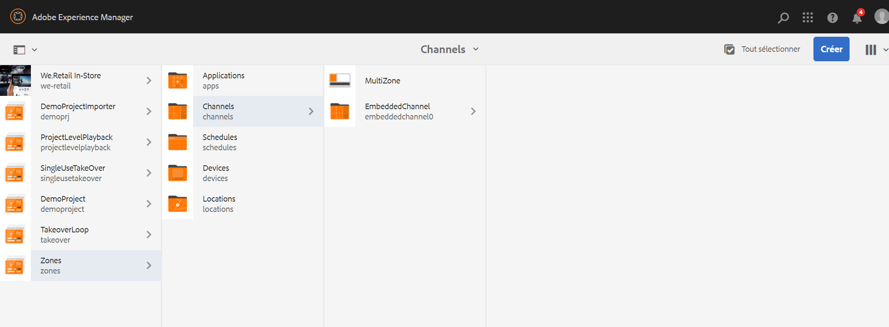
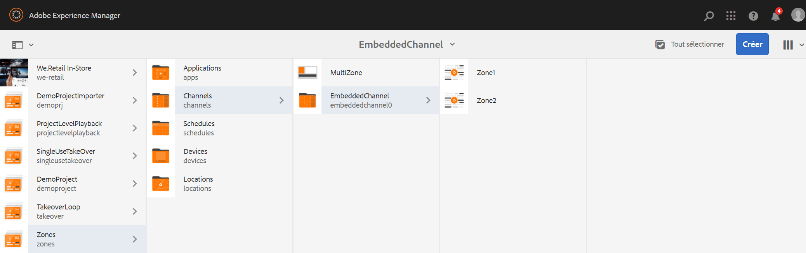

# Disposition multizone {#multi-zone-layout}

>[!IMPORTANT]
>Ce contenu est valide pour AEM on-premise/AMS (AEM 6.5LTS et AEM 6.5). Pour le contenu AEM as a Cloud Service Screens, reportez-vous au guide [AEM as a Cloud Service](https://experienceleague.adobe.com/en/docs/experience-manager-cloud-service/content/screens-as-cloud-service/overview/introduction).

La page suivante décrit l’utilisation de la disposition multizone et aborde les sujets suivants :

* Vue d’ensemble
* Créer une disposition multizone
* Conditions préalables
* Utilisation de ressources uniques dans une ou plusieurs zones
* Utilisation de contenu séquentiel dans une ou plusieurs zones

## Vue d’ensemble {#overview}

La ***disposition multizone*** permet de créer du contenu multizone et d’utiliser diverses ressources telles que des vidéos, des images et du texte, qui peuvent être regroupées en un seul écran. Il est possible d’importer des images, des vidéos et du texte, et de les mélanger de façon à créer une expérience digitale intuitive.

En fonction des exigences du projet, il est parfois nécessaire de disposer de plusieurs zones au sein d’un canal et dus modifier comme une unité entière. Par exemple, une séquence de produits avec un flux de médias sociaux associé qui s’exécute dans trois zones distinctes sur un seul canal.

>[!NOTE]
>Dans les canaux multizones, la planification au niveau des ressources n’est pas recommandée en raison de conflits potentiels et de comportements inattendus. Si une planification au niveau des ressources est nécessaire, créez un canal de séquence distinct et appliquez une logique de planification à ce canal. Ensuite, incorporez le canal de séquence dans le canal multizone.

### Conditions préalables {#prerequisites}

Avant de débuter la mise en œuvre de cette fonctionnalité, vous devez posséder des connaissances conceptuelles concernant les aspects suivants :

* [Création d’un projet AEM Screens](https://experienceleague.adobe.com/fr/docs/experience-manager-screens/user-guide/authoring/setting-up-projects/creating-a-screens-project)
* [Création d’un affichage](https://experienceleague.adobe.com/fr/docs/experience-manager-screens/user-guide/authoring/setting-up-projects/managing-displays)
* [Affectation d’un canal à un affichage](/help/user-guide/channel-assignment.md)

## Créer une disposition multizone {#creating-multi-zone-layout}

Lors de la création d’un canal, vous pouvez utiliser des modèles différents afin de créer des zones dans votre canal. Vous pouvez ajouter une image, une vidéo ou un canal incorporé qui permet d’afficher plusieurs ressources dans une séquence.

**Créer un canal**

1. Cliquez sur le lien Adobe Experience Manager (en haut à gauche), puis sur **Screens**. Vous pouvez également utiliser le lien d’accès direct : `http://localhost:4502/screens.html/content/screens`.
1. Accédez au dossier **Canaux** et cliquez sur **Créer** dans la barre d’actions.

1. Cliquez sur **Canal d’écran partagé 1x2** dans l’assistant **Créer**.

1. Cliquez sur **Suivant** et saisissez le **titre** **MultiZone**.

1. Cliquez sur **Créer** pour terminer la création du canal.

### Utilisation de ressources uniques dans une ou plusieurs zones {#using-single-assets-in-one-or-more-zones}

Vous pouvez utiliser des ressources uniques telles qu’une image ou une vidéo dans chacune des zones. Suivez les étapes ci-dessous pour la mise en œuvre :

1. **Ajout de contenu au canal**

   1. Accédez à **Zones** > **Canaux** > **MultiZone**.
   1. Cliquez sur le canal **Multizone** et cliquez sur **Modifier** dans la barre d’actions.

1. **Ajout d’images au canal**

   Pour lire une seule image ou une vidéo dans deux zones, il vous suffit de faire glisser une image dans chaque zone de l’éditeur de canal, comme illustré dans la figure ci-dessous :

   

### Utilisation de contenu séquentiel dans une ou plusieurs zones {#using-sequenced-content-in-one-or-more-zones}

Si vous souhaitez que les zones affichent une séquence d’images et une vidéo dans les différentes zones, suivez les étapes ci-dessous pour plus de détails.

1. **Créer un dossier de canaux**

   1. Accédez à **Zones** > **MultiZone** > **Canaux** et cliquez sur **Créer** dans la barre d’actions.
   1. Cliquez sur **Dossier de canaux** dans l’assistant **Créer**, puis sur **Suivant**.
   1. Saisissez le titre **EmbeddedChannels** et cliquez sur **Créer**.

   

1. **Ajout de deux autres canaux au dossier de canaux**

   1. Accédez à **Zones** > **Canaux** > **EmbeddedChannels** et cliquez sur **Créer** dans la barre d’actions.
   1. Cliquez sur **Canal de séquence** dans l’assistant **Créer** pour créer un canal intitulé **`Zone1`**.
   1. Cliquez sur **`Zone1`**, puis sur **Modifier** dans la barre d’actions.
   1. Faites glisser quelques images sur ce canal.
   1. De même, créez un autre canal de séquence intitulé **`Zone2`** dans le dossier **EmbeddedChannels**.
   1. Faites glisser une vidéo sur ce canal.

   La figure suivante montre les canaux **`Zone1`** et **`Zone2`** :

   

   Les images ajoutées à l’éditeur du canal de séquence **`Zone1`** sont présentées ci-dessous :

   

   La vidéo ajoutée à l’éditeur du canal de séquence **`Zone2`** est présentée ci-dessous :

   

1. **Ajout de séquences incorporées (composant) au canal principal (MultiZone)**

   1. Accédez à **Zones** > **Canaux** > **MultiZone**.
   1. Cliquez sur **Modifier** dans la barre d’actions.
   1. Faites glisser le composant **Séquence incorporée** dans les deux zones.
   1. Cliquez sur la séquence incorporée dans l’une des zones.
   1. Cliquez sur l’icône **Configurer** (clé à molette) pour accéder à l’une des séquences incorporées dans l’éditeur.
   1. Cliquez sur le chemin du canal **Zones** > **Canaux** > **EmbeddedChannels** > **`Zone1`**, comme illustré ci-dessous.
   1. De même, ajoutez **`Zone2`** à un autre composant de séquence incorporée dans l’éditeur.

      

### Création d’un emplacement et d’un affichage {#creating-location}

Vous devez créer un emplacement et un affichage afin de visualiser le contenu dans le lecteur AEM Screens.

1. **Créer un emplacement**

   1. Accédez au dossier **Zones** > **Emplacements**.
   1. Cliquez sur le dossier **Emplacements**, puis sur **Créer** dans la barre d’actions.
   1. Cliquez sur **Emplacement** à partir de l’assistant **Créer**, puis sur **Suivant**.
   1. Saisissez le **Titre** **SanJose**, puis cliquez sur **Créer**.

1. **Création d’un affichage**

   1. Accédez au dossier **Zones** > **Emplacements**.
   1. Cliquez sur l’emplacement **SanJose**, puis sur **Créer** dans la barre d’actions.
   1. Cliquez sur **Affichage** à partir de l’assistant **Créer**, puis sur **Suivant**.
   1. Saisissez le **Titre** **Lobby**, puis cliquez sur **Créer**.

### Affectation de canaux à l’affichage {#channel-channel}

Vous devez affecter les canaux à l’affichage de façon à visualiser le contenu. Suivez les étapes ci-dessous pour affecter le canal à l’affichage.

1. **Affectation du canal à l’affichage**

   1. Accédez à **Zones** > **Emplacements** > **SanJose** > **Lobby**.
   1. Cliquez sur l’affichage **Lobby**, puis sur **Attribuer le canal** dans la barre d’actions.
   1. Entrez le chemin du canal **MultiZone** dans **Chemin du canal**.
   1. Définissez les **Événements pris en charge** suivants : **Chargement initial**, **Écran inactif** et **Retardateur**.
   1. Cliquez sur **Enregistrer**.

      
   1. De même, attribuez les deux autres canaux incorporés (**`Zone1`** et **`Zone2`**) à cet affichage.
   1. Une fois que vous avez affecté les trois canaux à l’affichage **Lobby**, vous devez pouvoir visualiser les canaux affectés à partir du tableau de bord des affichages.

      

      >[!IMPORTANT]
      >
      >Une fois que vous avez affecté le canal principal (dans ce cas, **MultiZone**) à l’affichage, il est obligatoire de lui affecter également les deux autres canaux incorporés **`Zone1`** et **`Zone2`**.

### Enregistrement de l’appareil {#registering-device}

Une fois que vous avez configuré un emplacement et un affichage, suivez les étapes ci-dessous pour enregistrer l’appareil et lui attribuer l’affichage.

1. **Enregistrer l’appareil**

   1. Accédez aux dossiers **Zones** > **Appareils**.
   1. Cliquez sur le dossier **Appareils**, puis sur **Gestionnaire de périphériques** dans la barre d’actions.
   1. Cliquez sur **Enregistrement de périphérique**, puis sur l’appareil en attente dans la liste.

      >[!NOTE]
      > Le titre de l’appareil doit correspondre au jeton de l’appareil (champ **Jeton**) figurant dans l’onglet **Enregistrement de périphérique**.

   1. Si le titre correspond au jeton de l’appareil, cliquez sur l’appareil, puis sur **Enregistrer le périphérique** dans la barre d’actions.
   1. Si le code d’enregistrement correspond au code figurant dans l’onglet **Enregistrement d’appareil** du lecteur Screens, cliquez sur **Valider** dans la barre d’actions.
      
   1. Saisissez le **Titre** **`Chrome-Device1`**, puis cliquez sur **Enregistrer**.
   1. Cliquez sur **Attribuer l’affichage**, puis sur le chemin de la configuration de l’appareil.

   >[!NOTE]
   >Si vous essayez d’afficher le contenu dans le lecteur Screens, veillez à cliquer sur **Mettre à jour le contenu hors ligne** dans le tableau de bord des canaux pour chacun des canaux affectés à l’affichage.

### Afficher le résultat {#viewing-the-result}

Une fois que vous avez mis en œuvre des dispositions multizone en suivant les étapes précédentes, la sortie suivante s’affiche.

Utilisez le lecteur Screens afin de visualiser la sortie qui affiche le contenu dans deux zones différentes : Les zones de gauche et de droite (toutes deux utilisent la séquence incorporée comme composant).

La zone de gauche est un canal de séquence et celle de droite inclut une vidéo.

