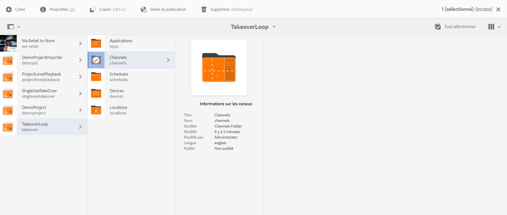
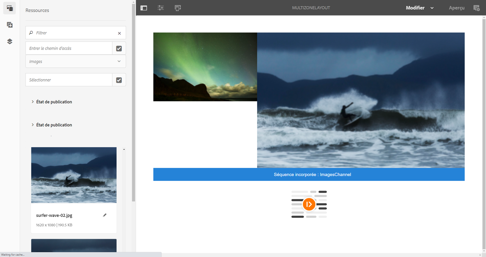
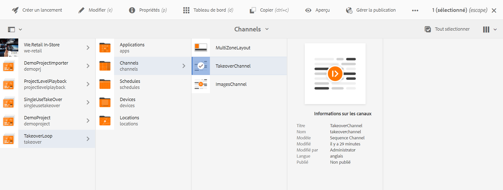
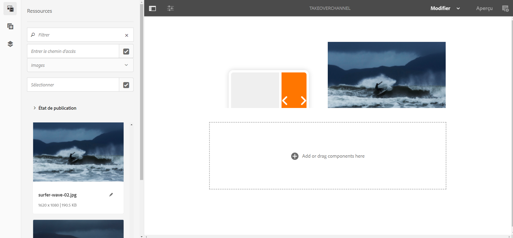
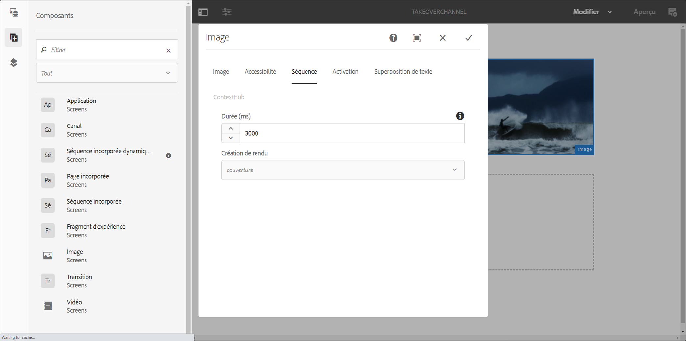

# Transition Multizone vers Zone unique {#multizone-to-singlezone-use-case}

## Description du cas d’utilisation {#use-case-description}

Cette section décrit un exemple de cas d’utilisation qui met l’accent sur la configuration d’un canal de disposition multizone qui alterne avec un canal de disposition à zone unique. Le canal multizone comporte des fichiers image/vidéo de séquencement et indique comment configurer un projet qui alterne entre multizone et zone unique.

### Conditions préalables {#preconditions}

Avant de commencer ce cas d’utilisation, vous devez comprendre comment :

* **[Création et gestion des canaux](managing-channels.md)**
* **[Création et gestion des emplacements](managing-locations.md)**
* **[Créer et gérer des planifications](managing-schedules.md)**
* **[Enregistrement de périphériques](device-registration.md)**

### Acteurs principaux {#primary-actors}

Auteurs de contenu

## Configuration du projet {#setting-up-the-project}

Pour configurer un projet, procédez comme suit :

1. Créez un projet AEM Screens appelé **TakeoverLoop**, comme illustré ci-dessous.

   

1. **Création d’un canal Screens multizone**

   1. Sélectionnez le dossier **Channels** (Canaux), puis cliquez sur **Créer** dans la barre d’actions pour ouvrir l’assistant afin de créer un canal.
   1. Sélectionnez **Left-L Bar Split Screen Channel** dans l’assistant et créez le canal intitulé **MultiZoneLayout**.
   1. Ajoutez du contenu au canal. Faites glisser les ressources vers chacune des zones. L’exemple suivant illustre un canal **MultiZoneLayout** comprenant une vidéo, une image et une bannière de texte (dans une séquence incorporée), comme illustré ci-dessous.
   

   >[!NOTE]
   >
   >Pour en savoir plus sur la création d’une disposition multizone dans votre canal, reportez-vous à [Disposition multizone](multi-zone-layout-aem-screens.md).

1. Créez un autre canal intitulé **TakeoverChannel** dans votre dossier **Channels** (Canaux).

   

1. Cliquez sur **Modifier** dans la barre d’actions pour ajouter du contenu à ce canal. Ajoutez à ce canal un composant **Canal** et une ressource image vers lesquels vous souhaitez basculer, comme illustré dans la figure ci-dessous :

   

1. Ouvrez les paramètres du composant Canal et faites pointer ce composant sur le canal **MultiZoneLayout** que vous avez créé à l’*étape 2*.

   

1. Définissez la durée dans le champ **Séquence** sur **10 000 ms**.

   

1. De même, ouvrez les paramètres de l’image (ressource que vous avez ajoutée) et définissez sa durée dans le champ **Séquence** sur **3000 ms**.

   

## Vérification de l’aperçu {#checking-the-preview}

Vous pouvez afficher la sortie souhaitée à partir du lecteur ou simplement en cliquant sur l’**Aperçu** dans l’éditeur.

La sortie indique comment une disposition multizone est lue pendant *10 000 ms*, puis passe à une disposition à zone unique dont la durée de lecture est de *3 000 ms*, pour ensuite revenir à la disposition multizone.

>[!VIDEO](https://video.tv.adobe.com/v/30366?captions=fre_fr)

>[!NOTE]
>
>Vous pouvez personnaliser votre transition de canal (de la disposition multizone à la disposition à zone unique ou vice versa), selon vos besoins.