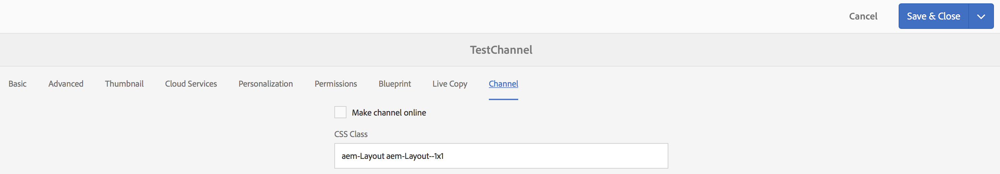

# Canaux hors ligne {#offline-channels}

The Screens player provides offline support for the channels by leveraging the ***ContentSync*** technology.

Les lecteurs utilisent un serveur http local pour diffuser le contenu décompressé.

Quand un canal est configuré de manière à s’exécuter *en ligne*, le lecteur met à disposition les ressources de canal en accédant au serveur AEM, mais lorsque le canal est configuré de sorte à s’exécuter *hors ligne*, le lecteur met à disposition les ressources de canal d’un serveur http local.

Le workflow du processus est le suivant :

1. Analyser la ou les pages demandées
1. Collecter tous les actifs associés
1. Encapsuler le tout dans un fichier zip
1. Télécharger le zip et l’extraire localement
1. Afficher une copie locale du contenu

## Mettre à jour les gestionnaires {#update-handlers}

***ContentSync**utilise des gestionnaires de mise à jour pour analyser et collecter toutes les pages et tous les actifs nécessaires à un projet spécifique.* AEM Screens utilise les gestionnaires de mise à jour suivants :

### Options communes {#common-options}

* *type* : type de gestionnaire de mise à jour à utiliser
* *path* : chemin d’accès à la ressource
* *[targetRootDirectory]*: dossier cible dans le fichier zip

<table>
 <tbody>
  <tr>
   <td><strong>Type</strong></td> 
   <td><strong>Description</strong></td> 
   <td><strong>Options</strong></td> 
  </tr>
  <tr>
   <td>canaux</td> 
   <td>collecte un canal</td> 
   <td>extension : extension de la ressource à collecter  [pathSuffix='''] : suffixe à ajouter au chemin du canal  </td> 
  </tr>
  <tr>
   <td>clientlib</td> 
   <td>collecte de la bibliothèque cliente spécifiée</td> 
   <td>[extension='''] : peut être soit css, soit js, pour collecter uniquement la première, soit la seconde</td> 
  </tr>
  <tr>
   <td>assertions</td> 
   <td>collecte des rendus de ressources</td> 
   <td>[rendus=[]] : liste des rendus à collecter. Valeur par défaut du rendu d’origine</td> 
  </tr>
  <tr>
   <td>Copier</td> 
   <td>copier la structure spécifiée à partir du chemin</td> 
   <td> </td> 
  </tr>
 </tbody>
</table>

### Test de la configuration de ContentSync {#testing-contentsync-configuration}

Suivez les étapes ci-dessous pour tester la configuration de ContentSync :

1. Ouvrir `https://localhost:4502/libs/cq/contentsync/content/console.html`
1. Sélectionner une config dans la liste
1. Cliquez sur Effacer le cache
1. Cliquez sur Mettre à jour le cache
1. Cliquez sur Télécharger complet
1. Extraire le fichier zip
1. Démarrage d’un serveur local dans le dossier extrait
1. Ouvrir la page de démarrage et vérifier l’état de l’application

## Activation de la configuration hors ligne d’un canal {#enabling-offline-config-for-a-channel}

Suivez les étapes ci-dessous pour activer la configuration hors ligne d’un canal :

1. Inspectez le contenu du canal et vérifiez s’il est demandé par une instance AEM (en ligne).

   

1. **Accédez au tableau de bord du canal et cliquez sur**... dans le panneau INFORMATIONS **DU** CANAL pour modifier les propriétés.

   

1. Accédez aux propriétés des canaux et assurez-vous que la case à cocher est désactivée dans l’onglet **Canal**. Cliquez sur **Enregistrer et fermer**.

   

   Avant que le contenu ne soit correctement déployé sur l’appareil, cliquez sur **Mettre à jour le contenu hors ligne**.

   

   Le statut **Hors ligne** sous **PROPRIÉTÉ** est également mis à jour en conséquence.

   

1. Inspectez le contenu du canal et vérifiez s’il est demandé par le cache de lecteur local.

   

