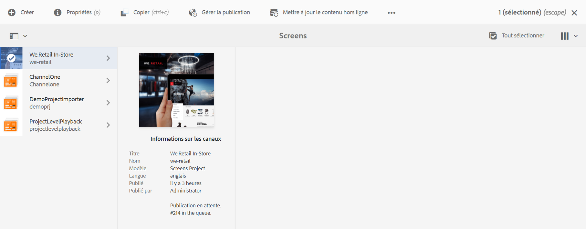
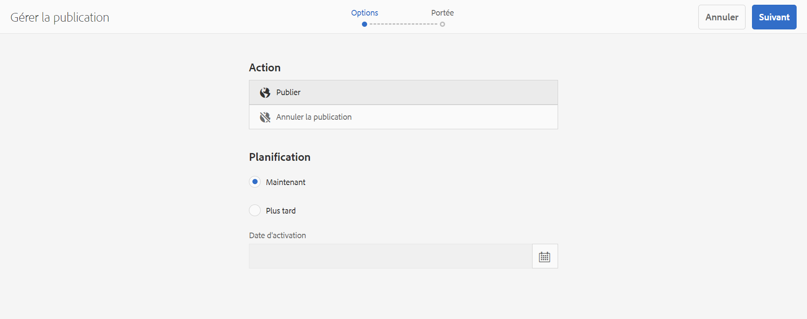
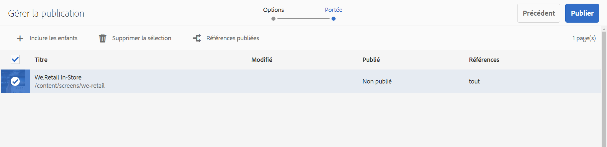
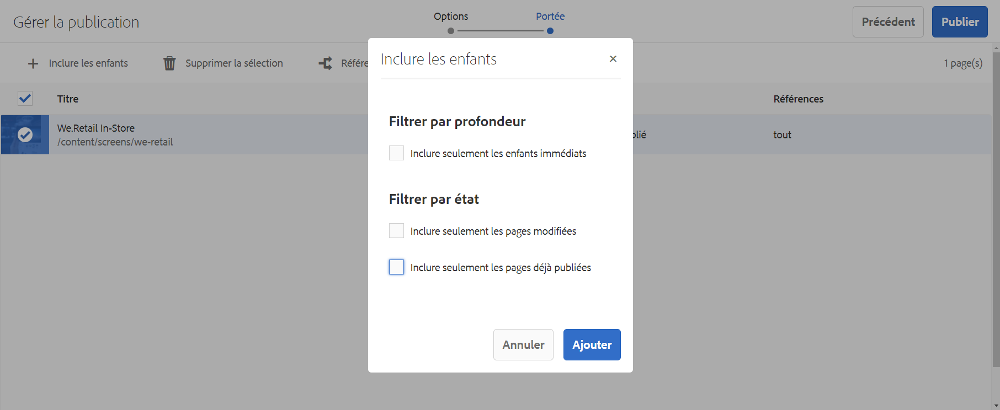
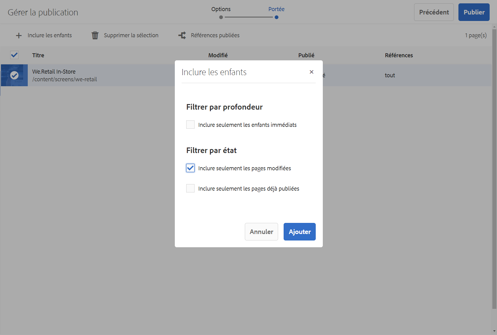
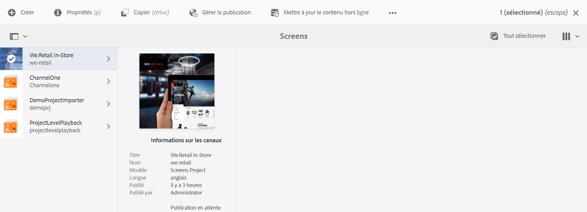
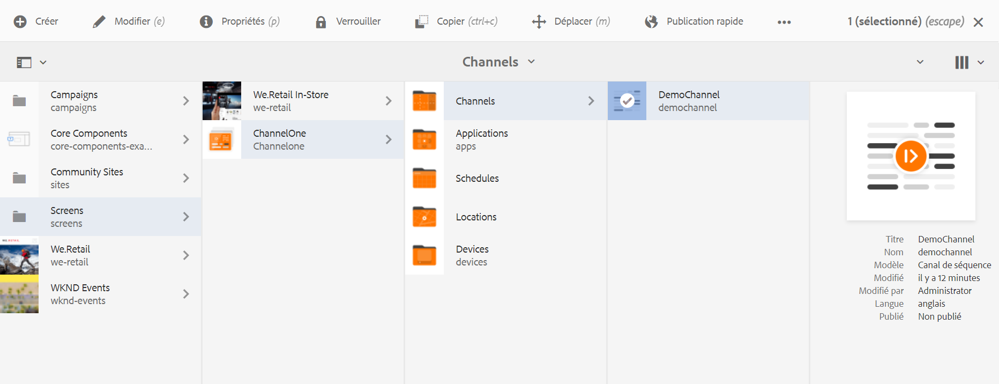
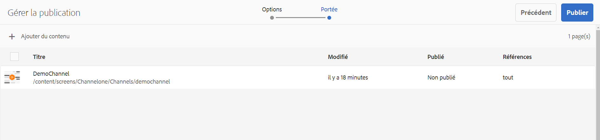
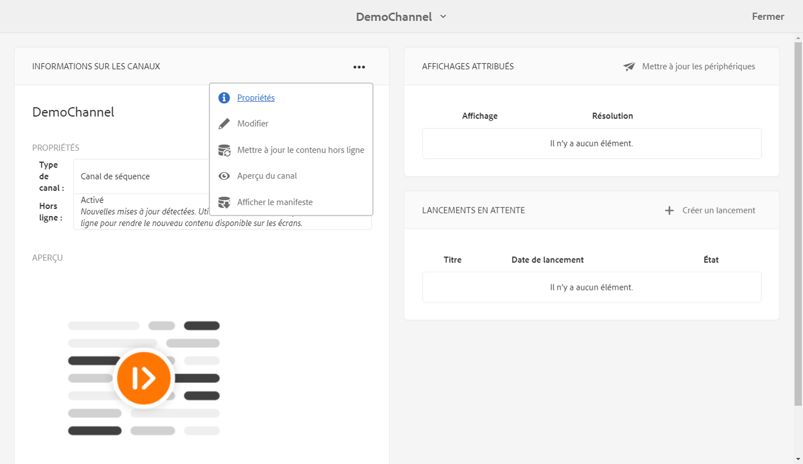

# Mise à jour du contenu On-Demand {#on-demand}

Cette section décrit le contenu On-Demand pour la gestion des publications.

## Gestion de la publication : diffusion des mises à jour de contenu de l’auteur à la publication sur le périphérique {#managing-publication-delivering-content-updates-from-author-to-publish-to-device}

Vous pouvez publier et annuler la publication de contenu à partir d’AEM Screens. La fonction Gérer les publications vous permet de diffuser des mises à jour de contenu de l’auteur à publier sur le périphérique. Vous pouvez publier/annuler la publication de contenu pour l’ensemble de votre projet AEM Screens ou uniquement pour l’un de vos canaux, emplacements, périphériques, applications ou plannings.

### Gestion de la publication pour un projet AEM Screens {#managing-publication-for-an-aem-screens-project}

Suivez les étapes ci-dessous pour diffuser des mises à jour de contenu de l’auteur à publier sur le périphérique pour un projet AEM Screens :

1. Accédez à votre projet AEM Screens.
1. Cliquez sur **Gérer la publication** dans la barre d’actions pour publier le projet vers l’instance de publication.

   

1. L’assistant de **Gestion de publication** démarre. Vous pouvez sélectionner l’**Action** et programmer l’heure de publication sur maintenant ou plus tard. Cliquez sur **Suivant**.

   

1. Cochez la case pour sélectionner l’intégralité du projet dans l’assistant de **Gestion de publication**.

   

1. Cliquez sur **+ Inclure les enfants** dans la barre d’actions et désactivez toutes les options pour publier tous les modules de votre projet, puis cliquez sur **Ajouter** pour publier.

   >[!NOTE]
   >
   >Par défaut, toutes les cases seront cochées et vous devrez les décocher manuellement pour publier tous les modules de votre projet.

   

   **Comprendre la boîte de dialogue Inclure les enfants**

   L’étape mentionnée ci-dessus montre comment publier l’intégralité du contenu. Si vous voulez utiliser les trois autres alternatives disponibles, vous devrez cocher cette option.
Par exemple, l’image suivante vous permet de gérer et de mettre à jour uniquement les pages modifiées de votre projet :
   

   Suivez les explications ci-dessous pour comprendre les options disponibles :

   1. **Inclure uniquement les enfants directs** :
cette option vous permet de gérer les mises à jour uniquement sur les sous-nœuds de la structure de votre projet.
   1. **Inclure uniquement les pages**modifiées :
cette option vous permet de gérer les mises à jour uniquement sur les pages modifiées du projet où les modifications se trouvent dans la structure du projet.
   1. **Inclure uniquement les pages déjà publiées** :
cette option permet de gérer les mises à jour uniquement sur les pages qui ont déjà été publiées.

1. Cliquez sur **Publier** dans l’assistant de **Gestion de publication.**

   

   >[!NOTE]
   >
   >Patientez quelques secondes/minutes pour que le contenu atteigne l’instance de publication.
   >
   >
   >    1. Le processus ne fonctionne pas si le projet ne contient aucune modification et qu’il n’y a pas lieu de **mettre à jour le contenu hors ligne**.
   >    1. Le processus ne fonctionne pas si l’auteur n’effectue pas le processus de réplication (le contenu est toujours téléchargé vers l’instance de publication) après avoir cliqué sur le bouton **Publier** dans le processus de gestion de la publication.

   > [!CAUTION]
   > Si, en tant qu’auteur ou créateur de contenu, vous souhaitez voir les modifications apportées aux périphériques connectés à l’instance d’auteur, cliquez sur **Mettre à jour le contenu hors ligne** dans le tableau de bord du canal ou en sélectionnant le projet. Dans ce cas, le contenu hors ligne n’est mis à jour que dans l’instance d’auteur.

1. Accédez au projet et cliquez sur **Mettre à jour le contenu hors ligne** dans la barre d’actions. Cette action transfère la même commande à l’instance de publication, de sorte que les fichiers compressés hors ligne soient également créés sur l’instance de publication.

   

   >[!NOTE]
   >
   >Une fois que vous avez terminé le processus de gestion de la publication, et si un lecteur désigne l’instance d’auteur, vous devez déclencher la mise à jour du contenu hors ligne dans l’auteur, ce qui crée la mise à jour hors ligne sur l’instance d’auteur.

   >[!CAUTION]
   >
   >Vous devez déclencher la mise à jour du contenu hors ligne dans l’instance d’auteur, si un lecteur est enregistré sur le serveur d’auteur. La mise à jour du contenu hors ligne n’est pas requise pour le lecteur enregistré sur l’instance de publication.

### Gestion des publications pour un canal {#managing-publication-for-a-channel}

Suivez les étapes ci-dessous pour diffuser des mises à jour de contenu de l’Auteur à publier sur le périphérique pour un canal dans un projet AEM Screens :

>[!NOTE]
>
>Suivez cette section uniquement si un canal contient des modifications. Si un canal ne comporte aucune modification après le contenu hors ligne de la mise à jour précédente, le processus de gestion des publications pour un canal individuel ne fonctionne pas.

1. Accédez à votre projet Screens et sélectionnez le canal.
1. Cliquez sur **Gérer la publication** dans la barre d’actions pour publier le canal vers l’instance de publication.

   

1. L’assistant de **Gestion de publication** démarre. Vous pouvez sélectionner l’**Action** et programmer l’heure de publication sur maintenant ou plus tard. Cliquez sur **Suivant**.

   

1. Cliquez sur **Publier** dans l’assistant de **Gestion de publication.**

   

   >[!NOTE]
   >
   >Patientez quelques secondes/minutes pour que le contenu atteigne l’instance de publication.

1. Le fait de déclencher la **mise à jour du contenu hors ligne** dans le tableau de bord du canal poussera le contenu hors ligne vers l’instance de création, mais pas vers l’instance de publication. Les étapes 1 à 4 permettent de pousser le contenu hors ligne vers l’instance de publication.

   

   >[!CAUTION]
   >
   >Vous devez d’abord publier, puis déclencher la mise à jour du contenu hors ligne, comme indiqué dans les étapes précédentes.

### Réaffectation de canal et de périphérique : {#channel-and-device-re-assignment}

Si vous avez réaffecté un périphérique, vous devez publier à la fois l’affichage initial et le nouvel affichage, une fois le périphérique réaffecté au nouvel affichage.

De même, si vous avez réaffecté un canal, vous devez publier à la fois l’affichage initial et le nouvel affichage, une fois que le canal a été réaffecté au nouvel affichage.