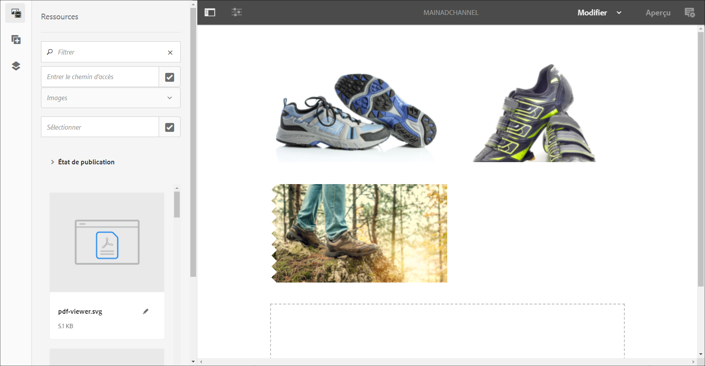
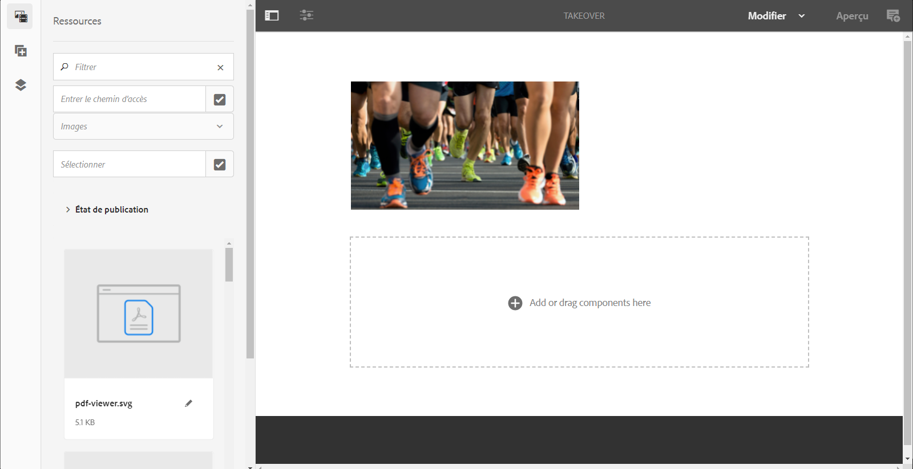
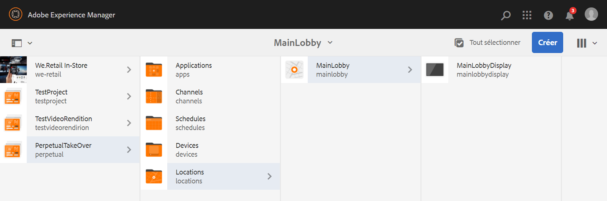
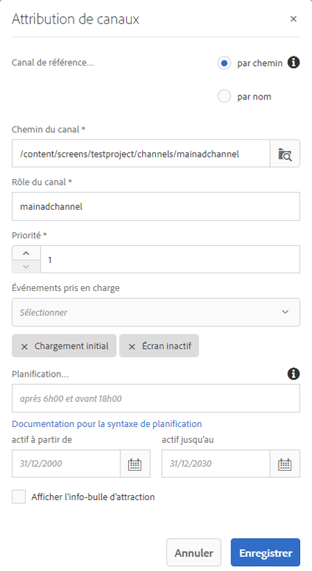
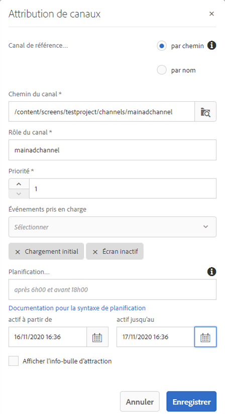
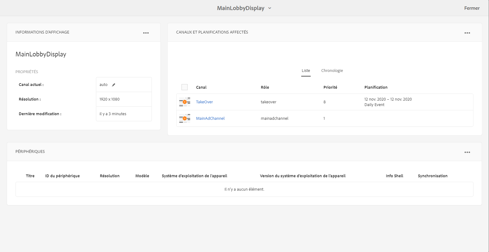

# Canal de prise en charge permanente {#perpetual-takeover-channel}

La page suivante présente un cas d’utilisation qui met l’accent sur la configuration d’un projet sur la création d’un canal de prise en charge permanente qui est lu pour une journée et une heure spécifiques en continu.

## Description du cas d’utilisation  {#use-case-description}

Ce cas d’utilisation explique comment créer un canal qui *prend le relais* du canal normalement lu pour un affichage ou un groupe d’affichages. La prise de contrôle aura lieu perpétuellement un jour et un moment précis.
Par exemple, il existe une chaîne Perpetual TakeOver qui joue tous les vendredis de 9h à 10h. Pendant ce temps, aucun autre canal ne devrait jouer. L’exemple suivant montre la création d’une chaîne de prise en charge permanente qui lit le contenu permet de lire le contenu tous les mercredis pendant 2 heures, de 17 h à 19 h.

### Conditions préalables {#preconditions}

Avant de commencer cette utilisation, assurez-vous de comprendre comment :

* **[Création et gestion des canaux](managing-channels.md)**
* **[Création et gestion des emplacements](managing-locations.md)**
* **[Création et gestion de calendriers](managing-schedules.md)**
* **[Enregistrement de périphériques](device-registration.md)**

### Acteurs principaux {#primary-actors}

Auteurs de contenu

## Setting up the Project {#setting-up-the-project}

Pour configurer un projet, procédez comme suit :

**Configuration des canaux et affichage**

1. Créez un projet AEM Screens intitulé **PerpetualTakeOver**, comme illustré ci-dessous.

   

1. Créez un **canalAdChannel** principal dans le dossier **Canaux** .

   

1. Sélectionnez **MainAdChannel** et cliquez sur **Modifier** dans la barre d’actions. Faites glisser et déposez certains fichiers (images, vidéos, séquences incorporées) sur votre canal.

   

   >[!NOTE]
   >Le **MainAdChannel** de cet exemple illustre un canal de séquence qui lit le contenu en continu.

1. Créez un canal **TakeOver** qui prend le contrôle du contenu dans **MainAdChannel** et jouera tous les mercredis de 14h00 à 16h00.

1. Sélectionnez le **TakeOver** et cliquez sur **Modifier** dans la barre d’actions. Faites glisser et déposez des fichiers sur votre canal. L’exemple suivant montre une image de zone unique ajoutée à ce canal.

   

1. Configurez un emplacement et un affichage pour vos canaux. Par exemple, l’emplacement suivant **MainLobby** et affichage **MainLobbyDisplay** est configuré pour ce projet.

   

**Affectation de canaux à un affichage**

1. Sélectionnez l’affichage **MainLobbyDisplay** dans le dossier **Emplacements** . Cliquez sur **Attribuer un canal** dans la barre d’actions pour ouvrir la boîte de dialogue Affectation **de** canal.

   >[!NOTE]
   >Pour savoir comment affecter un canal à un affichage, reportez-vous à Affectation **[de](channel-assignment.md)**canal.

1. Renseignez les champs (Chemin du **canal**, **Priorité** et Evénements **pris en charge) de la boîte de dialogue Affectation du** canal et cliquez sur Enregistrer pour affecter leMainAdChannel **à votre affichage.**********

   * **Chemin** du canal : Sélectionnez le chemin d&#39;accès au canal **MainAdChannel** .
   * **Priorité**: Définissez la priorité de ce canal sur 1.
   * **Evénements** pris en charge : Sélectionnez l’écran **initial Chargement** et **Inactif**.
   

1. Sélectionnez l’affichage **Prendre le contrôle** dans le dossier **Emplacements** . Cliquez sur **Attribuer un canal** dans la barre d’actions pour affecter le canal de reprise.

1. Pour affecter le canal **TakeOver** à votre affichage à un moment planifié et renseigner les champs suivants dans la boîte de dialogue Affectation **de** canal, puis cliquez sur **Enregistrer**:

   * **Chemin** du canal : Sélectionnez le chemin du canal **TakeOver** .
   * **Priorité**: Définissez la priorité de ce canal supérieure à celle de **MainAdChannel**. Par exemple, la priorité définie dans cet exemple est 8.
   * **Evénements** pris en charge : Sélectionnez l’écran **inactif** et le **minuteur**.
   * **Planification**: Entrez le texte de la planification pour que ce canal exécute l&#39;affichage. Par exemple, le texte ici permet au contenu de lire tous les mercredis de 14h00 à 16h00.
Le texte de la **planification** mentionnée dans cet exemple est *le mercredi après 14h00 et avant 16h00*.

      

      Accédez à l&#39;affichage à partir de **TakeOver** —> **Locations** —> **MainLobby** —> **MainLobbyDisplay et cliquez sur Dashboard dans la barre d&#39;action pour afficher les canaux affectés avec leurs priorités, comme illustré ci-dessous.******

      >[!NOTE]
      >Il est obligatoire de définir la priorité du canal de reprise comme étant la plus élevée.

      Now, la chaîne **TakeOver** prendra le relais de **MainAdChannelChannel** à 14h00 pendant deux heures jusqu&#39;à 16h00 tous les mercredis et diffusera son contenu du 9 janvier 2020 au 31 janvier 2020.

### Example Expressions {#example-expressions}

Le tableau suivant récapitule quelques exemples d’expressions que vous pouvez ajouter à la planification lors de l’affectation d’un canal à un affichage.

| **Expression** | **Interprétation** |
|---|---|
| après 12:15 et avant 12:45 | la chaîne est diffusée après 12h15 tous les jours pendant 30 minutes |
