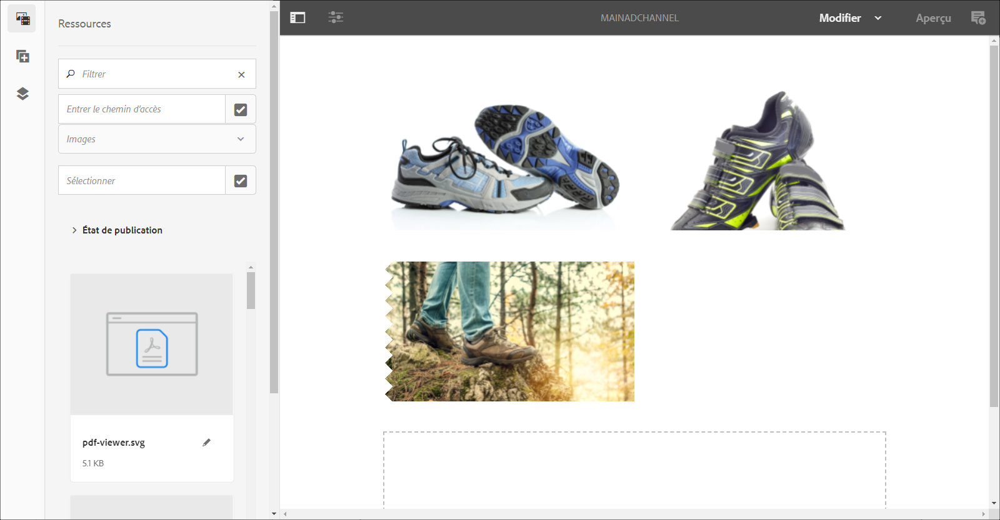
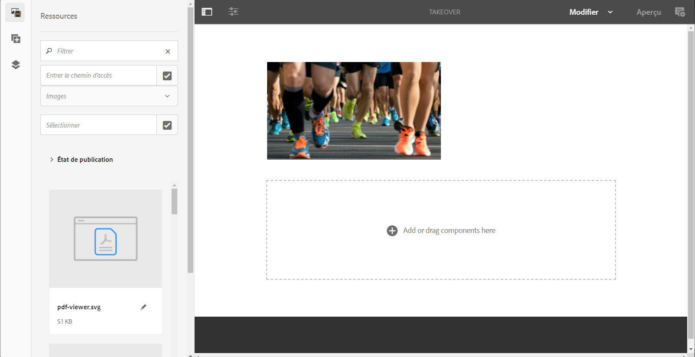
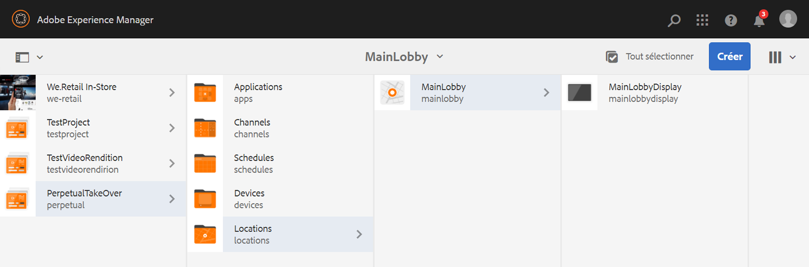
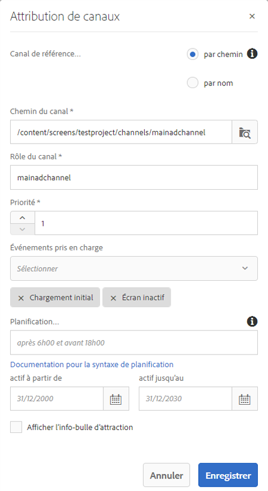
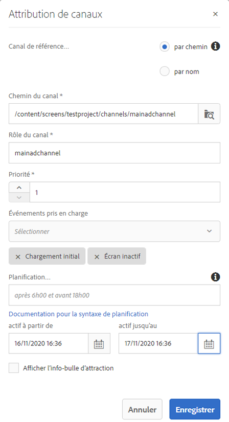
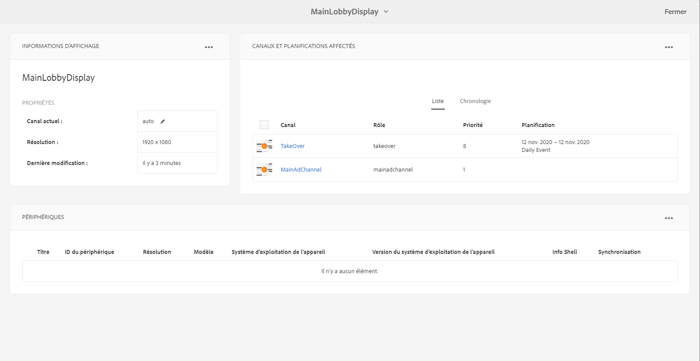

# Canal de prise de contrôle perpétuelle {#perpetual-takeover-channel}

>[!IMPORTANT]
>Ce contenu est valide pour AEM on-premise/AMS (AEM 6.5LTS et AEM 6.5). Pour le contenu AEM as a Cloud Service Screens, reportez-vous au guide [AEM as a Cloud Service](https://experienceleague.adobe.com/fr/docs/experience-manager-cloud-service/content/screens-as-cloud-service/overview/introduction).

La page suivante présente un cas d’utilisation qui met l’accent sur la configuration d’un projet concernant la création d’un canal de prise de contrôle permanente lu un jour et une heure spécifiques en continu.

## Description du cas d’utilisation {#use-case-description}

Ce cas d’utilisation explique comment créer un canal qui *prend le contrôle* du canal normalement lu pour un affichage ou un groupe d’affichages. La prise de contrôle a lieu de manière permanente pour un jour et une heure spécifiques.Par exemple, il existe un canal de prise de contrôle permanente qui est lu tous les vendredis de 9 :00 à 10 :00. Pendant ce temps, aucune autre chaîne ne doit jouer. L’exemple suivant illustre la création d’un canal de prise de contrôle perpétuel qui permet à la lecture du contenu tous les mercredis pendant deux heures:00 de 14 heures à 16 :00.

### Prérequis {#preconditions}

Avant de commencer ce cas d’utilisation, vous devez comprendre comment :

* **[Création et gestion des canaux](managing-channels.md)**
* **[Création et gestion des emplacements](managing-locations.md)**
* **[Création et gestion des planifications](managing-schedules.md)**
* **[Enregistrement d’appareils](device-registration.md)**

### Acteurs principaux {#primary-actors}

Auteurs de contenu

## Configuration du projet {#setting-up-the-project}

Pour configurer un projet, procédez comme suit :

**Configuration des canaux et de l’affichage**

1. Créez un projet AEM Screens appelé **PerpetualTakeOver**, comme illustré ci-dessous.

   

1. Créez un canal **MainAdChannel** dans le dossier **Channels** (Canaux).

   

1. Cliquez sur **MainAdChannel**, puis sur **Modifier** dans la barre d’actions. Faites glisser et déposez certaines ressources (images, vidéos, séquences incorporées) sur votre canal.

   

   >[!NOTE]
   >Le canal **MainAdChannel** de cet exemple illustre un canal de séquence qui lit le contenu en continu.

1. Créez un canal **TakeOver** qui prend en charge le contenu dans **MainAdChannel** et qui est lu tous les mercredis de 14 :00 à 16 :00.

1. Cliquez sur **TakeOver**, puis sur **Modifier** dans la barre d’actions. Faites glisser certaines ressources vers votre canal. L’exemple suivant présente une image de zone unique ajoutée à ce canal.

   

1. Configurez un emplacement et un affichage pour vos canaux. Par exemple, l’emplacement **MainLobby** et l’affichage **MainLobbyDisplay** suivants sont configurés pour ce projet.

   

**Affectation de canaux à un affichage**

1. Cliquez sur l’affichage **MainLobbyDisplay** dans le dossier **Emplacements**. Cliquez sur **Attribuer un canal** dans la barre d’actions pour ouvrir la boîte de dialogue **Attribution de canaux**.

   >[!NOTE]
   >Pour savoir comment attribuer un canal à un affichage, consultez **[Attribution de canaux](channel-assignment.md)**.

1. Renseignez les champs (**Chemin du canal**, **Priorité** et **Événements pris en charge**) de la boîte de dialogue **Attribution de canaux** et cliquez sur **Enregistrer** pour attribuer le canal **MainAdChannel** à votre affichage.

   * **Chemin du canal** : cliquez sur le chemin d’accès au canal **MainAdChannel**.
   * **Priorité** : définissez la priorité de ce canal sur 1.
   * **Événements pris en charge** : cliquez sur le **Chargement initial** et l’**Écran inactif**.

   

1. Cliquez sur l’affichage **TakeOver** dans le dossier **Emplacements**. Cliquez sur **Attribuer un canal** dans la barre d’actions pour attribuer le canal de prise de contrôle.

1. Attribuez le canal **TakeOver** à votre affichage à une heure planifiée. Renseignez ensuite les champs suivants à partir de l’**Attribution de canaux**, puis sélectionnez **Enregistrer** :

   * **Chemin du canal** : cliquez sur le chemin d’accès au canal **TakeOver**.
   * **Priorité** : attribuez à ce canal une priorité supérieure à celle du canal **MainAdChannel**. Par exemple, la priorité définie dans cet exemple est 8.
   * **Événements pris en charge** : cliquez sur **Écran inactif** et **Retardateur**.
   * **Planning** : saisissez le texte du planning selon lequel ce canal doit exécuter l’affichage. Le texte de l’**Annexe** mentionné dans cet exemple est *le mercredi après le 14:00 et avant le 16:00*.

     >[!NOTE]
     >Pour en savoir plus sur les expressions que vous pouvez ajouter au **Planning**, consultez la section [Exemples d’expressions](#example-expressions) ci-dessous.
   * **actif à partir de** : Date et heure de début.
   * **actif jusqu’à** : Date et heure de fin.

     Par exemple, le texte dans les dates et heures **Planifier** et **Actif à partir de** et **Actif jusqu’à** permet au contenu d’être lu tous les mercredis de 14 :00 à 16 :00.

     

     Accédez à l’affichage à partir de **TakeOver** > **Emplacements** > **MainLobby** > **MainLobbyDisplay** et cliquez sur **Tableau de bord** dans la barre d’actions pour afficher les canaux attribués avec leurs priorités, comme illustré ci-dessous.

     >[!NOTE]
     >Il est obligatoire de définir la priorité du canal de prise de contrôle sur le niveau le plus élevé.

     
Désormais, le canal **TakeOver** prend le contrôle du canal **MainAdChannel** à 14 :00 pendant deux heures jusqu’à 16 :00 tous les mercredis et diffuse son contenu du 9 janvier 2020 au 31 janvier 2020.

## Exemples d’expressions {#example-expressions}

Le tableau suivant récapitule quelques exemples d’expressions que vous pouvez ajouter au planning lors de l’attribution d’un canal à un affichage.

| **Expression** | **Interprétation** |
|---|---|
| avant 8:00 | la chaîne passe avant 8:00h tous les jours |
| après 14:00 | la chaîne joue après 14:00 tous les jours |
| après 12 :15 et avant 12 :45 | la chaîne passe après 12 :15 tous les jours pendant 30 minutes |
| avant 12:15 également après 12:45 | la chaîne joue avant 12 :15 tous les jours, puis également après 12 :45. |
| le premier jour de janvier après 14 :00, le deuxième jour de janvier et le troisième jour de janvier avant 3 :00. | la chaîne commence à jouer après 14 :00 01 janvier, et continue à jouer toute la journée du 2 janvier jusqu’à 3 :00 03 janvier |
| les 1 à 2 jours de janvier après 14 heures:00 ainsi que les 2 à 3 jours de janvier avant 3:00 heures. | le canal démarre le lecteur après 14 :00 01 janvier, continue la lecture jusqu’à 3 :00 02 janvier, puis recommence le 2 janvier à 14 :00 02 et continue jusqu’à 3 :00 03 janvier |

>[!NOTE]
>
>Vous pouvez également utiliser la notation _heure militaire_ (14:00) au lieu de *A.M./P.M.* (14:00).

