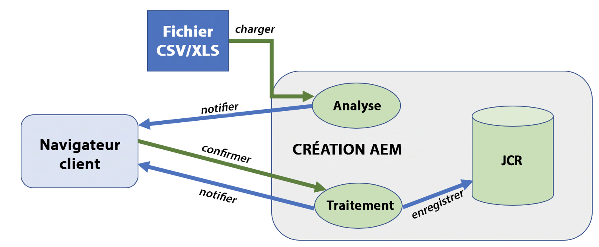
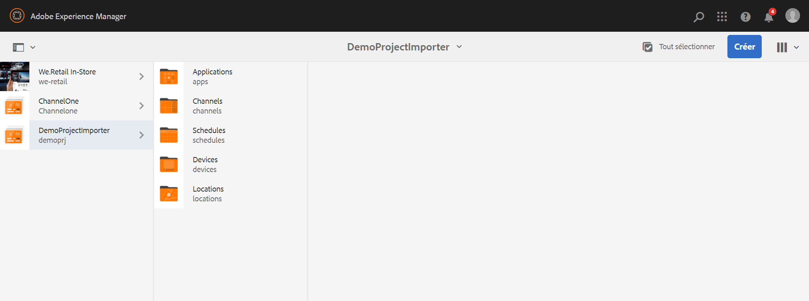
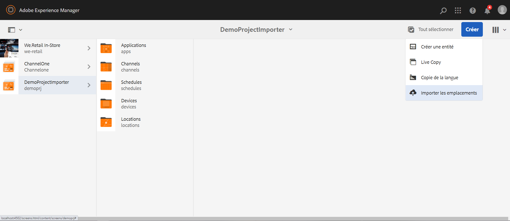
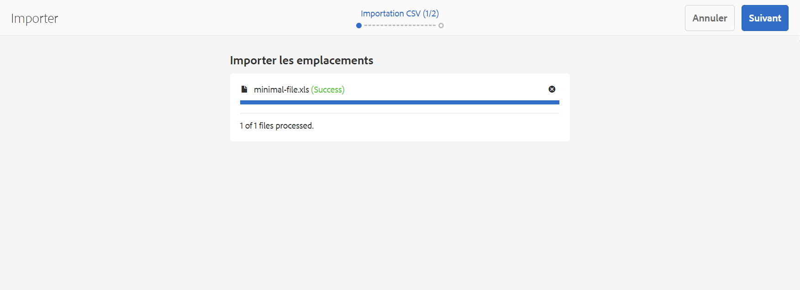
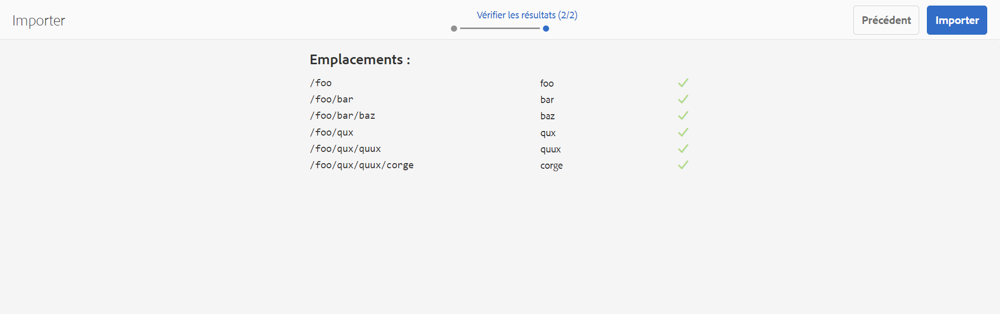
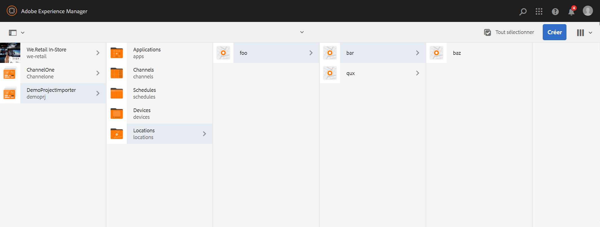

# Nouvel importateur de projet à partir d’un fichier {#new-project-importer-from-file}

Cette section décrit une fonctionnalité permettant d’importer en bloc un ensemble d’emplacements depuis une feuille de calcul CSV/XLS dans votre projet AEM Screens.

## Présentation {#introduction}

S’il s’agit de la première fois que vous configurez un projet AEM Screens pour votre entreprise, vous devez également créer tous les emplacements. Si votre projet implique un grand nombre d’emplacements, cela entraîne une tâche fastidieuse qui implique beaucoup de clics et d’attente dans l’interface utilisateur.

Cette fonctionnalité a pour objectif de réduire le temps nécessaire à la configuration du projet et de résoudre ainsi des problèmes de budgétisation.

En permettant à l’auteur de fournir une feuille de calcul en tant que fichier d’entrée et en laissant le système créer automatiquement l’arborescence de l’emplacement dans le serveur principal, cette fonction :

* *présente de meilleures performances par rapport à la navigation manuelle dans l’interface utilisateur*
* *permet aux clients d’exporter leurs emplacements depuis leur propre système et de les importer directement dans AEM*

Cela permet d’économiser du temps et de l’argent lors de la configuration initiale du projet ou lors de l’extension d’AEM Screens à de nouveaux emplacements.

## Présentation de l’architecture {#architectural-overview}

Le diagramme suivant offre un aperçu de l’architecture de la fonction Importateur de projet :

### Modèle de données {#data-model}

Le modèle de données de l’Importateur de projet est décrit ci-dessous :

>[!NOTE]
>
>La version actuelle ne prend en charge que les emplacements d’importation.

| **Propriété** | **Description** |
|---|---|
| ***path {string*}** | Chemin des ressources de l’emplacement |
| ***[./jcr:title] {string*}** | Nom du modèle à utiliser (emplacement des *écrans/du noyau/des modèles/de l’emplacement*) |
| ***template {string}*** | Titre facultatif à utiliser pour la page |
| ***[./jcr:description] {string}*** | Description facultative à utiliser pour la page |

La feuille de calcul (fichier CSV/XLS) requiert donc les colonnes suivantes :

* **path {string}** Chemin d’accès de l’emplacement à importer, où la racine du chemin d’accès correspond au dossier d’emplacement du projet (c’est-à-dire */foo* sera importé dans */content/screens/&lt;projet>/locations/foo*)

* **template {string}** Le modèle à utiliser pour le nouvel emplacement, pour l’instant la seule valeur autorisée est &quot;location&quot;, mais il sera étendu ultérieurement à tous les modèles Screens (&quot;display&quot;, &quot;sequencechannel, etc.)
* **[./*] {string}** Toute propriété facultative à définir sur l’emplacement (c’est-à-dire, ./jcr:title, ./jcr:description, ./foo, ./bar). La version actuelle n’autorise aucun filtrage pour le moment.

>[!NOTE]
>
>Toute colonne qui ne correspond pas aux conditions ci-dessus sera simplement ignorée. Par exemple, si une autre colonne est définie dans votre feuille de calcul (fichier CSV/XLS) autre que **path**, **template**, **title** et **description**, ces champs seront ignorés et l’**Importateur de projet** ne validera pas ces champs supplémentaires pour l’importation de votre projet dans votre projet AEM Screens.

## Utilisation de l’importateur de projet {#using-project-importer}

La section suivante décrit l’utilisation de l’importateur de projets dans un projet AEM Screens.

>[!CAUTION]
>
>Restrictions :
>
>* Les fichiers possédant une extension autre que CSV/XLS/XLSX ne sont pas pris en charge dans la version actuelle.
>* Il n’existe aucun filtrage des propriétés pour les fichiers importés et tout élément commençant par &quot;./&quot; sera importé.
>

### Prérequis {#prerequisites}

* Créez un projet intitulé **DemoProjectImport**

* Utilisez en exemple un fichier CSV ou Excel que vous devez importer.

A des fins de démonstration, vous pouvez télécharger un fichier Excel depuis la section ci-dessous.

[Obtenir le fichier](assets/minimal-file.xls)

### Importation du fichier avec un minimum de champs obligatoires {#importing-the-file-with-minimum-required-fields}

Pour importer un fichier dans un dossier d’emplacements avec un minimum de champs obligatoires, procédez comme suit :

>[!NOTE]
>
>L’exemple suivant présente les quatre champs minimum requis pour importer votre projet :

1. Accédez à votre projet AEM Screens (**DemoProjectImport**).

   

1. Sélectionnez le projet, **DemoProjectImporter **>** Créer **>** Importer des emplacements** depuis la barre latérale.

   

1. L’assistant d’**importation** s’ouvre. Sélectionnez votre fichier contenant des emplacements pour votre projet ou le fichier (***minimal-file.xls***) que vous avez téléchargé dans la section *Conditions préalables*.

   Une fois le fichier sélectionné, cliquez sur **Suivant**.

   

1. Vérifiez le contenu du fichier (emplacements) dans l’assistant d’importation, puis cliquez sur **Importer**.

   

1. Par conséquent, vous pourrez désormais afficher tous les emplacements importés dans votre projet.

   
