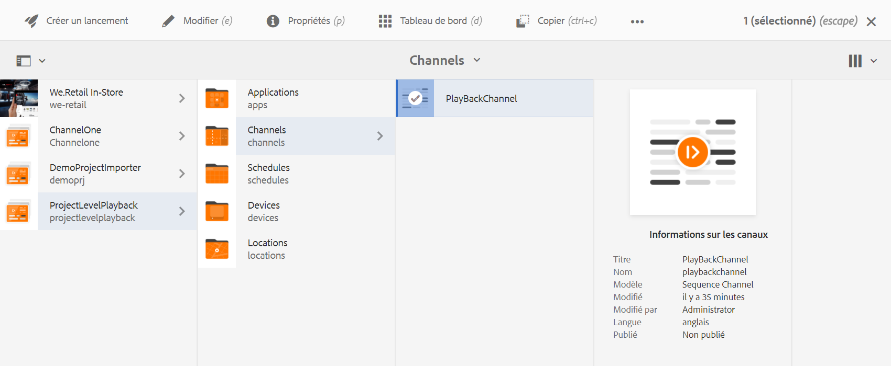
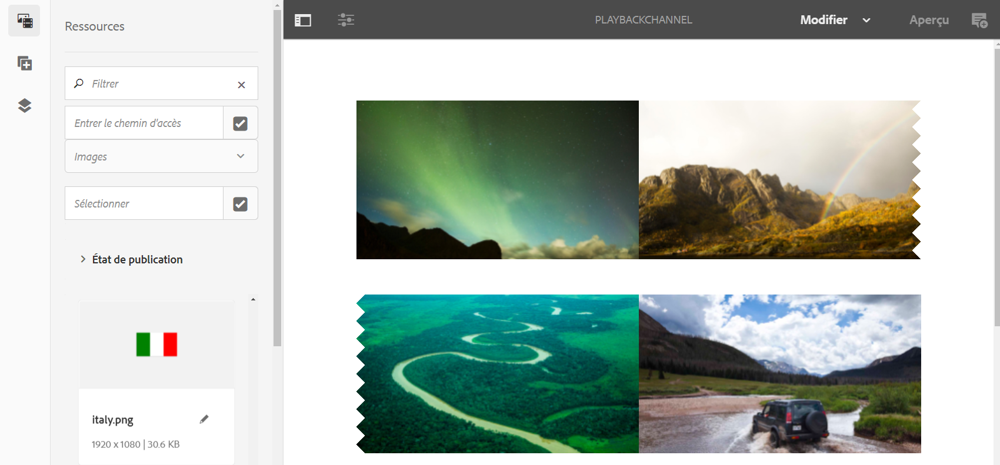
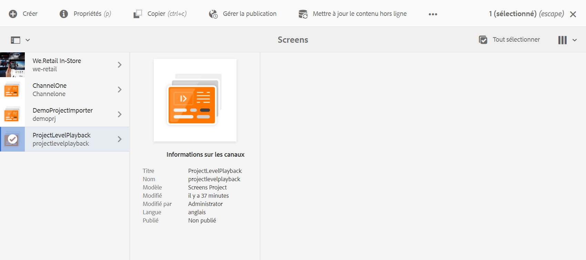

# Durée de lecture de l’image au niveau du projet {#project-level-image-playback}

## Présentation {#overview}

Cette fonctionnalité vous permet de définir la durée de lecture de l’image au niveau du projet. Par défaut, toutes les images héritent de cette durée de lecture. Si aucune durée n’est définie au niveau du projet, la lecture par défaut de 8 secondes se poursuit.

### Conditions préalables {#prerequisites}

Avant d’utiliser cette fonctionnalité, assurez-vous de configurer un projet comme prérequis pour commencer à mettre en oeuvre cette fonctionnalité. Par exemple :

1. Create an AEM Screens project (in this example, **ProjectLevelPlayback**)

1. Create a sequence channel as **PlayBackChannel** under **Channels** folder

1. Add content to **PlayBackChannel**

   

   Par exemple, l’image suivante présente les images ajoutées à l’éditeur **PlayBackChannel** :

   

## Editing Project Level Image Playback Duration Assignment {#editing-project-level-image-playback-duration-assignment}

La section ci-dessous explique comment modifier la durée de lecture du contenu dans un projet AEM Screens.

### Mise à jour de la durée de lecture des images au niveau du projet {#updating-the-playback-duration-for-images-in-a-project}

>[!NOTE]
>Si vous souhaitez mettre à jour une durée de lecture au niveau d’une image ou d’un canal, reportez-vous à la section Durée [de lecture de l’image au niveau du](channel-level-image-playback.md)canal.

Suivez les étapes ci-dessous pour savoir comment mettre à jour la durée de lecture d’image au niveau du projet :

1. Navigate to your project **ProjectLevelPlayback** and click **Properties** from the action bar.
   

1. Sélectionnez toutes les images du canal, puis cliquez sur l’icône en forme de clé à molette en haut à gauche (comme l’illustre la figure ci-dessous) pour ouvrir la boîte de dialogue de configuration de canal.

   

1. **La boîte de dialogue Page** s’ouvre.

   >[!NOTE]
   >
   >Par défaut, les images d’une chaîne sont définies sur une durée de lecture de 8 secondes et les vidéos sont lues sur la durée par défaut.

   

   Remplacez la **durée** 8 000 (ms) par 3 000 (ms), c’est-à-dire 3 secondes. Cochez la case en haut à droite de la boîte de dialogue **Page** pour enregistrer les modifications que vous avez apportées.

   

### Affichage du résultat {#viewing-the-result}

Une fois que vous avez mis à jour la durée de lecture du canal (en l’occurrence, les trois images), vous constaterez que la durée de lecture de ces images n’est pas de 8 secondes (valeur par défaut), mais de 3 secondes.

