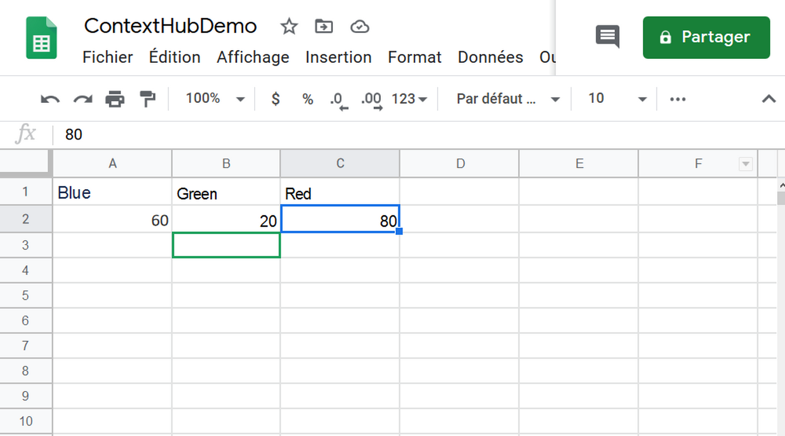
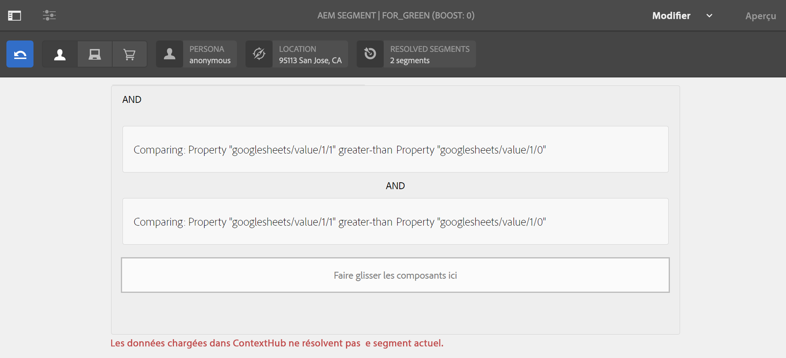
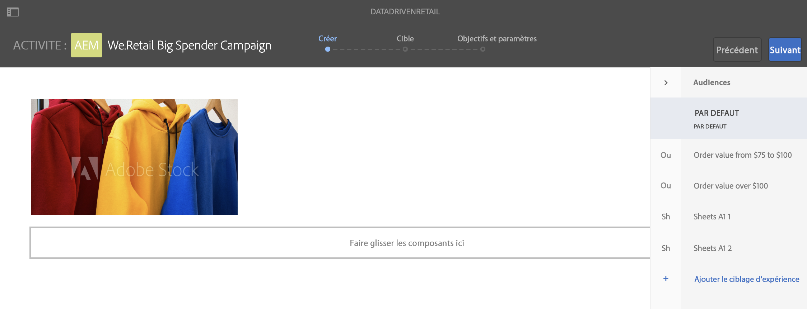

# Activation ciblée du stock de vente au détail {#retail-inventory-targeted-activation}

Le cas d’utilisation ci-dessous montre trois images différentes en fonction des valeurs de votre feuille de calcul Google.

## Description {#description}

Ce cas d’utilisation présente le stock de vente au détail de trois modèles de sweat-shirts de couleurs différentes. Selon le nombre de sweat-shirts disponibles en stock enregistré dans Google Sheets, l’image (sweat-shirt rouge, vert ou bleu) avec le plus grand nombre est affichée à l’écran.

Pour ce cas d’utilisation, le sweat-shirt rouge, vert ou bleu apparaît à l’écran en fonction du plus grand nombre d’articles disponibles.

## Conditions préalables {#preconditions}

Avant de commencer à implémenter l’activation du ciblage du stock de vente au détail, vous devez apprendre à configurer le ***magasin de données***, la ***segmentation de l’audience*** et l’***activation du ciblage des canaux*** dans un projet AEM Screens.

Consultez [Configuration de ContextHub dans AEM Screens](configuring-context-hub.md) pour plus d’informations.

## Flux de base {#basic-flow}

Pour mettre en œuvre le cas d’utilisation de l’activation du stock de vente au détail, procédez comme suit :

1. **Remplissage des feuilles de calcul Google Sheets**

   1. Accédez à la feuille de calcul Google appelée ContextHubDemo.
   1. Ajoutez trois colonnes (Rouge, Vert et Bleu) avec les valeurs correspondantes à trois sweat-shirts différents.

   

1. **Configuration des audiences selon les besoins**

   1. Accédez aux segments de votre audience (reportez-vous à l’***Étape 2 : configuration de la segmentation de l’audience*** sur la page **[Configuration de ContextHub dans AEM Screens](configuring-context-hub.md)** pour plus d’informations).

   1. Ajoutez trois nouveaux segments **For_Red**, **For_Green** et **For_Blue**.

   1. Sélectionnez **For_Red** et cliquez sur **Modifier** dans la barre d’actions.

   1. Faites glisser **Comparaison : Propriété - Propriété** et déposez-le dans l’éditeur, puis cliquez sur l’icône de configuration pour modifier les propriétés.
   1. Sélectionnez **googlesheets/value/1/2** dans la liste déroulante de **Nom de la première propriété.**

   1. Sélectionnez l’**opérateur** **supérieur à** dans le menu déroulant.

   1. Sélectionner le **Type de données** **Nombre**

   1. Sélectionnez **googlesheets/value/1/1** dans la liste déroulante de **Nom de la deuxième propriété.**.

   1. Faites glisser **une autre comparaison : Propriété - Propriété** et déposez-la dans l’éditeur, puis cliquez sur l’icône de configuration pour modifier les propriétés.
   1. Sélectionnez **googlesheets/value/1/2** dans la liste déroulante de **Nom de la première propriété**.

   1. Sélectionnez l’**opérateur** **supérieur à** dans le menu déroulant.

   1. Sélectionnez le **Type de données** **nombre**

   1. Sélectionnez **googlesheets/value/1/0** dans la liste déroulante **Nom de la deuxième propriété**

   

   De la même manière, modifiez et ajoutez des règles de propriétés de comparaison au segment **For_Blue**, comme illustré ci-dessous :

   

   De la même manière, modifiez et ajoutez des règles de propriétés de comparaison au segment **For_Green**, comme illustré ci-dessous :

   

   >[!NOTE]
   >
   >Vous remarquerez que pour les segments **For_Blue** et **For_Green**, les données ne peuvent pas être résolues dans l’éditeur car seule la première comparaison est actuellement valide, selon les valeurs de la feuille de calcul Google.

1. Recherchez et sélectionnez votre canal **DataDrivenRetail** (canal de séquence), puis cliquez sur **Modifier** dans la barre d’actions.

   

   >[!CAUTION]
   >
   >Vous devez avoir défini vos **configurations** ContextHub **à l’aide de l’onglet** Propriétés **du canal -->** **Personnalisation.**

   

   >[!NOTE]
   >
   >Vous devez sélectionner à la fois la **marque** et la **zone** pour que les activités soient correctement répertoriées au démarrage du processus de ciblage.

1. **Ajout d’une image par défaut**

   1. Ajoutez une image par défaut à votre canal et cliquez sur **Ciblage**.
   1. Sélectionnez **Marque** et l’**Activité** dans le menu déroulant, puis cliquez sur **Commencer le ciblage**.

   1. Cliquez sur **Commencer le ciblage**.

   

   >[!NOTE]
   >
   >Avant de commencer le ciblage, vous devez ajouter les segments (**For_Green**, **For_Red** et **For_Blue**) en cliquant sur **+ Ajouter le ciblage d’expérience** dans le rail latéral, comme illustré ci-dessous.

   

1. Ajoutez les images aux trois scénarios différents comme illustré ci-dessous.

   

1. **Vérification de l’aperçu**

   1. Cliquez sur **Aperçu.** Ouvrez également votre feuille de calcul Google et mettez à jour sa valeur.
   1. Modifiez la valeur des trois colonnes et notez que l’image d’affichage est mise à jour en fonction de la valeur de stock la plus élevée.

   

