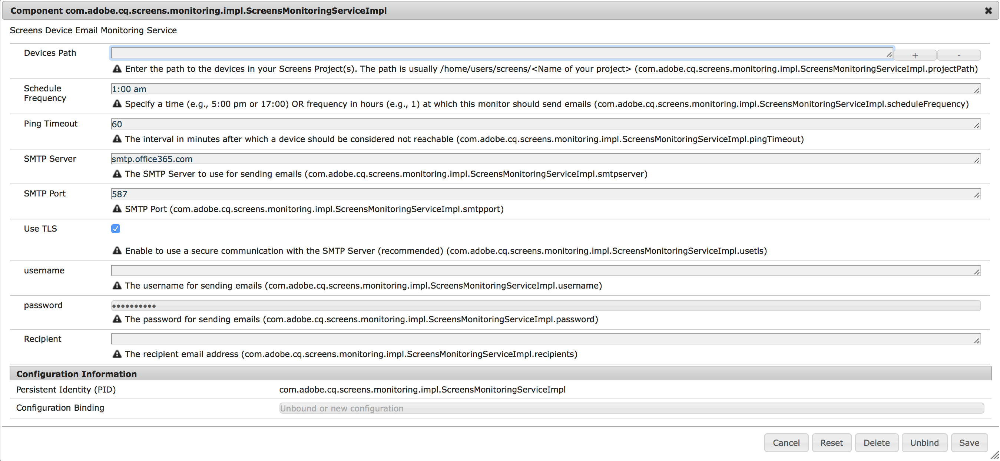

# Service de notifications AEM Screens{#aem-screens-notifications-service}

>[!IMPORTANT]
>Ce contenu est valide pour AEM on-premise/AMS (AEM 6.5LTS et AEM 6.5). Pour le contenu AEM as a Cloud Service Screens, reportez-vous au guide [AEM as a Cloud Service](https://experienceleague.adobe.com/fr/docs/experience-manager-cloud-service/content/screens-as-cloud-service/overview/introduction).

<!--removed from metadata: admitteddomains: @adobe.com;@caesars.com-->

Le ***service de notifications AEM Screens*** décrit comment surveiller l’activité des appareils.

Cette section couvre les sujets suivants :

* **Présentation**
* **Configuration des paramètres d’e-mail**
* **Notification par e-mail**
* **Exemple de cas d’utilisation**

<!-- 
OBSOLETE NOTE>
>[!CAUTION]
>
>This AEM Screens functionality is only available, if you have installed AEM 6.3.2 Feature Pack 3 or AEM 6.4.1 Screens Feature Pack 1.
>
>To get access to this Feature Pack, contact Adobe Support and request access. After you have permissions you can download it from Package Share. 
-->

## Vue d’ensemble {#overview}

Le ***service de notifications AEM Screens*** permet aux administrateurs et administratrices de recevoir un e-mail si le lecteur AEM Screens n’effectue pas de test ping pendant une période configurable.

Ce service peut être configuré dans la console web OSGi.

## Configuration des paramètres d’e-mail {#configuring-email-settings}

Pour configurer les paramètres de notification par e-mail, procédez comme suit :

1. Ouvrez le gestionnaire de **configuration de la console Web d’Adobe Experience Manager**.
1. Ouvrez le **Service de surveillance par e-mail des appareils Screens**.

   

1. Définissez les champs suivants pour configurer les paramètres d’e-mail :

   **Chemin d’accès aux appareils** - Saisissez le chemin d’accès aux projets Screens que vous souhaitez surveiller. Le chemin est habituellement `/home/users/screens/<Name of your project>`.

   Par exemple, si votre projet est **`We.Retail`**, vous utiliserez le chemin du projet ***/home/users/screens/we-retail***.

   >[!NOTE]
   >
   >Spécifiez le chemin du projet, où se trouvent les utilisateurs et utilisatrices de l’appareil.

   **Fréquence de planification** - Spécifiez une heure (par exemple, 17:00 ou 17:00) ou une fréquence en heures (par exemple, 1) à laquelle ce moniteur doit envoyer des e-mails.

   **Délai d’expiration du ping** Ce champ indique l’intervalle en minutes après lequel un appareil doit être considéré comme inaccessible.

   **Serveur SMTP** Spécifie le serveur SMTP utilisé pour envoyer des e-mails.

   **Port SMTP** Saisissez le port SMTP.

   **Utiliser TLS** Le protocole TLS (Transport Layer Security) vous permet de communiquer de manière sécurisée avec le serveur SMTP.

   Adobe recommande d’utiliser TLS pour établir une connexion sécurisée aux serveurs de messagerie d’entreprise. Vérifiez auprès de votre administrateur ou administratrice de messagerie les valeurs appropriées.

   **Nom d’utilisateur ou d’utilisatrice** Indiquez le nom d’utilisateur ou d’utilisatrice utilisé pour l’envoi des e-mails.

   **Mot de passe** Indiquez le mot de passe utilisé pour l’envoi des e-mails.

   **Personne destinataire** Indiquez l’adresse e-mail de la personne destinataire.

   >[!NOTE]
   >
   >Vous ne pouvez saisir qu’une seule adresse e-mail. Pour envoyer un e-mail en bloc, créez un groupe ou une liste de distribution contenant les utilisateurs et utilisatrices concernés.

1. Cliquez sur **Enregistrer** pour configurer l’activité du moniteur par e-mail pour votre appareil AEM Screens.

## Notification par e-mail {#email-notification}

Une fois la configuration définie pour vos notifications par e-mail, vous recevrez une notification par e-mail qui contiendra le lien vers l’appareil physique signalé comme inactif.

Ce lien vous mènera directement au tableau de bord de l’appareil.

Les e-mails ne sont envoyés que si :

* au moins un appareil qui n’a pas effectué de ping pendant le délai d’expiration du ping donné existe, et
* qu’il n’a toujours pas de ping au moment de la génération de l’e-mail.

### Exemples de cas d’utilisation {#example-use-cases}

L’exemple suivant décrit quelques scénarios à titre de référence pour configurer les propriétés à partir du service de surveillance par e-mail des appareils Screens.

**Scénario 1**

Vous définissez la fréquence de la planification sur 1 :00 et le délai d’expiration du ping sur 60. Ensuite, si votre appareil AEM Screens n’émet pas de ping entre 12 :00 et 13 :00, vous recevez une notification par e-mail qui confirme l’inactivité de l’appareil.

**Scénario 2**

Définissez la fréquence de planning sur 1 et le délai d’expiration du test ping sur 60. Ensuite, si votre appareil AEM Screens n’effectue pas de ping une fois à un moment donné de la journée, vous recevez une notification par e-mail qui confirme l’inactivité de l’appareil.

