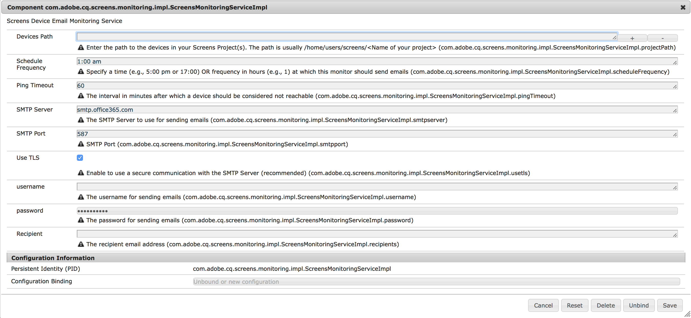

# Service de notifications AEM Screens {#aem-screens-notifications-service}

<!--removed from metadata: admitteddomains: @adobe.com;@caesars.com-->

Le ***service de notifications AEM Screens*** décrit la fonctionnalité permettant de surveiller l’activité des périphériques.

Cette section couvre les sujets suivants :

* **Présentation**
* **Configuration des paramètres d’e-mail**
* **Notification par e-mail**
* **Exemple de cas d’utilisation**

>[!CAUTION]
>
>Cette fonctionnalité d’AEM Screens est disponible uniquement si vous avez installé AEM 6.3.2 Feature Pack 3 ou AEM 6.4.1 Screens Feature Pack 1.
>
>Pour accéder à ce Feature Pack, vous devez contacter l’assistance d’Adobe et demander à y accéder. Une fois que vous disposez des autorisations nécessaires, vous pouvez le télécharger à partir de Package Share.

## Présentation {#overview}

Le ***service de notifications AEM Screens*** permet aux administrateurs de recevoir un e-mail si le lecteur AEM Screens n’effectue pas de test ping pendant une période configurable.

Ce service peut être configuré dans la console web OSGi.

## Configuration des paramètres d’e-mail {#configuring-email-settings}

Pour configurer les paramètres de notification par e-mail, procédez comme suit :

1. Ouvrez le gestionnaire de **configuration de la console Web d’Adobe Experience Manager**.
1. Ouvrez le **Service de surveillance des d’e-mails de Screens**.

   

1. Définissez les champs suivants pour configurer les paramètres d’e-mail :

   **Chemin d&#39;accès aux périphériques** Saisissez le chemin d&#39;accès au(x) projet(s) Screens que vous souhaitez surveiller. Le chemin est habituellement `/home/users/screens/<Name of your project>`.

   Par exemple, si votre projet est **We.Retail**, vous utiliserez le chemin du projet ***/home/users/screens/we-retail***.

   >[!NOTE]
   >
   >Spécifiez le chemin du projet, où se trouvent les utilisateurs du périphérique.

   **Fréquence de planification** Indiquez une heure (p. ex., 17 h ou 17 h) ou une fréquence en heures (p. ex., 1) à laquelle ce moniteur doit envoyer des e-mails.

   **Délai d&#39;expiration du ping** Indique l’intervalle en minutes après lequel un périphérique doit être considéré comme inaccessible.

   **Serveur SMTP** Spécifie le serveur SMTP utilisé pour envoyer des e-mails.

   **Port SMTP** Saisissez le port SMTP.

   **Utiliser TLS** Le protocole TLS (Transport Layer Security) vous permet de communiquer de manière sécurisée avec le serveur SMTP.

   Il est recommandé d’utiliser TLS pour établir une connexion sécurisée aux serveurs de messagerie d’entreprise. Vérifiez auprès de votre administrateur de messagerie les valeurs appropriées.

   **nom d’utilisateur** Indiquez le nom d’utilisateur utilisé pour l’envoi des e-mails.

   **mot de passe** Indiquez le mot de passe utilisé pour l’envoi des courriers e-mails.

   **Destinataire** Indiquez l’adresse e-mail du destinataire.

   >[!NOTE]
   >
   >Vous ne pouvez saisir qu’une seule adresse e-mail. Pour envoyer un e-mail en bloc, créez un groupe ou une liste de distribution contenant les utilisateurs concernés.

1. Cliquez sur **Enregistrer** pour configurer l’activité du moniteur par e-mail pour votre périphérique AEM Screens.

## Notification par e-mail {#email-notification}

Une fois la configuration définie pour vos notifications par e-mail, vous recevrez une notification par e-mail qui contiendra le lien vers le périphérique physique signalé comme inactif.

Ce lien vous mènera directement au tableau de bord du périphérique.

Les e-mails ne sont envoyés que s’il existe au moins un périphérique qui n’a pas renvoyé de ping pendant le délai d’expiration du ping spécifié et ne renvoie toujours pas de ping au moment de la génération de l’e-mail.

### Exemples de cas d’utilisation {#example-use-cases}

L&#39;exemple suivant décrit quelques scénarios à titre de référence pour configurer les propriétés à partir du service de surveillance par e-mail des périphériques Screens.

**Scénario 1** :

Si vous définissez la Fréquence de planification sur 1:00 et le délai d’expiration du ping sur 60, si votre périphérique Screens n’effectue pas de test ping entre 12:00 et 13:00, vous recevrez une notification par e-mail confirmant l’inactivité du périphérique.

**Scénario 2** :

Si vous définissez la Fréquence de planification sur 1 et le délai d’expiration du ping sur 60, si votre périphérique Screens ne renvoie pas de ping une fois à n’importe quel moment donné de la journée, vous recevrez une notification par e-mail confirmant l’inactivité du périphérique.
