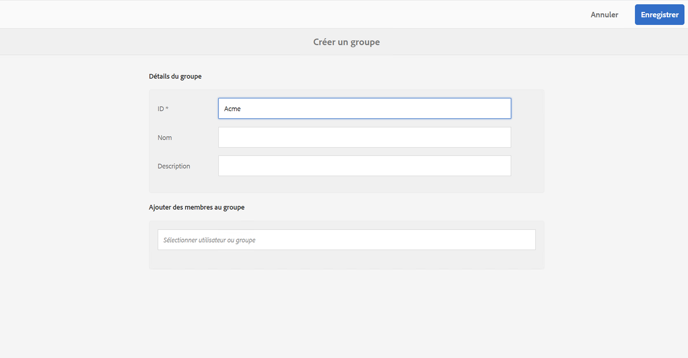
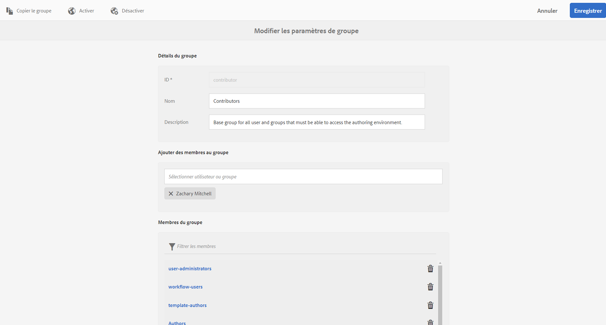
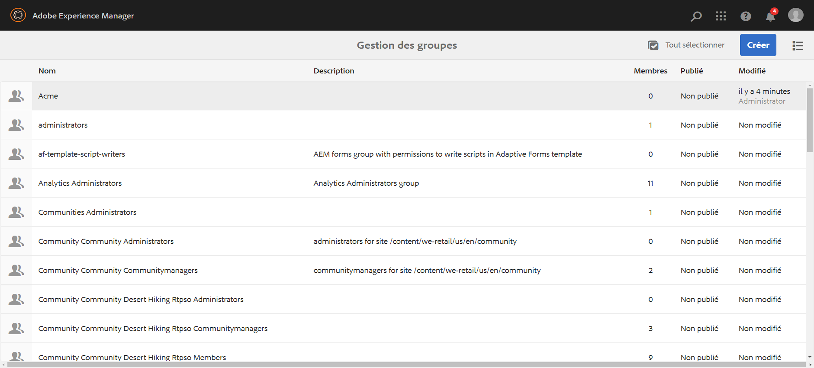
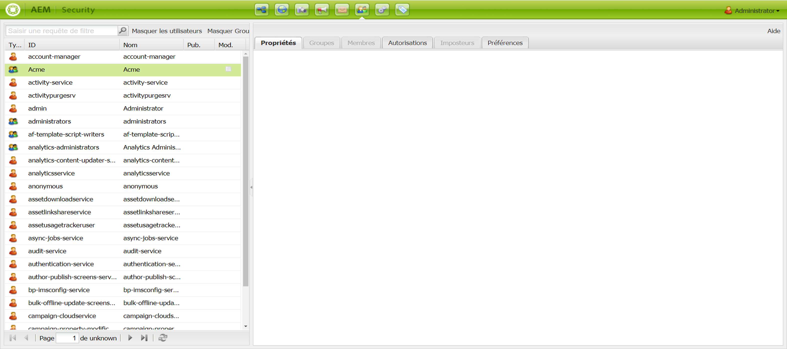

# Configuration des listes de contrôle d’accès {#setting-up-acls}

La section suivante explique comment séparer les projets à l’aide des listes de contrôle d’accès de sorte que chacune des personnes ou équipes gère son propre projet.

En tant qu’administrateur d’AEM, vous devez vous assurer que les membres de l’équipe d’un projet n’interfèrent pas avec les autres projets et que chaque utilisateur est affecté à des rôles spécifiques en fonction des exigences du projet.

## Configuration des autorisations {#setting-up-permissions}

Les étapes suivantes résument le processus de configuration de listes de contrôle d’accès pour un projet :

1. Connectez-vous à AEM et accédez à **Outils** > **Sécurité**.

   

1. Cliquez sur **Groupes**, puis saisissez un ID (par exemple, Acme).

   Vous pouvez également utiliser ce lien `http://localhost:4502/libs/granite/security/content/groupadmin.html`.

   Par la suite, cliquez sur **Enregistrer**.

   

1. Sélectionnez **Contributeurs** dans la liste et double-cliquez dessus.

   

1. Ajoutez le projet **Acme** (le projet que vous avez créé) pour **Ajouter des membres au groupe**. Cliquez sur **Enregistrer**.

   

   >[!NOTE]
   >
   >Si vous souhaitez que les membres de l’équipe de projet enregistrent les lecteurs (ce qui implique de créer un utilisateur pour chaque lecteur), recherchez le groupe administrateurs-utilisateurs et ajoutez le groupe ACME aux administrateurs-utilisateurs.

1. Ajoutez tous les utilisateurs qui vont travailler sur le projet **Acme** au groupe **Acme**.

   

1. Configurez les autorisations du groupe **Acme** à l’aide de ce `(http://localhost:4502/useradmin)`.

   Sélectionnez le groupe **Acme** et cliquez sur les **autorisations**.

   

### Autorisations {#permissions}

Le tableau ci-dessous résume le chemin d’accès avec les autorisations au niveau du projet :

| **Chemin** | **Autorisation** | **Description** |
|---|---|---|
| `/apps/<project>` | READ | Permet d’accéder aux fichiers de projet (le cas échéant). |
| `/content/dam/<project>` | ALL | Permet un accès pour stocker les ressources de projet telles que les images ou les vidéos dans la gestion des ressources numériques (DAM). |
| `/content/screens/<project>` | TOUT | Supprime l’accès à tous les autres projets sous /content/screens |
| `/content/screens/svc` | LECTURE | Fournit un accès au service d’enregistrement. |
| `/libs/screens` | LECTURE | Permet d’accéder au centre de collecte. |
| `/var/contentsync/content/screens/` | TOUT | Permet de mettre à jour le contenu en ligne pour le projet. |

>[!NOTE]
>
>Dans certains cas, vous pouvez séparer les fonctions de création (telles que la gestion des ressources et la création de canaux) des fonctions d’administration (telles que l’enregistrement des lecteurs). Dans ce cas, créez deux groupes et ajoutez le groupe des auteurs aux contributeurs et le groupe des administrateurs aux contributeurs et aux administrateurs-utilisateurs.

### Création de groupes {#creating-groups}

La création d’un nouveau projet doit également créer des groupes d’utilisateurs par défaut avec un ensemble élémentaire d’autorisations affectées. Vous devez étendre les autorisations aux rôles standard existant pour les AEM Screens.

Par exemple, vous pouvez créer les groupes spécifiques aux projets suivants :

* Administrateurs de projet Screens
* Opérateurs de projet Screens (enregistrement des lecteurs et gestion des emplacements et des périphériques)
* Utilisateurs de projet Screens (utilisation des canaux, des planifications et des affectations de canaux)

Le tableau suivant récapitule les groupes avec une description et les autorisations pour un projet AEM Screens :

<table>
 <tbody>
  <tr>
   <td><strong>Nom du groupe</strong></td>
   <td><strong>Description</strong></td>
   <td><strong>Autorisations</strong></td>
  </tr>
  <tr>
   <td>Administrateurs Screens  <em>screens-admins</em></td>
   <td>Accès de niveau administrateur aux fonctionnalités AEM Screens</td>
   <td>
    <ul>
     <li>Membre des contributeurs</li>
     <li>Membre des administrateurs-utilisateurs</li>
     <li>ALL /content/screens</li>
     <li>ALL /content/dam</li>
     <li>ALL /content/experience-fragments</li>
     <li>ALL /etc/design/screens</li>
    </ul> </td>
  </tr>
  <tr>
   <td>Utilisateurs Screens  <em>screens-users</em></td>
   <td>Créez et mettez à jour les canaux et les planifications et attribuez-les à l’emplacement dans AEM Screens</td>
   <td>
    <ul>
     <li>Membre des contributeurs</li>
     <li>&lt;projet&gt; /content/screens</li>
     <li>&lt;projet&gt; /content/dam</li>
     <li>&lt;projet&gt; /content/experience-fragments</li>
    </ul> </td>
  </tr>
  <tr>
   <td>Opérateurs Screens  <em>screens-operators</em></td>
   <td>Créez et mettez à jour la structure d’emplacement et enregistrez les lecteurs dans AEM Screens</td>
   <td>
    <ul>
     <li>Membre des contributeurs</li>
     <li>jcr:all /home/users/screens</li>
     <li>jcr:all /home/groups/screens</li>
     <li>&lt;projet&gt; /content/screens</li>
    </ul> </td>
  </tr>
  <tr>
   <td>Lecteurs Screens  <em>screens-&lt;projet&gt;-devices</em></td>
   <td>Les groupes contenant tous les lecteurs et tous les lecteurs/périphériques sont automatiquement membres des contributeurs.</td>
   <td>
 Membre des contributeurs
 </td>
  </tr>
 </tbody>
</table>
