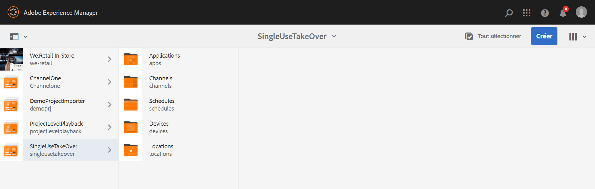

# Canal de prise en charge à usage unique {#single-use-takeover-channel}

La page suivante présente un cas d’utilisation qui met l’accent sur la configuration d’un projet sur la création d’un canal de prise en charge unique qui est lu une seule fois pendant une période spécifique.

## Description du cas d’utilisation {#use-case-description}

Ce cas d’utilisation explique comment créer un canal qui *prend le relais* du canal normalement lu pour un affichage ou un groupe d’affichages. La prise de contrôle ne se produira qu&#39;une fois et pour une durée déterminée.
Par exemple, il existe un canal TakeOver unique qui se joue le vendredi de 9 h à 10 h. Pendant ce temps, aucun autre canal ne devrait jouer. Avant et après cette période, le canal Prise en charge à usage unique ne sera pas lu. L’exemple suivant montre la création d’un canal de reprise unique qui est lu, ce qui permet au contenu de lire pendant 2 minutes avant 12h00 le 31 décembre jusqu’à 12h01.

### Conditions préalables {#preconditions}

Avant de commencer cette utilisation, assurez-vous de comprendre comment :

* **[Création et gestion des canaux](managing-channels.md)**
* **[Création et gestion des emplacements](managing-locations.md)**
* **[Création et gestion de calendriers](managing-schedules.md)**
* **[Enregistrement de périphérique](device-registration.md)**

### Acteurs principaux {#primary-actors}

Auteurs de contenu

## Setting up the Project {#setting-up-the-project}

Pour configurer un projet, procédez comme suit :

**Configuration des canaux et affichage**

1. Créez un projet AEM Screens intitulé **SingleUseTakeOver**, comme illustré ci-dessous.

   

1. Créez un **canalAdChannel** principal dans le dossier **Canaux** .

   

1. Sélectionnez **MainAdChannel** et cliquez sur **Modifier** dans la barre d’actions. Faites glisser et déposez certains fichiers (images, vidéos, séquences incorporées) sur votre canal.

   

   >[!NOTE]
   >Le **MainAdChannel** de cet exemple illustre un canal de séquence qui lit le contenu en continu.

   

1. Créez un canal **TakeOver** qui prend le contenu en charge dans **MainAdChannel** et qui ne sera lu que pour un jour et une heure spécifiques.

1. Sélectionnez le **TakeOver** et cliquez sur **Modifier** dans la barre d’actions. Faites glisser et déposez des fichiers sur votre canal. L’exemple suivant montre une image de zone unique ajoutée à ce canal.

   

1. Configurez un emplacement et un affichage pour vos canaux. Par exemple, l’emplacement suivant **Lobby** et affichage **MainLobbyDisplay** est configuré pour ce projet.

   

**Affectation de canaux à un affichage**

1. Sélectionnez l’affichage **MainLobbyDisplay** dans le dossier **Emplacements** . Click **Assign Channel** from the action bar.

   

   >[!NOTE]
   >Pour savoir comment affecter un canal à un affichage, reportez-vous à Affectation **[de](channel-assignment.md)**canal.

1. Renseignez les champs (Chemin du **canal**, **Priorité** et Evénements **pris en charge) dans la boîte de dialogue Affectation du****canal, puis cliquez sur Enregistrer.****** Vous avez maintenant affecté **MainAdChannel** à votre écran.

   

1. Sélectionnez l’affichage **Prendre le contrôle** dans le dossier **Emplacements** . Cliquez sur **Attribuer un canal** dans la barre d’actions pour affecter le canal de reprise à usage unique.

1. Pour affecter le canal **TakeOver** à votre affichage à un moment planifié et renseigner les champs suivants dans la boîte de dialogue Affectation **de** canal, puis cliquez sur **Enregistrer**:

   * **Chemin** du canal : Sélectionnez le chemin du canal de prise en charge
   * **Priorité**: Définissez la priorité de ce canal supérieure à celle de **MainAdChannel**. Par exemple, la priorité définie dans cet exemple est 8.
   * **Evénements** pris en charge : Sélectionnez l’écran **inactif** et le **minuteur**.
   * **Planification**: Entrez le texte de la planification pour que ce canal exécute l&#39;affichage. Par exemple, le texte ici permet au contenu de lire 2 minutes avant 12h00 le 31 décembre jusqu’à 12h01.
Le texte de l&#39; **annexe** mentionnée dans cet exemple est *le 31 décembre après 23:58 et le 1er janvier avant 00:01*.

      

      Accédez à l&#39;affichage à partir de **SingleUseTakeOver** —> **Locations** —> **Lobby** —> **Principale présentation du hall d&#39;entrée et cliquez sur Tableau de bord dans la barre d&#39;action pour afficher les canaux affectés avec leurs priorités, comme illustré ci-dessous.******

      >[!NOTE]
      >Il est obligatoire de définir la priorité du canal de reprise comme étant la plus élevée.

      

      >[!NOTE]
      >Vous pouvez mentionner le calendrier des différents cas d’utilisation. Consultez Cas d&#39;utilisation permanente pour plus de détails.