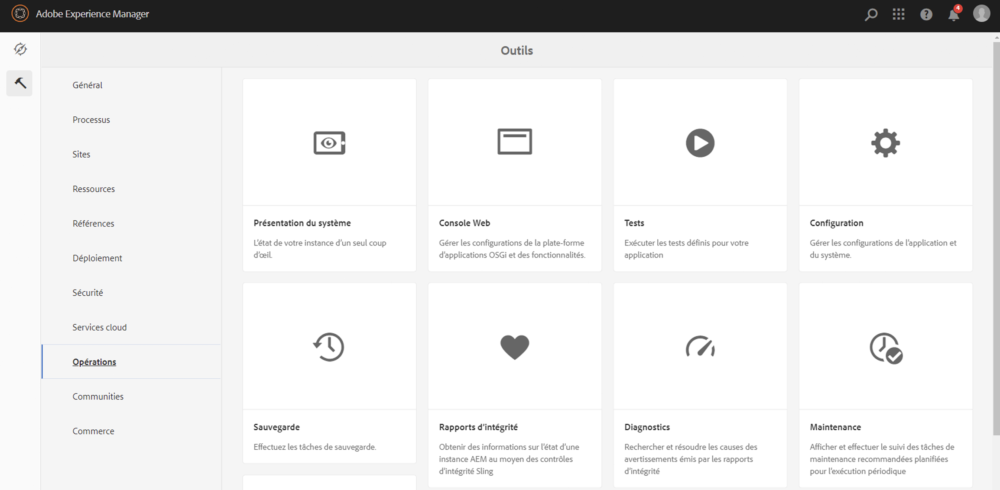
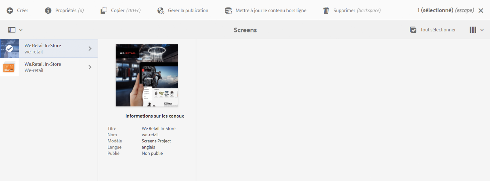

# Transition de ContentSync à SmartSync {#transitioning-from-contentsync-to-smartsync}

Cette section présente la fonctionnalité SmartSync et explique comment elle minimise la charge/le stockage du serveur et le trafic réseau afin de réduire les coûts.

## Présentation {#overview}

SmartSync est le tout dernier mécanisme utilisé par AEM Screens. Il remplace la méthode actuelle utilisée pour mettre en cache les canaux hors ligne et les diffuser au lecteur.

Il s’exécute à la fois côté serveur et côté client.

**Côté serveur** :

* Le contenu des canaux, y compris les ressources, est mis en cache dans */var/contentsync*.
* Le cache est exposé aux lecteurs via un manifeste qui décrit le contenu disponible pour un affichage.

**Côté client** :

* Le lecteur met à jour son contenu en fonction du manifeste généré ci-dessus.

### Avantages de SmartSync {#benefits-of-using-smartsync}

La fonctionnalité SmartSync offre plusieurs avantages à votre projet AEM Screens. On peut citer, entre autres :

* Une réduction spectaculaire du trafic réseau et des besoins de stockage côté serveur
* Le lecteur télécharge intelligemment les ressources uniquement si la ressource est manquante ou a été modifiée.
* Optimisations du stockage côté serveur et côté client

>[!NOTE]
>
>Adobe recommande vivement d’utiliser SmartSync pour les projets AEM Screens.

## Migration de ContentSync vers SmartSync {#migrating-from-contentsync-to-smartsync}

>[!NOTE]
>
>Si vous avez déjà installé AEM 6.3 Feature Pack 5 et AEM 6.4 Feature Pack 3, vous pouvez activer SmartSync pour les ressources afin d’améliorer l’utilisation de l’espace disque. Pour activer SmartSync, consultez la section ci-dessous pour passer de ContentSync à SmartSync et activer ainsi SmartSync.
>
>SmartSync est disponible pour le lecteur Screens avec les serveurs AEM 6.4.3 FP3 pris en charge.
>
>Reportez-vous à la section [Téléchargements du lecteur AEM Screens](https://download.macromedia.com/screens/) pour télécharger le dernier lecteur. Le tableau suivant décrit la version minimale du lecteur requise pour chaque plateforme :

| **Plate-forme** | **Version minimale du lecteur prise en charge** |
|---|---|
| Android | 3.3.72 |
| Chrome OS | 1.0.136 |
| Windows | 1.0.136 |

Pour passer de ContentSync à SmartSync, procédez comme suit :

1. La migration de ContentSync vers SmartSync nécessite l’effacement du cache ContentSync avant l’activation de SmartSync.

   Accédez à la console ContentSync à partir de votre instance à l’aide du lien ***https://localhost:4502/libs/cq/contentsync/content/console.html*** et cliquez sur **Effacer le cache**, comme illustré ci-dessous :

   

   >[!CAUTION]
   >
   >Tout le cache de contenu doit être effacé avant d’utiliser SmartSync pour la première fois.

1. Accédez au gestionnaire de **Configuration de la console Web Adobe Experience Manager** via l’instance AEM —&gt; icône en forme de marteau —&gt; **Opérations** —&gt; **Console Web**.

   

1. **La configuration de la console Web d’Adobe Experience Manager **s’ouvre. Recherchez *offlinecontentservices*.

   Pour rechercher la propriété **Services contenus hors-ligne Screens** , appuyez sur **Command+F** pour **Mac** et **Ctrl+F** pour **Windows**.

   

1. Cliquez sur **Enregistrer** pour activer la propriété **Services contenus hors ligne Screens** et, par conséquent, utiliser SmartSync pour AEM Screens.
1. Une fois que vous avez activé SmartSync, vous devez accéder à votre projet et cliquer sur **Mettre à jour le contenu hors ligne** *(dans la barre d’actions),* comme illustré ci-dessous.

   