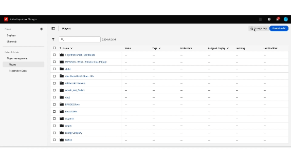

# Balisage sur Screens Cloud {#tagging-on-Screens-Cloud}

>[!CAUTION]
>
>La fonctionnalité de **balisage** n’est disponible que si elle est activée pour votre client ou cliente. Contactez l’équipe d’ingénierie AEM Screens pour l’activer.

## Présentation {#introduction}

L’utilisateur ou l’utilisatrice peut créer des balises sur Screens Cloud et les utiliser pour classer les affichages et les lecteurs.

## Créer et gérer des balises {#create-and-manage-tags}

.

Utilisez le même menu Action pour renommer une balise ou la supprimer.

>[!NOTE]
> 
> Le nom de la balise ne peut contenir que des lettres, des chiffres, des tirets et des traits de soulignement. Le nom doit commencer et se terminer par des lettres ou des chiffres uniquement.
> Un total de 500 balises est autorisé pour un client ou une cliente.

## Gérer les affectations de balises {#manage-tags-assignments}

Utilisez les balises créées sur les affichages et lecteurs. Vous pouvez en baliser un avec au maximum 30 balises.

.

## Filtrer par balises {#filter-by-tags}

Sélectionnez des balises pour filtrer la liste des affichages ou lecteurs.

.

>[!NOTE]
> 
> Les balises définies dans Screens Cloud ne sont pas liées ou synchronisées avec les balises définies dans AEM.
> 
