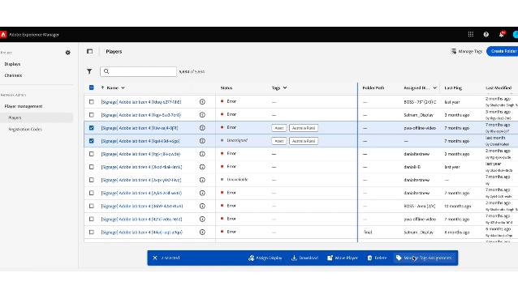
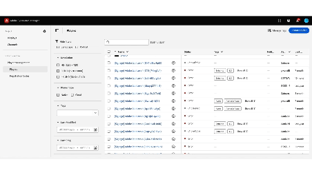

# Balisage sur Screens Cloud {#tagging-on-Screens-Cloud}

>[!IMPORTANT]
>Ce contenu est valide pour AEM on-premise/AMS (AEM 6.5LTS et AEM 6.5). Pour le contenu AEM as a Cloud Service Screens, reportez-vous au guide [AEM as a Cloud Service](https://experienceleague.adobe.com/en/docs/experience-manager-cloud-service/content/screens-as-cloud-service/overview/introduction).

>[!CAUTION]
>
>La fonctionnalité de **balisage** n’est disponible que si elle est activée pour votre client ou cliente. Contactez le service Ingénierie AEM Screens pour l’activer.

## Présentation {#introduction}

L’utilisateur ou l’utilisatrice peut créer des balises sur Screens Cloud et les utiliser pour classer les affichages et les lecteurs.

## Créer et gérer des balises {#create-and-manage-tags}

.

Utilisez le même menu Action pour renommer une balise ou la supprimer.

>[!NOTE]
> 
> Un total de 500 balises est autorisé pour un client ou une cliente.

## Gérer les affectations de balises {#manage-tags-assignments}

Utilisez les balises créées sur les affichages et les lecteurs.

.

>[!NOTE]
>
> 30 balises au maximum peuvent être attribuées à un affichage ou à un lecteur.
> 30 éléments au maximum peuvent être balisés en une seule fois.

## Filtrer par balises {#filter-by-tags}

Sélectionnez des balises pour filtrer la liste des affichages ou lecteurs.

.

>[!NOTE]
> 
> Les balises définies dans Screens Cloud ne sont pas liées ou synchronisées avec les balises définies dans AEM.
> 
