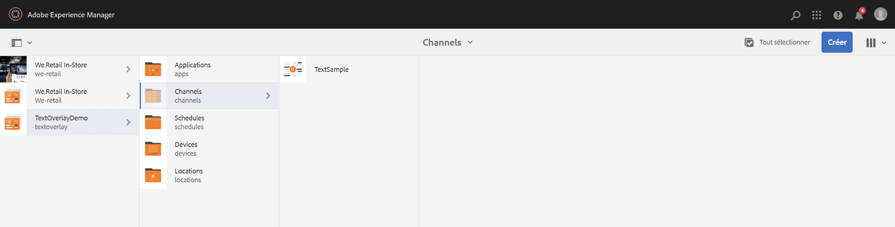
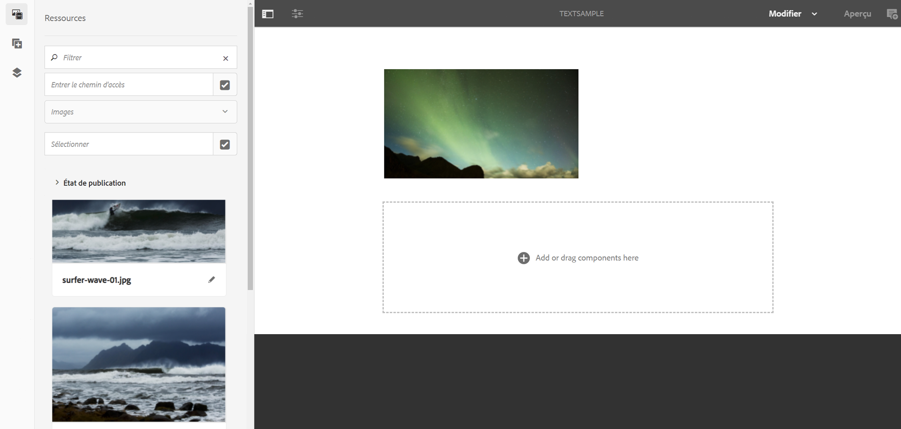
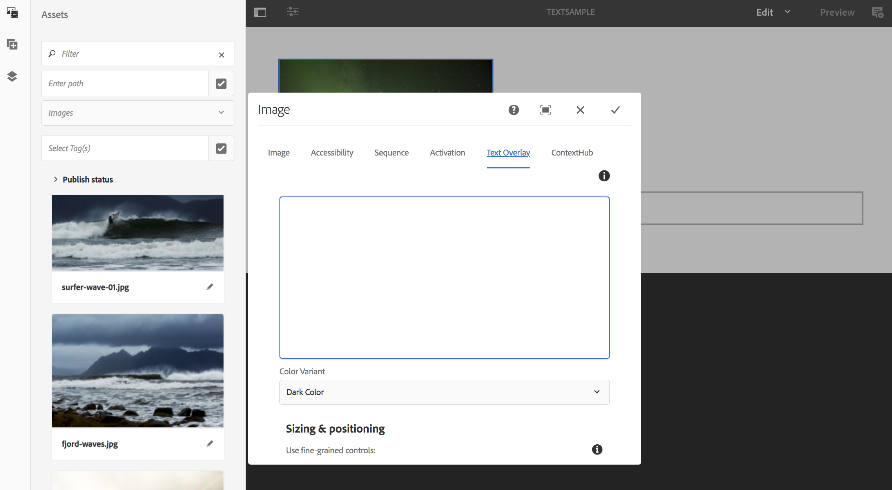

# Superposition de texte {#text-overlay}

Cette section couvre les sujets suivants :

* **Présentation**
* **Utilisation de la superposition de texte**
* **Conditions préalables**
* **Présentation des propriétés de superposition de texte**

>[!CAUTION]
>
>La fonction **Superposition de texte** n’est disponible que si vous avez installé AEM 6.3 Feature Pack 5 ou AEM 6.4 Feature Pack 3.

## Présentation {#overview}

La superposition de texte est une fonctionnalité disponible dans AEM Screens qui vous permet de créer une expérience attrayante dans un canal de séquence en incluant un titre ou une description superposés à une image.

Pour savoir comment créer votre propre composant personnalisé, reportez-vous à la section **Extension d’un composant AEM Screens**.

Cette section explique uniquement comment utiliser et exploiter le composant poster dans un projet AEM Screens et l’utiliser comme superposition de texte dans l’un de vos canaux de séquence.

## Utilisation de la superposition de texte{#using-text-overlay}

La section ci-dessous décrit l’utilisation de la superposition de texte dans un projet AEM Screens.

### Conditions préalables {#prerequisites}

Avant de commencer à implémenter cette fonctionnalité, assurez-vous d’avoir configuré un projet, condition préalable pour commencer à implémenter la superposition de texte. Par exemple :

* Créez un projet AEM Screens (dans cet exemple, **TextOverlayDemo**)

* Créez un canal appelé **TextSample** sous le dossier **Channels** (Canaux)

* Ajoutez du contenu à votre canal **TextSample**

L’image suivante montre le projet **TextOverlayDemo** avec le canal **TextSample** dans le dossier **Channels** (Canaux).

1. Accédez à **TextOverlayDemo** —&gt; **Canaux** —&gt; **TextSample** et cliquez sur **Modifier** dans la barre d’actions pour ouvrir l’éditeur.

   

1. Sélectionnez l’image et cliquez sur **Configurer** (icône en forme de clé) pour ouvrir la boîte de dialogue des propriétés.

   

1. Sélectionnez l’option **Superposition de texte** dans la barre de navigation de la boîte de dialogue, comme illustré dans la figure ci-dessous.

   

### Présentation des propriétés de superposition de texte{#understanding-text-overlay-properties}

Les propriétés de superposition de texte vous permettent d’ajouter du texte à n’importe quel composant de votre projet Screens. La section suivante présente un aperçu des propriétés disponibles dans Superposition de texte :

Vous pouvez ajouter du texte à la zone de texte et utiliser des styles typographiques tels que le gras, l’italique, le soulignement, etc.

**Variante de couleur** Cette option permet d’afficher le texte en foncé (texte en noir) ou clair (texte en blanc).

**Dimensionnement et positionnement** Cette option permet à l’utilisateur d’aligner le texte horizontalement ou verticalement, ou encore d’utiliser des outils d’ajustement précis pour l’alignement du texte.

>[!NOTE]
>
>Pour utiliser correctement les outils d’ajustement précis, veillez à identifier la position correcte en pixels en utilisant (px) comme suffixe, par exemple 200 px. Le résultat de cette expression sera de 200 pixels à partir du point de départ.

