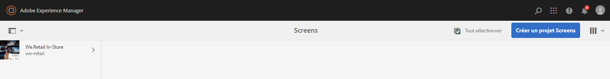
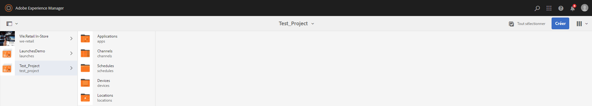
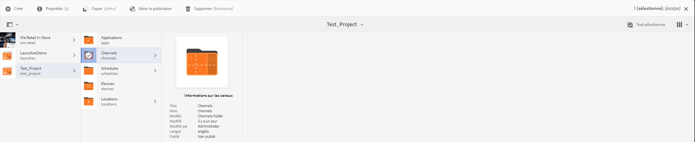
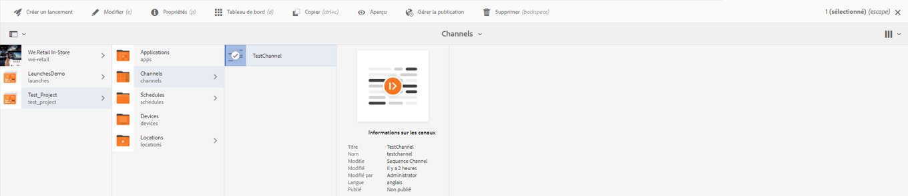

# Configuration et dépannage de la lecture vidéo {#video-playback-configuration-and-troubleshooting}

Lorsque vous chargez une vidéo dans la Gestion des actifs numériques et que vous l’ajoutez à votre canal, il est possible que la vidéo ne soit pas lue dans le lecteur Screens.

Les sections qui suivent décrivent comment déboguer et résoudre les problèmes liés à la lecture de vidéos dans votre canal.

## Rendus de la gestion des actifs numériques {#dam-renditions}

Une fois la vidéo chargée dans le canal, AEM doit commencer à créer des rendus. Vous pouvez afficher vos vidéos sous Ressources.

Pour visionner la vidéo, procédez comme suit :

1. Accédez à votre vidéo, par exemple `http://localhost:4502/assets.html/content/dam/we-retail/en/videos`.
1. Click the video and expand the top left menu and click **Renditions**.

Il doit y avoir différents rendus (MP4 ou M4V).

S’il n’existe aucun rendu, assurez-vous que ffmpeg est installé sur le système d’exploitation sur lequel AEM est en cours d’exécution.

>[!CAUTION]
>
>S’il n’existe aucun rendu, assurez-vous que ffmpeg est installé sur le système d’exploitation sur lequel AEM est en cours d’exécution.
>
>Cliquez [ici](https://evermeet.cx/ffmpeg/) pour installer ffmpeg.

## Ressources vidéo {#video-assets}

S’il n’y a pas d’attribut source sous la vidéo, il est possible que la vidéo n’ait pas été transcodée. Si la vidéo est transcodée correctement, elle s’affiche dans le tableau de bord, comme indiqué dans l’illustration ci-dessous.

Vérifiez que ffmpeg est installé et les profils vidéo.

### Vérification du profil vidéo {#checking-video-profile}

1. Navigate to the **Video Profile**, that is, `http://localhost:4502/etc/dam/video.html` and click **Upload Test Video**.

   

1. Upload a test video and click **Ok** to begin the transcoding.

   En cas d’échec du transcodage, développez la sortie ffmpeg pour comprendre les erreurs dans la sortie de la console de ffmpeg.

   

   En revanche, si la vidéo est transcodée correctement, il est possible de télécharger le fichier transcodé.

   

   >[!NOTE]
   >
   >Avant de l’ajouter à un canal, veillez à laisser suffisamment de temps pour le transcodage de la vidéo (l’indicateur « Nouvelle » et non « Traitement en cours » doit s’afficher).

### Vérification du profil avec un composant vidéo {#checking-profile-with-a-video-component}

Consultez la liste des profils dans la conception des pages si le composant vidéo n’est pas configuré correctement.

1. Accédez à votre canal et sélectionnez le mode **Conception**.

   

1. Sélectionnez la vidéo et ouvrez la boîte de dialogue **Modifier**. Ouvrez l’onglet **Profils**.

   Sélectionnez différents profils (au minimum, le profil « Qualité élevée H.264 » doit être répertorié).

   

### Vérification de la vidéo dans le lecteur web {#checking-the-video-in-the-web-player}

Use the **Web Player** `http://localhost:4502/content/mobileapps/cq-screens-player/firmware.html/content/screens/we-retail/locations/demo/flagship/single/device0` to validate playback in browsers (Chrome and Safari). Chrome est utilisé sur les appareils Android, tandis que Safari est le navigateur d’OS X et d’iOS.

Si la vidéo n’est pas lue sous Safari, elle ne fonctionnera pas dans les lecteurs OS X et iOS. Il s’agit probablement d’un problème d’encodage ; la vidéo doit être réencodée.

Pour utiliser un workflow de gestion des actifs numériques afin de créer des rendus FullHD, procédez comme suit :

1. Navigate to the *workflow model admin*, that is `http://localhost:4502/libs/cq/workflow/admin/console/content/models.html/etc/workflow/models`.
1. Sélectionnez le modèle **Screens – Mettre à jour la ressource**.
1. Cliquez sur **Démarrer le workflow** dans la barre d’actions pour ouvrir la boîte de dialogue **Exécuter le workflow**.

1. Sélectionnez la ressource vidéo dans **Charge utile**.
1. Cliquez sur **Exécuter**.

>[!NOTE]
>
>Patientez quelques instants avant de créer les rendus. Après quelques secondes ou minutes (selon la taille de la vidéo), rechargez le lecteur web sous Safari.

#### Dépannage de l’indicateur de stratégie de lecture automatique {#troubleshooting-autoplay-policy-flag}

Si le lecteur AEM Screens sélectionne la vidéo mais ne l’affiche pas, vous devez résoudre les problèmes liés à l’indicateur Stratégie de lecture automatique.

Suivez les étapes ci-dessous pour résoudre le problème d’indicateur de stratégie de lecture automatique de Google :

1. Accédez à ***chrome://flags/#autoplay-policy***
1. La stratégie **de lecture** automatique passe de **Par défaut** à **aucun mouvement utilisateur obligatoire**

1. Relancez votre navigateur Web et mettez à jour le lecteur.

>[!NOTE]
>
>Pour en savoir plus sur les meilleures pratiques pour les bonnes expériences des utilisateurs avec les nouvelles stratégies de lecture automatique dans Chrome, consultez la documentation relative aux modifications *de la stratégie de lecture* automatique, c’est-à-dire `https://developers.google.com/web/updates/2017/09/autoplay-policy-changes#webaudio`.

### Synchronisation des vidéos sur plusieurs lecteurs {#syncing-video-across-multiple-players}

Pour lire des vidéos de manière synchrone sur plusieurs périphériques, vous devez utiliser la stratégie absolue pour la séquence dans laquelle fait partie la vidéo.

#### Conditions {#requirements}

* deux joueurs identiques
* Matériel similaire idéalement
* topologie réseau identique (les lecteurs sont connectés à un serveur NTP qui aligne leurs horloges système internes)

#### Configuration de la stratégie absolue {#setting-up-the-absolute-strategy}

La stratégie absolue :

* calcule une heure d’ancrage (minuit le jour courant) ;
* calcule la durée de la séquence (somme de la durée de tous ses éléments) ;
* à tout moment, il calcule l’élément qui doit être lu et l’élément suivant en résolvant la séquence _restes_time = (current_time - anchor_time) % séquence_length.

Pour configurer une stratégie absolue, procédez comme suit :

1. Accédez au créateur du canal et sélectionnez le composant Séquence, comme indiqué dans l’illustration ci-dessous.
1. Ouvrez la boîte de dialogue de configuration.
1. Edit the **Strategy** and add absolute.

>[!NOTE]
>
>Le système d’exploitation des lecteurs doit posséder la même horloge.

**Alignement des horloges sur OS X** Suivez les étapes ci-dessous pour aligner les horloges sur OSX :

1. Open **Date &amp; Time** preferences on each OSX box
1. Vérifier** Définir la date et l'heure automatiquement**
1. Paste value 0.pool.ntp.org, 1.pool.ntp.org, 2.pool.ntp.org, 3.pool.ntp.org, time.apple.com in the dropdown or simply run *sudo ntpdate -u -v 0.pool.ntp.org*
1. Démarrez deux lecteurs ou plus.

Il peut s’écouler un certain temps avant que les lecteurs ne commencent une nouvelle séquence synchronisée.

