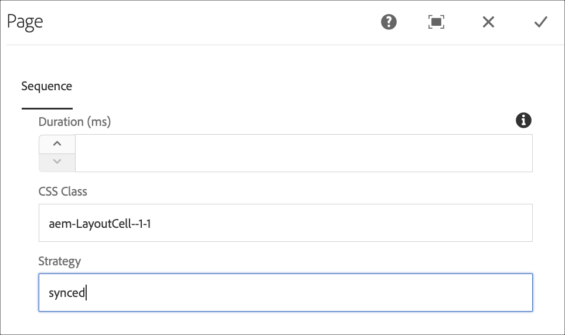

# Synchronisation des commandes {#command-sync}

La page suivante décrit l’utilisation de la synchronisation des commandes. La synchronisation des commandes permet une lecture synchronisée sur différents lecteurs. Les lecteurs peuvent lire un contenu différent, mais chaque fichier doit avoir la même durée.

## Présentation {#overview}

Les solutions de signalisation numérique doivent prendre en charge les murs vidéo et la lecture synchronisée pour prendre en charge des scénarios tels que les comptes à rebours du Nouvel An ou les vidéos volumineuses découpées pour être lues sur plusieurs écrans. C’est là que la synchronisation des commandes entre en jeu.

To use Command Sync, one player acts as a *master* and sends command and all the other players act as *clients* and play when they receive the command.

Le *maître* envoie une commande à tous les clients enregistrés lorsqu’il est sur le point de démarrer la lecture d’un élément. La charge utile liée à cette opération peut être l’index de l’élément à lire et/ou le code html externe de l’élément à lire.

## Mise en œuvre de la synchronisation des commandes {#using-command-sync}

La section suivante décrit l’utilisation de la synchronisation des commandes dans un projet AEM Screens.

### Configuration du projet {#setting-up}

Avant d’utiliser la fonction de synchronisation des commandes, assurez-vous d’avoir un projet et un canal avec du contenu configuré pour le projet.

1. L’exemple suivant présente un projet de démonstration nommé **CommandSyncDemo** et un canal de séquence **ChannelLobby**.

   

   >[!NOTE]
   >
   >Pour savoir comment créer un canal ou ajouter du contenu à un canal, voir [Création et gestion des canaux](/help/user-guide/managing-channels.md).

   Le canal contient le contenu suivant, comme illustré ci-dessous.

   

1. Créez un affichage dans le dossier **Emplacements**, comme illustré ci-dessous.
   

1. Affectez le canal **ChannelLobby** au canal **LobbyDisplay**.
   

   >[!NOTE]
   >
   >Pour savoir comment attribuer un canal à un affichage, reportez-vous à [Création et gestion des affichages](/help/user-guide/managing-displays.md)..

1. Accédez au dossier **Appareils** et cliquez sur **Gestionnaire de périphériques** dans la barre d’actions pour enregistrer les appareils.

   

   >[!NOTE]
   >
   >Pour savoir comment attribuer un canal à un affichage, reportez-vous à [Création et gestion des affichages](/help/user-guide/managing-displays.md).

1. À des fins de démonstration, cet exemple présente un périphérique chrome et un lecteur Windows comme deux périphériques distincts. Les deux appareils pointent vers le même affichage.
   

### Mise à jour des paramètres de canal

1. Accédez à **ChannelLobby** et cliquez sur **Modifier** dans la barre d’actions pour mettre à jour les paramètres du canal.

1. Sélectionnez l’ensemble du canal comme illustré dans la figure ci-dessous.
   

1. Cliquez sur l’icône de clé à molette pour ouvrir la boîte de dialogue **Page** .
   

1. Entrez le mot-clé *synchronisé* dans le champ **Stratégie** .

   

### Configuration d’un maître {#setting-up-master}

1. Accédez au tableau de bord d’affichage à partir de **CommandSyncDemo** > **Locations** > **Lobby** > **LobbyDisplay** et cliquez sur **Tableau de bord** dans la barre d’actions.
You will see the two devices (chrome and windows player) in **DEVICES** panel, as shown in the figure below.
   

1. Dans le panneau **APPAREILS**, sélectionnez l’appareil à définir comme maître. L’exemple suivant illustre la configuration de l’appareil Chrome en tant que maître. Cliquez sur **Définir en tant qu’appareil maître**.

   

1. Entrez l’adresse IP dans **Définir en tant qu’appareil maître** et cliquez sur **Enregistrer**.

   

>[!NOTE]
> Vous pouvez configurer plusieurs périphériques en tant que maîtres.

### Synchronisation avec le maître {#sync-up-master}

1. Une fois que vous avez défini le périphérique Chrome comme maître, vous pouvez synchroniser l’autre périphérique (dans ce cas, le lecteur Windows) pour la synchroniser avec le périphérique maître.
Select the other device (in this case, windows player) from the **DEVICES** panel and click on **Sync to master device**, as shown in the figure below.

   

1. Sélectionnez l’appareil dans la liste et cliquez sur **Enregistrer**.

1. Une fois que le périphérique (lecteur Windows) est synchronisé avec le maître (lecteur Chrome), le périphérique est synchronisé dans le panneau **APPAREILS** .

   

### Suppression ou déssynchronisation avec le fichier maître {#desync-up-master}

Une fois que vous avez synchronisé un ou plusieurs périphériques sur un maître, vous pouvez désynchroniser ou supprimer l’affectation de ce dernier. Pour supprimer la synchronisation du périphérique maître, sélectionnez le périphérique et cliquez sur **Desync** dans le panneau **APPAREILS** .

