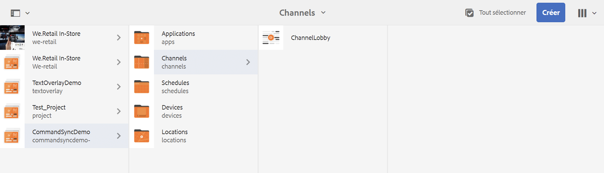
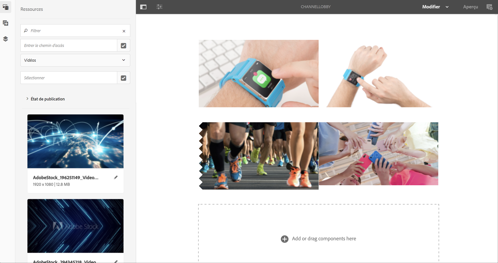
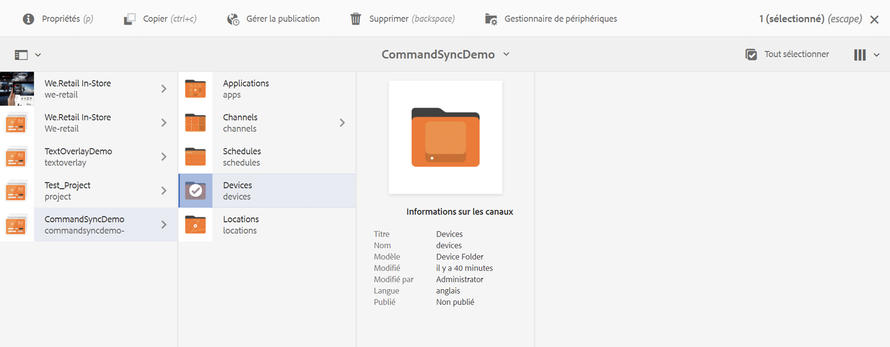
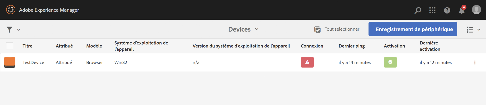
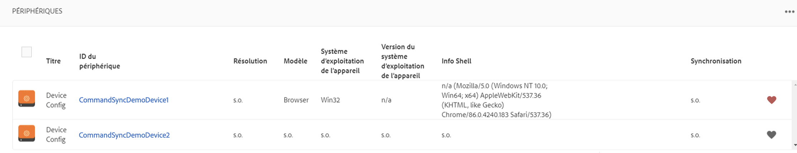
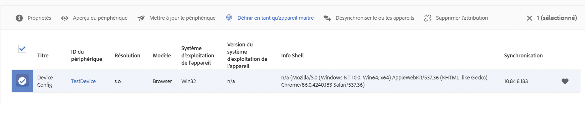
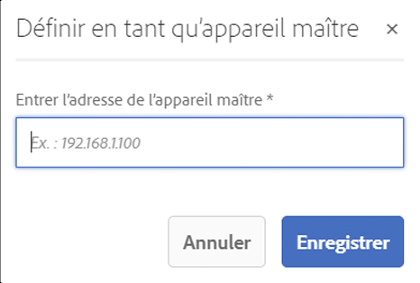
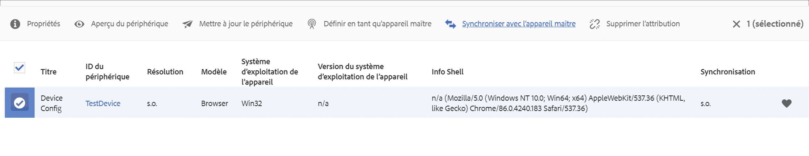
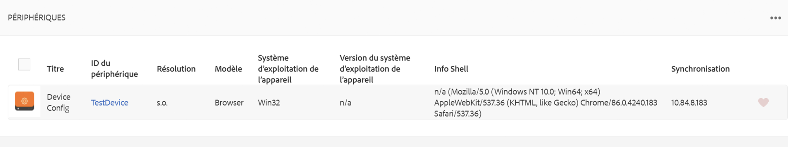
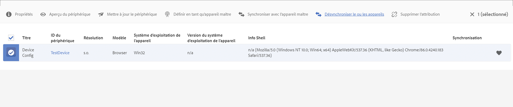

# Synchronisation des commandes {#command-sync}

La page suivante décrit l’utilisation de la synchronisation des commandes. La synchronisation des commandes permet une lecture synchronisée sur différents lecteurs. Les lecteurs peuvent lire un contenu différent, mais chaque ressource doit avoir la même durée.

>[!IMPORTANT]
>
>Cette fonctionnalité ne prend pas en charge les séquences incorporées, les séquences incorporées dynamiques, les canaux d’application ni les transitions.

## Présentation {#overview}

Les solutions de signalétique digitale doivent prendre en charge les murs vidéo et la lecture synchronisée pour prendre en charge des scénarios tels que les comptes à rebours du Nouvel An ou les vidéos volumineuses découpées pour être lues sur plusieurs écrans. C’est à ce stade que la synchronisation des commandes entre en jeu.

Pour utiliser la synchronisation des commandes, un lecteur agit comme *maître* et envoie une commande, tandis que tous les autres lecteurs agissent comme *clients* et procèdent à la lecture lorsqu’ils reçoivent la commande.

Le *maître* envoie une commande à tous les clients enregistrés lorsqu’il est sur le point de démarrer la lecture d’un élément. La charge utile liée à cette opération peut être l’index de l’élément à lire et/ou le code html externe de l’élément à lire.

## Mise en œuvre de la synchronisation des commandes {#using-command-sync}

La section suivante décrit l’utilisation de la synchronisation des commandes dans un projet AEM Screens.

>[!NOTE]
>
>Pour la lecture synchronisée, il est nécessaire que tous les appareils présentent les mêmes spécifications matérielles et, de préférence, le même système d’exploitation. Il n’est pas recommandé de synchroniser des appareils et systèmes d’exploitation différents.

### Configuration du projet {#setting-up}

Avant d’utiliser la fonction de synchronisation des commandes, assurez-vous d’avoir un projet et un canal avec du contenu configuré pour le projet.

1. L’exemple suivant présente un projet de démonstration nommé **CommandSyncDemo** et un canal de séquence **ChannelLobby**.

   

   >[!NOTE]
   >
   >Pour savoir comment créer un canal ou ajouter du contenu à un canal, voir [Création et gestion des canaux](/help/user-guide/managing-channels.md).

   Le canal contient le contenu suivant, comme illustré ci-dessous.

   

1. Créez un emplacement **Lobby**, puis, par la suite, un affichage intitulé **LobbyDisplay** dans le dossier **Locations**, comme illustré dans la figure ci-dessous.
   

1. Affectez le canal **ChannelLobby** au canal **LobbyDisplay**. Vous pouvez afficher le canal affecté à l’affichage à partir du tableau de bord.
   

   >[!NOTE]
   >
   >Pour savoir comment attribuer un canal à un affichage, voir [Création et gestion des affichages](/help/user-guide/managing-displays.md).

1. Accédez au dossier **Appareils** et cliquez sur **Gestionnaire de périphériques** dans la barre d’actions pour enregistrer les appareils.

   

   >[!NOTE]
   >
   >Pour savoir comment enregistrer un appareil, consultez [Enregistrement d’appareil](/help/user-guide/device-registration.md).

1. À des fins de démonstration, cet exemple présente un appareil Chrome et un lecteur Windows comme deux appareils distincts. Les deux appareils pointent vers le même affichage.
   

### Mise à jour des paramètres de canal

1. Accédez à **ChannelLobby** et cliquez sur **Modifier** dans la barre d’actions pour mettre à jour les paramètres du canal.

1. Sélectionnez l’ensemble du canal comme illustré ci-dessous.
   

1. Cliquez sur l’icône de clé à molette pour ouvrir la boîte de dialogue **Page**.
   

1. Entrez le mot-clé *synchronisé* dans le champ **Stratégie**.

   

### Configuration d’un maître {#setting-up-master}

1. Accédez au tableau de bord d’affichage à partir de **CommandSyncDemo** > **Locations** > **Lobby** > **LobbyDisplay** et cliquez sur **Tableau de bord** dans la barre d’actions.
Les deux appareils (Chrome et lecteur Windows) apparaissent dans le panneau **APPAREILS**, comme illustré ci-dessous.
   

1. Dans le panneau **APPAREILS**, sélectionnez l’appareil à définir comme maître. L’exemple suivant illustre la configuration de l’appareil Chrome en tant que maître. Cliquez sur **Définir en tant qu’appareil maître**.

   

1. Entrez l’adresse IP dans **Définir en tant qu’appareil maître** et cliquez sur **Enregistrer**.

   

>[!NOTE]
>
>Vous pouvez configurer plusieurs appareils en tant que maîtres.

### Synchronisation avec le maître {#sync-up-master}

1. Une fois l’appareil Chrome défini comme maître, vous pouvez synchroniser l’autre appareil (dans ce cas, le lecteur Windows) avec le maître.
Sélectionnez l’autre appareil (ici le lecteur Windows) dans le panneau **APPAREILS** et cliquez sur **Synchroniser avec l’appareil maître**, comme illustré ci-dessous.

   

1. Sélectionnez l’appareil dans la liste et cliquez sur **Enregistrer**.

   >[REMARQUE :]
   > La boîte de dialogue **Synchroniser avec l’appareil maître** affiche la liste des appareils maîtres. Vous pouvez sélectionner celui que vous désirez.

1. Une fois que l’appareil (le lecteur Windows) est synchronisé avec le maître (le lecteur Chrome), il apparaît comme synchronisé dans le panneau **APPAREILS**.

   

### Désynchronisation du maître {#desync-up-master}

Une fois que vous avez synchronisé un ou plusieurs appareils avec un maître, vous pouvez les désynchroniser.

>[!NOTE]
>
>Si vous désynchronisez un appareil maître, cela annule également la liaison de tous les appareils clients qui lui sont associés.

Pour annuler la synchronisation avec l’appareil maître, procédez comme suit :

1. Accédez au panneau **APPAREILS** et sélectionnez l’appareil.

1. Cliquez sur **Désynchroniser le ou les appareils** pour désynchroniser le client et l’appareil maître.

   

1. Cliquez sur **Confirmer** pour désynchroniser l’appareil sélectionné et le maître.

   >[REMARQUE :]
   > Si vous sélectionnez l’appareil maître et que vous utilisez l’option de désynchronisation, tous les appareils connectés au maître seront désynchronisés en une seule étape.
