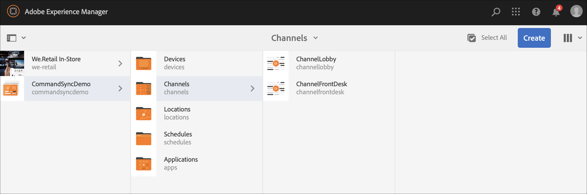
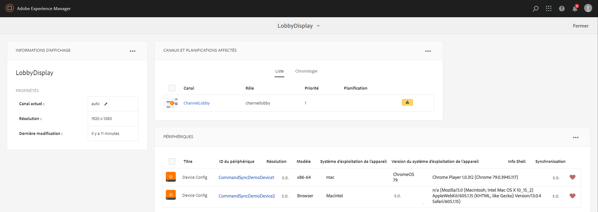
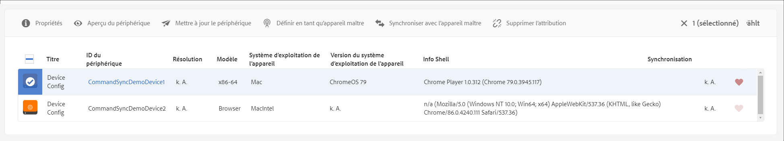

# Synchronisation des commandes {#command-sync}

La page suivante décrit l’utilisation de la synchronisation des commandes. La synchronisation des commandes permet une lecture synchronisée sur différents lecteurs. Les lecteurs peuvent lire un contenu différent, mais chaque fichier doit avoir la même durée.

## Présentation {#overview}

Les solutions de signalisation numérique doivent prendre en charge les murs vidéo et la lecture synchronisée pour prendre en charge des scénarios tels que les comptes à rebours du Nouvel An ou les vidéos volumineuses découpées pour être lues sur plusieurs écrans. C’est là que la synchronisation des commandes entre en jeu.

To use Command Sync, one player acts as a *master* and sends command and all the other players act as *clients* and play when they receive the command.

Le *maître* envoie une commande à tous les clients enregistrés lorsqu’il est sur le point de démarrer la lecture d’un élément. La charge utile liée à cette opération peut être l’index de l’élément à lire et/ou le code html externe de l’élément à lire.

## Implémentation de la synchronisation des commandes {#using-command-sync}

La section suivante décrit l’utilisation de la synchronisation des commandes dans un projet AEM Screens.

### Configuration du projet {#setting-up}

Avant d’utiliser la fonction de synchronisation des commandes, assurez-vous d’avoir un projet et un canal avec du contenu configuré pour votre projet.

1. L’exemple suivant présente un projet de démonstration nommé **CommandSyncDemo** et un canal de séquence **ChannelLobby**.

   

   >[!NOTE]
   >
   >Pour savoir comment créer un canal ou ajouter du contenu à un canal, voir [Création et gestion des canaux.](/help/user-guide/managing-channels.md)

   Le canal contient le contenu suivant, comme illustré dans la figure ci-dessous.

   

1. Créez un affichage dans le dossier **Emplacements** , comme illustré dans la figure ci-dessous.
   

1. Affectez le canal **ChannelLobby** à votre **affichage**de hall.
   

   >[!NOTE]
   >
   >To learn how to assign a channel to a display, refer to [Creating and Managing Displays](/help/user-guide/managing-displays.md)

1. Accédez au dossier **Devices** et cliquez sur **Device Manager** dans la barre d’actions pour enregistrer les périphériques.

   

   >[!NOTE]
   >
   >To learn how to assign a channel to a display, refer to [Creating and Managing Displays](/help/user-guide/managing-displays.md)

1. À des fins de démonstration, cet exemple présente un périphérique chrome et un lecteur Web comme deux périphériques distincts. Les deux périphériques pointent vers le même affichage.
   

### Setting up a Master {#setting-up-master}

1. Accédez au tableau de bord d&#39;affichage à partir de **CommandSyncDemo** —> **Locations** —> **Lobby** —> **LobbyDisplay et cliquez sur Dashboard dans la barre d&#39;actions.******
Vous verrez les deux périphériques (chrome et lecteur Windows) dans le panneau **APPAREILS** , comme illustré dans la figure ci-dessous.

   

1. Dans le panneau **APPAREILS** , sélectionnez le périphérique à définir comme maître. L’exemple suivant illustre la configuration du périphérique Chrome en tant que maître. Cliquez sur **Définir comme périphérique** maître.

   

1. Entrez l&#39;adresse IP dans **Définir comme périphérique** maître et cliquez sur **Enregistrer**.

   

### Synchronisation avec le gabarit {#sync-up-master}

1. Une fois que vous avez défini le périphérique Chrome comme maître, vous pouvez synchroniser l’autre périphérique avec le périphérique maître.
Sélectionnez l&#39;autre périphérique dans le panneau **APPAREILS** et cliquez sur **Synchroniser sur le périphérique** maître, comme illustré dans la figure ci-dessous.

1. Sélectionnez le périphérique dans la liste et cliquez sur **Enregistrer**.

1. Navigate to the [Web Player](http://localhost:4502/screens/player.html).

