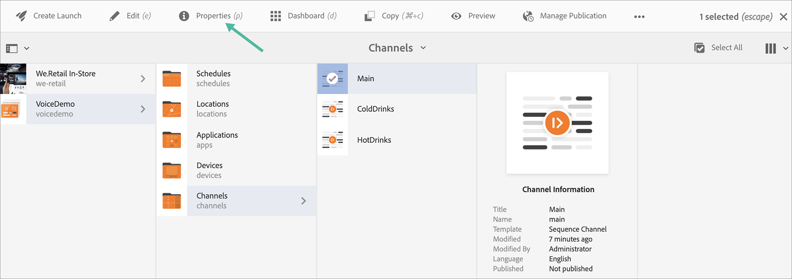

# Reconnaissance vocale dans AEM Screens {#voice-recognition}

>[!IMPORTANT]
>
>**Informations importantes concernant la confidentialité**
>
>Lorsque vous utilisez la fonction de reconnaissance vocale, suivez toutes les directives légales et éthiques applicables à votre zone géographique (y compris, mais sans s’y limiter, en indiquant clairement aux utilisateurs finaux que le lecteur utilise la reconnaissance vocale). Adobe Inc., ne reçoit, ne stocke ni ne traite aucune information relative à la voix. Les lecteurs AEM Screens utilisent l’API vocale web standard intégrée au moteur de navigation. En arrière-plan, cette API envoie une forme d’onde de votre voix aux serveurs de Google pour la convertir en texte. Ce texte est ensuite comparé par le lecteur à des mots-clés configurés.
>
>Pour plus d’informations, consultez le [livre blanc de Google relatif à la confidentialité concernant l’API vocale web](https://www.google.com/chrome/privacy/whitepaper.html#speech).

La fonction de reconnaissance vocale permet de modifier le contenu d’un canal AEM Screens par interaction vocale.

Un auteur de contenu peut configurer un affichage pour permettre la reconnaissance vocale. Cette fonction permet aux clients d’utiliser la voix pour interagir avec leurs écrans. Certains cas pratiques similaires prévoient la recherche de recommandations de produits dans les magasins ainsi que la commande de plats indiqués dans les menus des restaurants. Cette fonctionnalité accroît l’accessibilité pour les utilisateurs et peut améliorer considérablement l’expérience client.

>[!NOTE]
>Le matériel du lecteur doit prendre en charge l’entrée vocale, par exemple à l’aide d’un microphone.

## Mise en œuvre de la reconnaissance vocale {#implementing}

>[!IMPORTANT]
> La fonction de reconnaissance vocale n’est disponible que sur les lecteurs Chrome OS et Windows.

Pour mettre en œuvre la reconnaissance vocale dans votre projet AEM Screens, vous devez activer la reconnaissance vocale pour l’affichage et associer chaque canal à une balise unique afin de déclencher une transition de canal.

La section suivante décrit l’activation et l’utilisation de la fonctionnalité de reconnaissance vocale dans un projet AEM Screens.

## Affichage du contenu en mode Plein écran ou Canal d’écran partagé {#sequence-channel}

Avant d’utiliser la fonction de reconnaissance vocale, assurez-vous d’avoir un projet et un canal avec du contenu configuré pour le projet.

1. L’exemple suivant présente un projet de démonstration nommé **VoiceDemo** et trois canaux de séquence **Main**, **ColdDrinks** et **HotDrinks**, comme illustré dans la figure ci-dessous.

   

   >[!NOTE]
   >
   >Pour savoir comment créer un canal ou ajouter du contenu à un canal, voir [Création et gestion des canaux](/help/user-guide/managing-channels.md).

   Ou,

   Vous pouvez créer trois canaux de séquence **Main**, **ColdDrinks** et **HotDrinks**, ainsi qu’un canal d’écran partagé 1x2 supplémentaire **SplitScreen**, comme illustré dans la figure ci-dessous.

   

1. Accédez à chacun des canaux et ajoutez du contenu. Par exemple, accédez à **VoiceDemo** --> **Canaux** --> **Main** et sélectionnez le canal. Cliquez sur **Modifier** dans la barre d’actions pour ouvrir l’éditeur et ajouter du contenu (images/vidéos) selon vos besoins. De même, ajoutez du contenu aux canaux **ColdDrinks** et **HotDrinks**.

   Les canaux contiennent maintenant des ressources (images), comme le montrent les figures ci-dessous.

   **Main** :

   

   **ColdDrinks** :

   

   **HotDrinks** :

   

   Si vous avez ajouté le canal d’écran partagé (Split Screen) à votre projet, accédez à **SplitScreen**, faites glisser et déposez deux séquences incorporées et ajoutez les chemins d’accès aux canaux **ColdDrinks** et **HotDrinks**, comme illustré dans la figure ci-dessous.
   

### Configuration de balises pour les canaux {#setting-tags}

Une fois le contenu ajouté aux canaux, vous devez accéder à chacun d’eux et ajouter les balises appropriées pour déclencher la reconnaissance vocale.

Procédez comme suit pour ajouter des balises à votre canal :

1. Accédez à chacun des canaux et ajoutez du contenu. Par exemple, accédez à **VoiceDemo** --> **Canaux** --> **Main** et sélectionnez le canal.

1. Cliquez sur **Propriétés** dans la barre d’actions.

   

1. Accédez à l’onglet **De base** et sélectionnez une balise existante dans le champ **Balises**, ou créez-en une.

   Vous pouvez créer une balise en lui donnant un nouveau nom et appuyer sur la touche `return`, comme illustré dans la figure ci-dessous :

   

   Ou,

   Vous pouvez également créer au préalable des balises à partir de votre instance AEM pour votre projet et les sélectionner également. Une fois que vous avez suivi les étapes décrites dans [Création de balises](#creating-tags), vous pouvez sélectionner la balise à partir de l’emplacement et l’ajouter à votre canal, comme indiqué dans la figure ci-dessous :

   

1. De même, ajoutez une balise intitulée **hot** au canal **HotDrinks**.

1. Si vous utilisez un canal d’écran partagé, ajoutez les deux balises (**hot** et **cold**) aux propriétés du canal **SplitScreen**, comme indiqué dans la figure ci-dessous.

   

1. Une fois que vous avez terminé, cliquez sur **Enregistrer et fermer**.

### Création de balises {#creating-tags}

Pour créer des balises, procédez comme suit :

1. Accédez à votre instance AEM.

1. Cliquez sur l’icône Outils --> **Balisage**.
   

1. Cliquez sur **Créer** --> **Créer un espace de noms**.
   

1. Entrez le nom de votre projet, par exemple, **VoiceDemo** et cliquez sur **Créer**.

1. Sélectionnez le projet **VoiceDemo** et cliquez sur **Créer une balise** dans la barre d’actions.
   

1. Saisissez le nom de votre balise, puis cliquez sur **Envoyer**.
   

Vous pouvez désormais utiliser ces balises dans votre projet AEM Screens.

### Attribution d’un canal à un affichage et activation de la reconnaissance vocale {#channel-assignment}

1. Créez un affichage dans le dossier **Emplacements**, comme illustré ci-dessous.

   

   >[!NOTE]
   >Pour savoir comment attribuer un canal à un affichage, voir [Création et gestion des affichages](/help/user-guide/managing-displays.md).

1. Attribuez les canaux **Main**, **ColdDrinks** et **HotDrinks** à votre **LobbyDisplay**. De plus, si vous utilisez le canal **SplitScreen** pour votre projet, assurez-vous de l’attribuer également à l’affichage.

   >[!NOTE]
   >Si vous avez créé un canal d’écran partagé, attribuez aussi le canal **SplitScreen** à votre affichage.

1. Lors de l’attribution des canaux, définissez les propriétés suivantes pour chacun d’eux.

   | **Nom du canal** | **Priorité** | **Événements pris en charge** |
   |---|---|---|
   | Principal | 2 | Charge initiale, écran inactif, minuteur |
   | HotDrinks | 1 | Interaction de l’utilisateur |
   | ColdDrinks | 1 | Interaction de l’utilisateur |
   | SplitScreen | 1 | Interaction de l’utilisateur |

   >[!NOTE]
   >
   >Pour savoir comment attribuer un canal à un affichage, voir [Création et gestion des affichages](/help/user-guide/managing-displays.md).

1. Une fois que vous avez attribué des canaux à un affichage, accédez au **LobbyDisplay** et sélectionnez l’affichage. Sélectionnez **Propriétés** dans la barre d’actions.

1. Accédez à l’onglet **Affichage** et activez l’option **Reconnaissance vocale activée** dans **Contenu**.

   

   >[!IMPORTANT]
   >Il est obligatoire d’activer la fonction de reconnaissance vocale à partir de l’affichage.

### Affichage du contenu dans le lecteur Chrome {#viewing-content}

Une fois les étapes précédentes effectuées, vous pouvez enregistrer votre appareil Chrome pour afficher la sortie.

>[!NOTE]
>Voir [Enregistrement des appareils](device-registration.md) pour savoir comment enregistrer un appareil sur un lecteur AEM Screens.

**Sortie désirée du canal de séquence**

Le canal **Main** lit son contenu, mais lorsque vous utilisez le mot-clé **hot** (chaud) comme dans *Je voudrais une boisson chaude*, le canal commence à lire le contenu du canal **HotDrinks**.

De même, si vous utilisez un mot-clé **cold** (froid) comme dans *Je voudrais avoir quelque chose de froid*, le canal commence à lire le contenu du canal **ColdDrinks**.

**Sortie désirée du canal SplitScreen**

Le canal **Main** lit son contenu, mais lorsque vous utilisez les mots-clés **hot** et **cold** ensemble, comme dans *Je voudrais voir le menu des boissons chaudes et froides*, le canal commence à lire le contenu du canal **SplitScreen**. Si vous dites *Revenir au menu principal*, le processus revient au canal principal.

