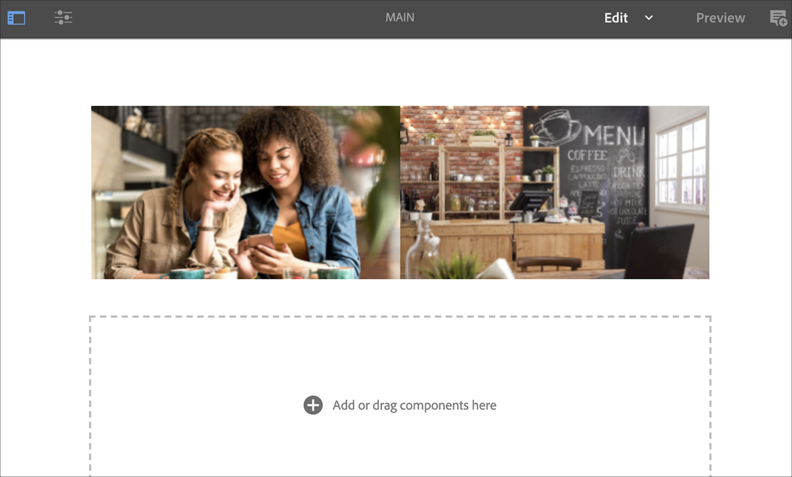

# Reconnaissance vocale en AEM Screens {#voice-recognition}

>[!IMPORTANT]
>
>**Informations importantes sur la confidentialité**
>
>Lorsque vous utilisez la fonction de reconnaissance vocale, suivez toutes les directives légales et éthiques applicables à votre région (y compris, mais sans s&#39;y limiter, en indiquant clairement aux utilisateurs finaux que le joueur utilise la reconnaissance vocale). adobe inc, ne reçoit, ne stocke ni ne traite aucune information relative à la voix. Les lecteurs AEM Screens utilisent l’API de parole Web standard intégrée au moteur de navigation. En coulisses, une forme d&#39;onde de votre discours est envoyée aux serveurs de Google pour conversion de la parole en texte et ce texte est comparé par le lecteur à des mots-clés configurés.
>
>Consultez le livre blanc sur la confidentialité de [Google sur l’API](https://www.google.com/chrome/privacy/whitepaper.html#speech) de parole Web pour plus d’informations.

La fonction de reconnaissance vocale permet de modifier le contenu dans un canal AEM Screens piloté par l’interaction vocale.

Un auteur de contenu peut configurer un affichage pour qu’il accepte la voix. Cette fonction permet aux clients d’utiliser la parole comme méthode d’interaction avec leurs écrans. Certains cas d&#39;utilisation similaires incluent la recherche de recommandations de produits dans les magasins, la commande d&#39;options de menu dans les restaurants et les dîners. Cette fonctionnalité augmente l’accessibilité pour les utilisateurs et peut améliorer considérablement l’expérience client.

>[!NOTE]
>Le matériel du lecteur doit prendre en charge la saisie vocale, par exemple un microphone.

## Mise en oeuvre de la reconnaissance vocale {#implementing}

>[!IMPORTANT]
> La fonction de reconnaissance vocale est disponible uniquement sur les lecteurs Chrome OS et Electron.

Pour mettre en oeuvre la reconnaissance vocale dans votre projet AEM Screens, vous devez activer la reconnaissance vocale pour l’affichage et associer chaque canal à une balise unique pour déclencher une transition de canal.

La section suivante décrit comment activer et utiliser la fonctionnalité de reconnaissance vocale dans un projet AEM Screens.

Vous pouvez configurer votre projet à l’aide des deux modèles suivants :

* [Canal de séquence](#sequence-channel)
* [Canal Scinder les écrans](#split-channel)

## Utilisation du Canal de séquence comme modèle {#sequence-channel}

Avant d’utiliser la fonction de reconnaissance vocale, assurez-vous d’avoir un projet et un canal avec du contenu configuré pour votre projet.

1. L’exemple suivant présente un projet de démonstration nommé **VoiceDemo** et trois canaux de séquence **Main**, **ColdDrinks** et **HotDrinks, comme illustré dans la figure ci-dessous.**

   

   >[!NOTE]
   >
   >Pour savoir comment créer un canal ou ajouter du contenu à un canal, voir [Création et gestion des canaux](/help/user-guide/managing-channels.md).

1. Accédez à chacun des canaux et ajoutez du contenu. Par exemple, accédez à **VoiceDemo** —> **Canaux** —> **Main** et sélectionnez le canal. Cliquez sur **Modifier** dans la barre d’actions pour ouvrir l’éditeur et ajouter du contenu (images/vidéos) selon vos besoins. De même, ajoutez du contenu à **ColdDrinks** et au canal **HotDrinks** .

   Les canaux contiennent désormais des ressources (images), comme le montrent les figures ci-dessous.

   **Principal**:

   

   **ColdDrinks**:

   

   **HotDrinks**:

   

### Setting up Tags for Channels {#setting-tags}

Une fois que vous avez ajouté du contenu à vos canaux, vous devez accéder à chacun des canaux et ajouter les balises appropriées qui déclencheraient la reconnaissance vocale.

Pour ajouter des balises à votre canal, procédez comme suit :

1. Accédez à chacun des canaux et ajoutez du contenu. Par exemple, accédez à **VoiceDemo** —> **Canaux** —> **Main** et sélectionnez le canal.

1. Cliquez sur **Propriétés** dans la barre d’actions.

   

1. Accédez à l’onglet **Concepts de base** et sélectionnez une balise existante dans le champ **Balises** ou créez-en une nouvelle.

   Vous pouvez créer une nouvelle balise en entrant un nouveau nom pour la balise et la `return` touche d’accès, comme illustré dans la figure ci-dessous :

   

   Ou,

   Vous pouvez créer des balises à partir de votre instance AEM au préalable pour votre projet et les sélectionner également. Une fois que vous avez suivi les étapes décrites dans la section [Création de balises](#creating-tags), vous pouvez sélectionner la balise à l’emplacement et l’ajouter à votre canal, comme indiqué dans la figure ci-dessous :

   

1. De même, ajoutez une balise intitulée **hot** au canal **HotDrinks** .

1. Cliquez sur **Enregistrer et fermer** une fois que vous avez terminé.

### Création de balises {#creating-tags}

Pour créer des balises, procédez comme suit :

1. Accédez à votre instance AEM.

1. Cliquez sur Outils —> **Balisage**.
   

1. Click **Create** --> **Create Namespace**.
   

1. Entrez le nom de votre projet, par exemple, **VoiceDemo** et cliquez sur **Créer**.

1. Select the **VoiceDemo** project and click **Create Tag** from the action bar.
   

1. Saisissez le nom de votre balise, puis cliquez sur **Envoyer**.
   

Vous pouvez désormais utiliser ces balises dans votre projet AEM Screens.

### Affectation d’un Canal à un affichage et activation de la reconnaissance vocale {#channel-assignment}

1. Créez un affichage dans le dossier **Emplacements**, comme illustré ci-dessous.

   

   >[!NOTE]
   >To learn how to assign a channel to a display, refer to [Creating and Managing Displays](/help/user-guide/managing-displays.md).

1. Attribuez les canaux **Main**, **ColdDrinks** et **HotDrinks** à votre **LobbyDisplay.**

1. Définissez les propriétés suivantes pour chacun des canaux, lors de l’attribution du canal.

   | **Nom du canal** | **Priorité** | **Événements pris en charge** |
   |---|---|---|
   | Principal | 2 | Charge initiale, écran d’inactivité, minuteur |
   | HotDrinks | 1 | Interaction de l’utilisateur |
   | ColdDrinks | 1 | Interaction de l’utilisateur |

   >[!NOTE]
   >
   >To learn how to assign a channel to a display, refer to [Creating and Managing Displays](/help/user-guide/managing-displays.md).

1. Une fois que vous avez attribué des canaux à un affichage, accédez au **LobbyDisplay** et sélectionnez l’affichage. Sélectionnez **Propriétés** dans la barre d’actions.

1. Accédez à l’onglet **Affichage** et activez l’option **Voix activée** sous **Contenu**.

   

   >[!IMPORTANT]
   >Il est obligatoire d’activer la fonction de reconnaissance vocale à partir de l’écran.

### Affichage du contenu dans Chrome Player {#viewing-content}

Une fois les étapes précédentes terminées, vous pouvez enregistrer votre périphérique chrome pour vue la sortie.

>[!NOTE]
>Reportez-vous à Enregistrement [de](device-registration.md) périphérique pour savoir comment enregistrer un périphérique sur un lecteur AEM Screens.

Cet exemple présente la sortie sur un lecteur Chrome.

Le **canal principal** lit son contenu, mais lorsque vous utilisez des mots avec des mots-clés **chauds** tels que *je voudrais avoir une boisson* chaude, les débuts canaux lisant le contenu du canal **HotDrinks.**

De même, si vous utilisez un mot avec un mot-clé **froid** tel que *je voudrais avoir quelque chose de froid*, le canal début lire le contenu du canal **ColdDrinks** .

## Utilisation du Canal Ecrans fractionnés comme modèle {#split-channel}

Avant d’utiliser la fonction de reconnaissance vocale, assurez-vous d’avoir un projet et un canal avec du contenu configuré pour votre projet.

1. L’exemple suivant présente un projet de démonstration nommé **VoiceDemo** et trois canaux de séquence **Main**, **ColdDrinks** et **HotDrinks, ainsi qu’un canal d’écran fractionné 1x2 SplitScreen comme illustré dans la figure ci-dessous.******

   

   >[!NOTE]
   >
   >Pour savoir comment créer un canal ou ajouter du contenu à un canal, voir [Création et gestion des canaux](/help/user-guide/managing-channels.md).

1. Accédez à chacun des canaux et ajoutez du contenu. Par exemple, accédez à **VoiceDemo** —> **Canaux** —> **Main** et sélectionnez le canal. Cliquez sur **Modifier** dans la barre d’actions pour ouvrir l’éditeur et ajouter du contenu (images/vidéos) selon vos besoins. De même, ajoutez du contenu à **ColdDrinks** et au canal **HotDrinks** .

   Les canaux contiennent désormais des ressources (images), comme le montrent les figures ci-dessous.

   **Principal**:

   

   **ColdDrinks**:
   

   **HotDrinks**:

   

1. Accédez à **SplitScreen** , faites glisser et déposez deux séquences incorporées et ajoutez des chemins au canal **ColdDrinks** et **HotDrinks** , comme illustré dans la figure ci-dessous.
   

### Setting up Tags for Channels {#setting-tags-split}

Une fois que vous avez ajouté du contenu à vos canaux, vous devez accéder à chacun des canaux et ajouter les balises appropriées qui déclencheraient la reconnaissance vocale.

Pour ajouter des balises à votre canal, procédez comme suit :

1. Accédez à chacun des canaux et ajoutez du contenu. Par exemple, accédez à **VoiceDemo** —> **Canaux** —> **Main** et sélectionnez le canal.

1. Cliquez sur **Propriétés** dans la barre d’actions.

   

1. Accédez à l’onglet **Concepts de base** et sélectionnez une balise existante dans le champ **Balises** ou créez-en une nouvelle.

   Vous pouvez créer une nouvelle balise en entrant un nouveau nom pour la balise et la `return` touche d’accès, comme illustré dans la figure ci-dessous :

   

   Ou,

   Vous pouvez créer des balises à partir de votre instance AEM au préalable pour votre projet et les sélectionner également. Une fois que vous avez suivi les étapes décrites dans la section [Création de balises](#creating-tags), vous pouvez sélectionner la balise à l’emplacement et l’ajouter à votre canal, comme indiqué dans la figure ci-dessous :

   

1. De même, ajoutez une balise intitulée **hot** au canal **HotDrinks** .

1. ajoutez les balises (**chaud** et **froid**) aux propriétés de canal **SplitScreen** .

   

1. Cliquez sur **Enregistrer et fermer** une fois que vous avez terminé.

### Affectation d’un Canal à un affichage et activation de la reconnaissance vocale {#channel-assignment-split}

1. Créez un affichage dans le dossier **Emplacements**, comme illustré ci-dessous.

   

   >[!NOTE]
   >To learn how to assign a channel to a display, refer to [Creating and Managing Displays](/help/user-guide/managing-displays.md).

1. Affectez les canaux **Main**, **ColdDrinks**, **HotDrinks** et **SplitScreen à votre LobbyaffichageÉcran.******

1. Définissez les propriétés suivantes pour chacun des canaux, lors de l’attribution du canal.

   | **Nom du canal** | **Priorité** | **Événements pris en charge** |
   |---|---|---|
   | Principal | 2 | Charge initiale, écran d’inactivité, minuteur |
   | HotDrinks | 1 | Interaction de l’utilisateur |
   | ColdDrinks | 1 | Interaction de l’utilisateur |
   | SplitScreen | 1 | Interaction de l’utilisateur |

   >[!NOTE]
   >
   >To learn how to assign a channel to a display, refer to [Creating and Managing Displays](/help/user-guide/managing-displays.md).

1. Une fois que vous avez attribué des canaux à un affichage, accédez à l’affichage **du hall** et sélectionnez l’affichage. Sélectionnez **Propriétés** dans la barre d’actions.

1. Accédez à l’onglet **Affichage** et activez l’option **Voix activée** sous **Contenu**.

   

   >[!IMPORTANT]
   >Il est obligatoire d’activer la fonction de reconnaissance vocale à partir de l’écran.

### Affichage du contenu dans Chrome Player {#viewing-content-split}

Une fois les étapes précédentes terminées, vous pouvez enregistrer votre périphérique chrome pour vue la sortie.

>[!NOTE]
>Reportez-vous à Enregistrement [de](device-registration.md) périphérique pour savoir comment enregistrer un périphérique sur un lecteur AEM Screens.

Cet exemple présente la sortie sur un lecteur Chrome.

Le canal **principal** lit son contenu, mais lorsque vous utilisez des mots avec des mots-clés **chauds** et **froids** ensemble, comme *je voudrais voir le menu pour les boissons chaudes et froides, les débuts canaux lisant le contenu du canal SplitScreen.*****

