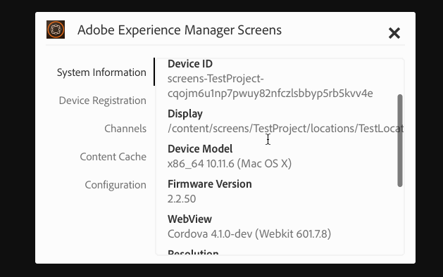

# Utilisation du lecteur AEM Screens

Vous pouvez gérer le contenu du canal et d’autres paramètres sur l’écran AEM Screens.

>[!NOTE]
>
>Presse ***Ctrl+Cmd+F*** vous pouvez donc quitter le mode plein écran du lecteur AEM Screens OS X.

Une fois que vous avez attribué un canal à un affichage, le lecteur AEM Screens affiche le contenu. Vous pouvez configurer les paramètres de votre lecteur à l’aide des préférences de l’interface utilisateur d’administration (du tableau de bord) ou du lecteur lui-même.

## Utilisation du tableau de bord de l’appareil {#using-the-device-dashboard}

Vous pouvez configurer les préférences de votre appareil à partir de son tableau de bord, accessible via votre instance de création AEM.

1. Accédez au tableau de bord du périphérique à partir de votre projet, par exemple : ***Test du projet*** > ***Périphériques***.

   Sélectionnez **Appareils** et **Gestionnaire d’appareils** dans la barre d’actions.

   

1. Cliquez sur le périphérique pour ouvrir le tableau de bord du périphérique.

   

1. Consultez le panneau **PRÉFÉRENCES**. Vous pouvez activer/désactiver l’**interface utilisateur d’administration** et le **sélecteur de canal** pour votre lecteur grâce à ces deux options.

   

### L’interface utilisateur d’administration {#the-admin-ui}

En activant l’**interface utilisateur d’administration** à partir du panneau Préférences, l’utilisateur peut ouvrir les paramètres d’administrateur du lecteur Screens. En outre, si vous désactivez cette option dans le tableau de bord du périphérique, l’utilisateur ne peut pas ouvrir l’interface utilisateur d’administration à partir du lecteur.

Pour afficher l’interface utilisateur d’administration du lecteur Screens, appuyez longuement sur le coin supérieur gauche afin d’ouvrir le menu Admin, sur votre lecteur AEM Screens tactile ou en utilisant la souris. Les informations s’affichent une fois l’enregistrement terminé et les canaux chargés.

>[!NOTE]
>
>Vous pouvez également afficher le temps de disponibilité de l’application AEM Screens Player pour vérifier l’état d’intégrité de l’application.

#### Accès aux options du menu de configuration {#configuration-options}

Vous pouvez mettre à jour vos configurations si vous sélectionnez l’option **Configuration** dans le menu latéral, comme illustré dans la figure ci-dessous :

Le menu Configuration vous permet de modifier les paramètres suivants :

* Réinitialisez **Micrologiciel**, **Préférences** ou **Paramètres d’usine** dans cette boîte de dialogue.

* Spécifiez le nombre maximal de fichiers journaux à conserver pour un lecteur AEM Screens dans **Nombre max. de fichiers journaux à conserver**.

* Activez ou désactivez **Menu d’administration**, **Sélecteur de canal** et **Activity UI** (IU d’activité) pour le lecteur Screens.

  Si la case **Activity UI** (IU d’activité) est cochée dans le menu **Configuration**, le lecteur AEM Screens affiche les *notifications d’activité du lecteur* dans le coin supérieur droit du lecteur, comme illustré ci-dessous.

  

>[!NOTE]
>
>La variable **Mettre à jour le micrologiciel** fonctionne uniquement sur Cordova, comme les lecteurs Android™.

>[!NOTE]
>
>Il est recommandé de désactiver l’**interface utilisateur d’administration** dans les déploiements de production.

#### Accès aux options du menu Cache de contenu {#content-cache-options}

Vous pouvez effacer le cache des canaux et des applications à partir de l’interface utilisateur d’administration du lecteur AEM Screens.

Sélectionnez la variable **Cache de contenu** à partir du rail latéral afin que vous puissiez mettre à jour le cache.

### Le sélecteur de canal {#the-channel-switcher}

En activant le **sélecteur de canal** à partir du panneau Préférences, l’utilisateur peut ouvrir la sélection ou les paramètres de canal du lecteur Screens.

En outre, si vous désactivez cette option dans le tableau de bord du périphérique, l’utilisateur ne peut pas contrôler les préférences de canal à partir du lecteur Screens.

Vous pouvez permuter et contrôler les paramètres de votre canal à partir de votre lecteur Screens.

Pour afficher le sélecteur de canal à partir du lecteur, appuyez longuement sur le coin inférieur gauche afin d’ouvrir le sélecteur de canal qui permet de basculer entre les canaux et d’autres fonctionnalités.

>[!NOTE]
>
>Vous pouvez également activer ou désactiver le menu d’administration et le sélecteur de canal pour le lecteur à partir du lecteur Screens.
>
>(Voir *Modification des préférences à partir du lecteur Screens* comme mentionné dans la section ci-dessous).

### Gestions des préférences à partir du lecteur AEM Screens

Vous pouvez également modifier les paramètres de l’interface utilisateur d’administration et le sélecteur de canal à partir du lecteur.

Pour modifier les préférences du lecteur :

1. Appuyez longuement dans le coin supérieur gauche du canal inactif pour ouvrir le panneau d’administration.
1. Accédez à **Configuration** dans le menu d’actions à gauche.
1. Activez/désactivez la configuration pour l’**interface utilisateur d’administration** ou le **sélecteur de canal**.

## Dépannage du lecteur AEM Screens

Vous pouvez résoudre de nombreux problèmes liés au lecteur AEM Screens (matériels et logiciels) :

| **Numéros** | **Recommandations** |
|---|---|
| L’espace de stockage du lecteur est plein | Éliminez les fichiers inutiles |
| Le lecteur a perdu le réseau | Utilisez un câble Cat-5/Cat-6. Pour une connexion Wi-Fi, réduisez la distance entre le routeur et l’appareil de lecture. |
| Le lecteur AEM Screens s’est bloqué | Il est recommandé de disposer d’une application de contrôle qui vérifie que le lecteur AEM Screens fonctionne toujours. |
| Perte des paramètres du lecteur AEM Screens | Vérifiez la connexion au serveur AEM |
| Le lecteur AEM Screens ne démarre pas automatiquement après le redémarrage du lecteur | Vérifiez le dossier de démarrage ou de la procédure d’initialisation du système d’exploitation |
| Le lecteur AEM Screens affiche un contenu erroné/obsolète | Vérifiez la connexion réseau |

### Mises à jour du lecteur AEM Screens

Il existe deux types de mises à jour du lecteur AEM Screens :

| **Méthode** | **Détails** | **par le biais de l’option À distance** | **Automatique** | **0 temps d’arrêt** |
|---|---|---|---|---|
| Mise à jour du micrologiciel | Application sur les lecteurs existants installés par le biais d’une commande à distance. Après la mise à jour, le lecteur se recharge automatiquement avec le contenu existant. | Oui | Personnalisé | Presque - 1 à 3 secondes |
| Mises à jour du shell du lecteur | Il s’agit d’un nouveau fichier exécutable à déployer sur le lecteur. Pour ce faire, vous devez copier à distance le nouveau fichier binaire sur le lecteur, arrêter l’exécution en cours et démarrer la nouvelle version. Cela peut nécessiter le téléchargement du préchargement des modules à nouveau. | Oui (par shell distant) | Personnalisé | Non |

## Instructions de sélection du matériel pour les appareils de lecture {#hardware-selection-guidelines-for-player-device}

La section suivante présente les directives de sélection du matériel pour un projet Screens :

* Vous devez toujours vous procurer des composants de qualité ***professionnelle*** ou ***industrielle*** pour le lecteur PC comme pour le panneau d’affichage ou le projecteur.

* Adressez-vous toujours à des fournisseurs qui desservent le marché de la signalétique numérique.
* Tenez toujours compte des facteurs environnementaux tels que la température ambiante et l’humidité relative.
* Examinez toujours les exigences en matière d’alimentation et de conditionnement d’alimentation.
* Examinez attentivement les besoins en performances et les ports d’E/S requis pour l’application.

Le tableau suivant récapitule les configurations matérielles avec les cas d’utilisation standard d’un projet AEM Screens :

<table>
 <tbody>
  <tr>
   <td>Configuration du lecteur</td>
   <td>Processeur</td>
   <td>Mémoire</td>
   <td>Lecteur SSD</td>
   <td>GPU</td>
   <td>Affichage</td>
   <td>E/S</td>
   <td>Cas d’utilisation standard</td>
  </tr>
  <tr>
   <td>De base</td>
   <td>Processeur Intel® Atom quadri-coeur double coeur, i3 ou quadri-coeur d’entrée de gamme</td>
   <td>
4 Go de mémoire
 
2 Mo de cache
 </td>
   <td>
*ChromeOS 32 Go
 
*Windows 128 Go
 </td>
   <td>Intégré</td>
   <td>1920 x 1080</td>
   <td>DVI  Ethernet / sans fil  2xUSB</td>
   <td>
    <ul>
     <li>Boucle plein écran standard  </li>
     <li>Tranches horaires</li>
    </ul> </td>
  </tr>
  <tr>
   <td>Standard</td>
   <td>Processeur quadri-coeur Intel® Core™ i5</td>
   <td>
8 Go de mémoire
 
4 Mo de cache
 </td>
   <td>128 Go</td>
   <td>Intégré</td>
   <td>3840 x 2160 (4K)</td>
   <td>DVI, HDMI  Ethernet / sans fil,  2 x USB</td>
   <td>
    <ul>
     <li>Contenu dynamique issu de source unique</li>
     <li>Interactif simple</li>
     <li>1-3 dispositions de zone</li>
    </ul> </td>
  </tr>
  <tr>
   <td>Avancé</td>
   <td>Processeur Intel® Core™ i7 quadri-coeur avec hyperthreading</td>
   <td>
16 Go de mémoire
 
8 Mo de cache
 </td>
   <td>256 Go</td>
   <td>Carte graphique dédiée</td>
   <td>3840 x 2160 (4K)</td>
   <td>DVI, HDMI  Ethernet / sans fil,  4 x USB</td>
   <td>
    <ul>
     <li>4 zones de contenu ou plus, lecture vidéo simultanée</li>
     <li>Interactif multipage</li>
     <li>Déclencheurs de données multisource</li>
    </ul> </td>
  </tr>
 </tbody>
</table>
